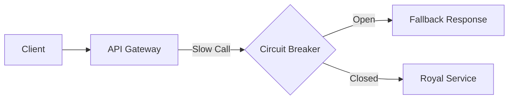

# Backend Resilience and Fault Tolerance

A modern system does not assume that the network is trustworthy.

##Circuit Breakers
If an external microservice continually fails, the loop "opens" by returning fast errors instead of freezing threads of execution.

## Rate Limiting and Throttling
Protection against DDOS and abuse. *Token Bucket* algorithms using Redis.

> [!NOTE]
> The rest of the white paper is kept in its original language to preserve the syntax of code and diagrams.

