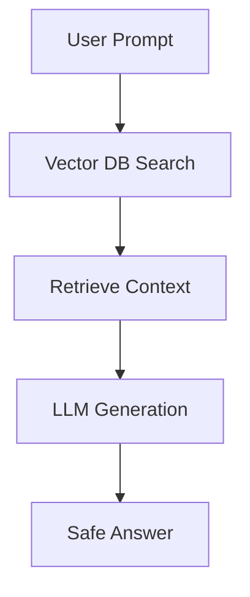

# Integration of LLMs and Corporate RAG

## Internal Data Privacy
Companies cannot submit PII to public OpenAI/Anthropic APIs.

## RAG (Retrieval-Augmented Generation) architecture
1. Indexing of internal documents in Vector DB (Chroma, Pinecone).
2. Semantic context recovery.
3. Injection at the LLM prompt (Local or Private).

> [!NOTE]
> The rest of the white paper is kept in its original language to preserve the syntax of code and diagrams.

