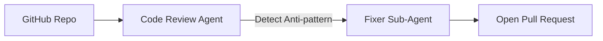

# Code Agents and AI in the Workflow

Artificial intelligence (Swarm/Agents) revolutionizing the SDLC.

## Continuous Automation
Using AI Agents to auto-generate unit tests (TDD) and scan static code refactorings.

## Anti-Technical Debt Pipeline
Night agents (Cron-based) that raise automatic Pull Requests resolving obsolete dependencies or minor bugs identified by SonarQube.

> [!NOTE]
> The rest of the white paper is kept in its original language to preserve the syntax of code and diagrams.

