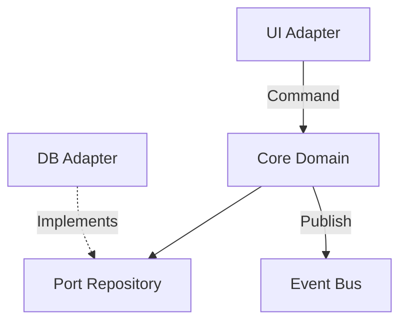

# Advanced Software Architectures

The structural design of a system dictates its scalability, maintainability, and resilience.

## Hexagonal Architecture (Ports and Adapters)
Separates the core of the domain from external dependencies (databases, UI, APIs). The domain does not know the infrastructure.
- **Ports:** Interfaces defined by the domain.
- **Adapters:** Technological implementations that connect with ports.

## Event Oriented Architecture (EDA)
The components communicate through the emission and consumption of asynchronous events (Choreography vs Orchestration).
- Ideal for high load and weakly coupled systems.

> [!NOTE]
> The rest of the white paper is kept in its original language to preserve the syntax of code and diagrams.

