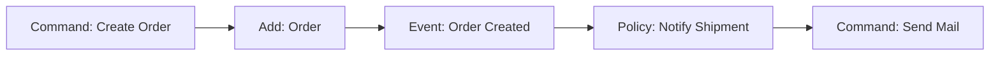

# Advanced Requirements Taking and DDD

Effective requirements capture is the cornerstone of a successful product, moving away from static documents towards collaborative discovery.

## Domain-Driven Design (DDD)
Approach that unifies the mental model of the business with the code through *Ubiquitous Language* (Ubiquitous Language).
- **Bounded Contexts:** Explicit boundaries where terms have a single meaning.

## Event Storming
Visual workshop technique (using post-its) to model complex business flows by identifying *Domain Events*, *Commands* and *Aggregations*.

> [!NOTE]
> The rest of the white paper is kept in its original language to preserve the syntax of code and diagrams.

