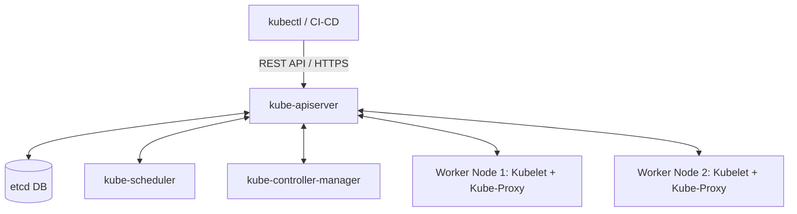

# Advanced Orchestration with Kubernetes (K8s)

Kubernetes (K8s) is not simply a container orchestrator; is a declarative **Desired State** management platform based on a closed loop reconciliation engine (*Control Loop*).

---

## 1. Cluster Architecture and Control Plane

The Kubernetes control plane ensures that the number of replicas, network routes, and security policies always converge towards what is defined in the declarative manifests:

* **kube-apiserver:** The only HTTP/REST entry point to the cluster. All interaction (CLI `kubectl`, operators, UI) goes through it.
* **etcd:** Distributed and consistent key-value database (Raft algorithm) that stores the cluster's immutable source of truth.
* **kube-scheduler:** Assigns pending Pods to Worker Nodes (*Worker Nodes*) according to available resources (CPU/RAM), taints/tolerations and affinities.
* **kube-controller-manager:** Runs the primary control loops (DeploymentController, StatefullSetController, NodeController).



---

## 2. Fundamental Abstractions: Pods,

> [!NOTE]
> The rest of the white paper is kept in its original language to preserve the syntax of code and diagrams.

 Services e Ingress

### A. Anatomía de un Pod
Un **Pod** es la unidad atómica de ejecución. Puede alojar un contenedor principal y contenedores secundarios (*Sidecars*) que comparten la misma red (`localhost`), la misma pila IP y los mismos volúmenes de almacenamiento local.

### B. Manifiesto de Despliegue con Estrategia RollingUpdate
```yaml
apiVersion: apps/v1
kind: Deployment
metadata:
  name: nmerge-backend
  namespace: prod
  labels:
    app: nmerge-backend
spec:
  replicas: 3
  strategy:
    type: RollingUpdate
    rollingUpdate:
      maxUnavailable: 1 # Mantiene como mínimo 2 Pods activos en producción
      maxSurge: 1       # Genera 1 Pod nuevo antes de apagar uno antiguo
  selector:
    matchLabels:
      app: nmerge-backend
  template:
    metadata:
      labels:
        app: nmerge-backend
    spec:
      containers:
      - name: backend
        image: registry.nmergeia.com/nmerge-backend:v1.2.2
        ports:
        - containerPort: 3005
        resources:
          requests:
            cpu: "250m"
            memory: "256Mi"
          limits:
            cpu: "500m"
            memory: "512Mi"
```

---

## 3. Sondas de Salud (Liveness, Readiness y Startup Probes)

Sin sondas de salud, Kubernetes solo sabe si el proceso de Linux del contenedor está vivo, pero no si la aplicación está respondiendo o bloqueada por un interbloqueo (*Deadlock*).

```yaml
livenessProbe:
  httpGet:
    path: /api/healthz
    port: 3005
  initialDelaySeconds: 15
  periodSeconds: 10
  failureThreshold: 3

readinessProbe:
  httpGet:
    path: /api/ready
    port: 3005
  initialDelaySeconds: 5
  periodSeconds: 5
```

* **Liveness Probe:** Si falla $N$ veces consecutivas, Kubelet mata el contenedor y lo reinicia (Auto-Healing).
* **Readiness Probe:** Si falla, elimina temporalmente la IP del Pod del balanceador de carga del Service para evitar enviar tráfico a una instancia saturada.

---

## 4. Autoescalado Horizontal (HPA) y Resiliencia

El **Horizontal Pod Autoscaler (HPA)** ajusta el número de réplicas en función del consumo real métrico:

```yaml
apiVersion: autoscaling/v2
kind: HorizontalPodAutoscaler
metadata:
  name: nmerge-backend-hpa
spec:
  scaleTargetRef:
    apiVersion: apps/v1
    kind: Deployment
    name: nmerge-backend
  minReplicas: 3
  maxReplicas: 20
  metrics:
  - type: Resource
    resource:
      name: cpu
      target:
        type: Utilization
        averageUtilization: 75
```
