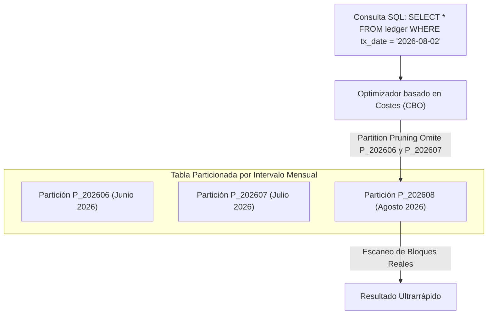

## 🎯 1. Particionado Empresarial, Seguridad Fina (VPD) & TDE

Para tablas con cientos de millones de registros, el rendimiento depende del **Particionado de Tablas e Índices**. Adicionalmente, la seguridad nivel bancario en Oracle exige **Virtual Private Database (VPD / Fine-Grained Access Control)** y cifrado transparente en disco **TDE (Transparent Data Encryption)**.

### 💡 Estrategias de Particionado & Seguridad Avanzada:
- **Partition Pruning:** El optimizador elimina automáticamente el escaneo de particiones no relevantes durante la ejecución de la consulta.
- **Interval Partitioning:** Creación automática de nuevas particiones de fecha a medida que se ingresan nuevos registros.
- **Composite Partitioning:** Combinación de dos métodos (ej. Particionado principal por Rango de Fecha + Subparticionado por Hash de Cliente).
- **Virtual Private Database (VPD / DBMS_RLS):** Inyección transparente de cláusulas `WHERE` dinámicas en el motor SQL según el rol y contexto de seguridad del usuario autenticado.

---

## 🏗️ 2. Flujo de Partition Pruning en el Optimizador Oracle



---

## 💻 3. Implementación Empresarial: Tabla Particionada Compuesta y Política VPD (DBMS_RLS)

```sql
-- =====================================================================
-- NMerge IA - Oracle Enterprise: Particionado Compuesto y Seguridad VPD
-- =====================================================================

-- 📌 1. Creación de Tabla Particionada por Intervalo (Mes) y Subparticionada por Hash (16 Subparticiones)
CREATE TABLE ledger_transactions (
    transaction_id   NUMBER(18) NOT NULL,
    account_id       NUMBER(12) NOT NULL,
    tenant_id        NUMBER(6)  NOT NULL,
    transaction_date DATE       NOT NULL,
    amount           NUMBER(15,2) NOT NULL,
    currency         VARCHAR2(3) NOT NULL,
    description      VARCHAR2(255)
)
TABLESPACE tbs_finance_data
PARTITION BY RANGE (transaction_date)
INTERVAL (NUMTOYMINTERVAL(1, 'MONTH'))
SUBPARTITION BY HASH (account_id) SUBPARTITIONS 16
(
    PARTITION p_initial VALUES LESS THAN (TO_DATE('2026-01-01', 'YYYY-MM-DD'))
);

-- Crear Índice Local Particionado
CREATE INDEX idx_ledger_acc_date ON ledger_transactions(account_id, transaction_date)
LOCAL;

-- 📌 2. Implementación de Función de Seguridad para Virtual Private Database (VPD)
CREATE OR REPLACE FUNCTION fn_security_tenant_predicate (
    p_schema IN VARCHAR2,
    p_object IN VARCHAR2
) RETURN VARCHAR2 AS
    v_context_tenant NUMBER;
BEGIN
    -- Obtener el tenant_id de la sesión del usuario activo desde el contexto SYS_CONTEXT
    v_context_tenant := SYS_CONTEXT('nmerge_ctx', 'current_tenant_id');
    
    -- Si es DBA/Admin, no restringe ninguna fila
    IF SYS_CONTEXT('USERENV', 'ISDBA') = 'TRUE' THEN
        RETURN '1=1';
    END IF;
    
    -- Inyectar filtro automático transparente por tenant_id
    RETURN 'tenant_id = ' || NVL(v_context_tenant, -1);
END fn_security_tenant_predicate;
/

-- 📌 3. Asignación de la Política RLS (VPD) a la Tabla Ledger
BEGIN
    DBMS_RLS.ADD_POLICY (
        object_schema   => 'USR_FINANCE_APP',
        object_name     => 'LEDGER_TRANSACTIONS',
        policy_name     => 'pol_tenant_isolation',
        function_schema => 'USR_FINANCE_APP',
        policy_function => 'fn_security_tenant_predicate',
        statement_types => 'SELECT, UPDATE, DELETE',
        update_check    => TRUE
    );
END;
/
```

---

© 2026 NMerge IA. StackUpIA Software Labs. Todos los derechos reservados.