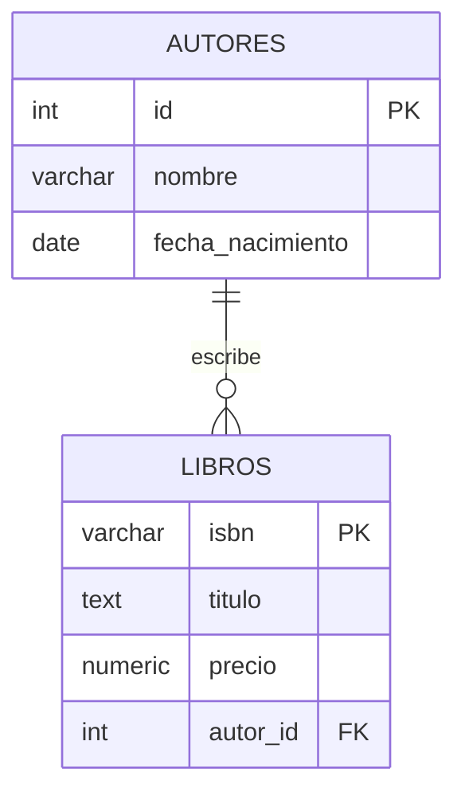

# Nivel Básico: Primeros Pasos con PostgreSQL

> [!NOTE]
> **Propósito de esta guía:** Comprender los fundamentos de la sintaxis SQL en PostgreSQL, la creación de tablas, relaciones y las consultas básicas de manipulación de datos (CRUD).

Esta guía te llevará de la mano por los conceptos fundamentales de PostgreSQL. Todo lo que necesitas saber para empezar a construir y consultar tu primera base de datos.

## 1. Tipos de Datos Fundamentales
Antes de crear una tabla, debes entender qué tipo de datos puedes almacenar. PostgreSQL ofrece un conjunto rico de tipos:

*   **Numéricos:** `INTEGER`, `SERIAL` (autoincremental clásico), `NUMERIC(precision, scale)`, `REAL`, `DOUBLE PRECISION`.
*   **Texto:** `VARCHAR(n)` (longitud variable con límite), `CHAR(n)` (longitud fija), `TEXT` (longitud ilimitada recomendada).
*   **Fechas y Tiempo:** `DATE`, `TIME`, `TIMESTAMP` (con o sin zona horaria).
*   **Lógicos:** `BOOLEAN` (`true`, `false`, `null`).

> [!TIP]
> **Best Practice:** En PostgreSQL moderno, generalmente se prefiere usar `TEXT` o `VARCHAR` sin especificar longitud a menos que exista una restricción estricta de negocio, ya que no hay penalización de rendimiento entre ellos.

## 2. DDL: Creación de Tablas y Relaciones
El Lenguaje de Definición de Datos (DDL) nos permite estructurar nuestra información.

```sql
-- Creación de la tabla de Autores
CREATE TABLE autores (
    id SERIAL PRIMARY KEY,
    nombre VARCHAR(100) NOT NULL,
    nacionalidad VARCHAR(50),
    fecha_nacimiento DATE
);

-- Creación de la tabla de Libros con una llave foránea
CREATE TABLE libros (
    isbn VARCHAR(20) PRIMARY KEY,
    titulo TEXT NOT NULL,
    precio NUMERIC(5,2) DEFAULT 0.00,
    autor_id INTEGER REFERENCES autores(id) ON DELETE CASCADE
);
```

### Relaciones Visualizadas


## 3. DML: Inserción, Actualización y Eliminación (CRUD)

### Crear (Insert)
```sql
INSERT INTO autores (nombre, nacionalidad, fecha_nacimiento) 
VALUES ('Gabriel García Márquez', 'Colombiana', '1927-03-06'),
       ('Isabel Allende', 'Chilena', '1942-08-02');
```

### Leer (Select)
```sql
SELECT nombre, nacionalidad 
FROM autores 
WHERE nacionalidad = 'Colombiana'
ORDER BY nombre ASC;
```

### Actualizar (Update)
```sql
UPDATE libros 
SET precio = precio * 1.10 
WHERE autor_id = 1;
```

### Eliminar (Delete)
```sql
DELETE FROM autores 
WHERE id = 2;
```
> [!WARNING]
> Dado que nuestra llave foránea tiene `ON DELETE CASCADE`, al eliminar un autor, **todos los libros asociados a ese autor se eliminarán automáticamente**. Úsalo con extrema precaución.

## 4. Uniones Básicas (JOINs)
Para recuperar información de múltiples tablas, utilizamos `JOIN`. El más común es `INNER JOIN`.

```sql
SELECT l.titulo, a.nombre AS autor, l.precio
FROM libros l
INNER JOIN autores a ON l.autor_id = a.id
WHERE l.precio > 20.00;
```

---

*Fuente Oficial:* [PostgreSQL 16 Documentation - SQL Syntax](https://www.postgresql.org/docs/16/sql-syntax.html)
*Autores:* Enjambre de IA NMerge.
