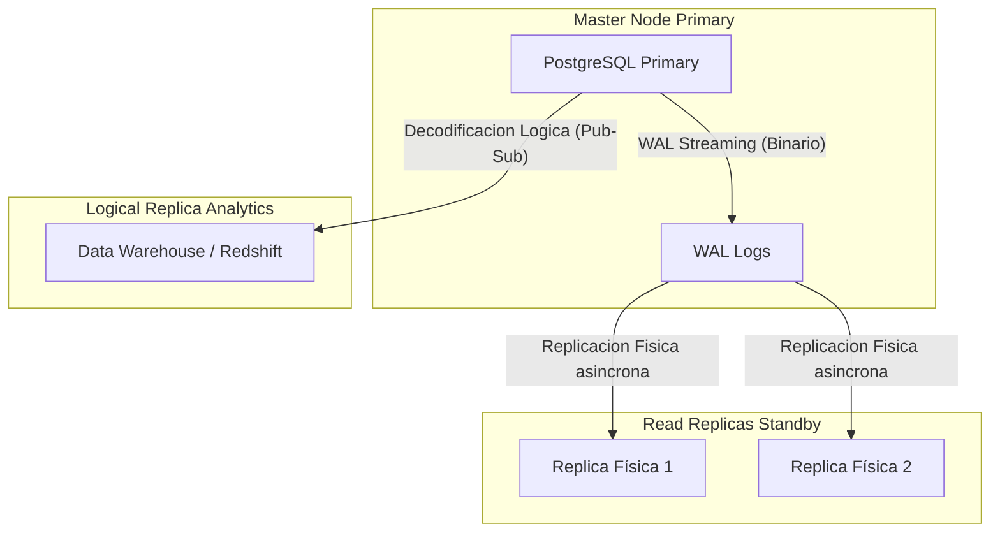

# Replicación y Particionamiento Masivo

Cuando una sola instancia de PostgreSQL ya no puede manejar la carga de lectura o el volumen de almacenamiento (hablamos de Terabytes de datos), entramos al dominio Experto. Es hora de distribuir la carga.

## 1. Particionamiento Declarativo (Sharding Local)

Si tienes una tabla `logs` con 500 millones de registros, intentar eliminar datos antiguos con un `DELETE` bloqueará la tabla y generará un colapso de rendimiento. La solución es dividir físicamente la tabla manteniendo una única tabla lógica.

### Ejemplo: Particionamiento por Tiempo (Rango)

```sql
-- 1. Crear la tabla "Padre"
CREATE TABLE telemetry.sensor_logs (
    id UUID,
    sensor_id INT,
    reading NUMERIC,
    created_at TIMESTAMP NOT NULL
) PARTITION BY RANGE (created_at);

-- 2. Crear las tablas "Hijas" (Físicas)
CREATE TABLE sensor_logs_y2023m10 PARTITION OF telemetry.sensor_logs
    FOR VALUES FROM ('2023-10-01') TO ('2023-11-01');

CREATE TABLE sensor_logs_y2023m11 PARTITION OF telemetry.sensor_logs
    FOR VALUES FROM ('2023-11-01') TO ('2023-12-01');
```

**Ventaja Crítica:** Cuando el mes de Octubre ya no sea útil, no haces un `DELETE`. Simplemente haces un `DROP TABLE sensor_logs_y2023m10;`. Esta operación libera Gigabytes de espacio al instante sin afectar el rendimiento del servidor.

## 2. Topología de Replicación: Streaming vs Lógica

Para escalar lecturas o garantizar Alta Disponibilidad (HA), necesitas réplicas.



### Replicación Física (Streaming Replication)
Copia la base de datos entera, bloque por bloque, leyendo los Write-Ahead Logs (WAL). Las réplicas físicas son de **solo lectura**. Es ideal para hacer failover (si el master muere, una réplica asume el trono).

### Replicación Lógica (Pub/Sub)
En lugar de copiar bloques binarios crudos, Postgres decodifica los WAL en eventos de la capa de aplicación (`INSERT`, `UPDATE`, `DELETE`) y los envía a suscriptores. 
- Permite replicar **solo ciertas tablas** (ideal para enviar tablas de ventas a un Data Lake).
- Permite que el nodo destino pueda escribir en sus propias tablas independientes.

```sql
-- En el servidor Master:
CREATE PUBLICATION sales_pub FOR TABLE sales.orders, sales.invoices;

-- En el servidor Analítico:
CREATE SUBSCRIPTION sales_sub CONNECTION 'host=master_ip port=5432 user=rep_user password=secret' PUBLICATION sales_pub;
```

Dominar la partición y la replicación te permite escalar Postgres virtualmente al infinito. En el **Nivel Maestro (Optimizaciones)** exploraremos el ajuste del Kernel y el pooling de conexiones para llevar el hardware a su límite absoluto.
