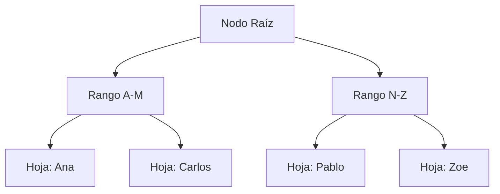

# Nivel Medio: Funciones Avanzadas e Índices

> [!NOTE]
> **Propósito de esta guía:** Dominar la agregación de datos, subconsultas, el diseño e implementación de índices básicos, y las funciones analíticas (Window Functions).

Una vez dominados los fundamentos, es hora de hacer consultas complejas y asegurarse de que la base de datos responda de manera eficiente ante grandes volúmenes de datos.

## 1. Agrupación y Funciones de Agregación
Para resumir datos, utilizamos `GROUP BY` junto a funciones como `COUNT`, `SUM`, `AVG`, `MAX` y `MIN`.

```sql
-- Obtener el número de ventas y el ingreso total por mes
SELECT 
    DATE_TRUNC('month', fecha_venta) AS mes,
    COUNT(id) AS total_ventas,
    SUM(monto) AS ingresos
FROM ventas
GROUP BY DATE_TRUNC('month', fecha_venta)
ORDER BY mes DESC;
```

### Filtrando Agrupaciones (`HAVING`)
Si quieres filtrar resultados *después* de haber agrupado, utiliza `HAVING` en lugar de `WHERE`.
```sql
-- Departamentos con más de 10 empleados
SELECT departamento_id, COUNT(*) AS total_empleados
FROM empleados
GROUP BY departamento_id
HAVING COUNT(*) > 10;
```

## 2. Subconsultas y Common Table Expressions (CTEs)
Las subconsultas pueden hacer que el código sea difícil de leer. Las CTEs (`WITH`) ofrecen una forma limpia y legible de estructurar consultas complejas.

```sql
WITH VentasPorEmpleado AS (
    SELECT empleado_id, SUM(monto) AS total_vendido
    FROM ventas
    WHERE fecha_venta >= '2023-01-01'
    GROUP BY empleado_id
)
SELECT e.nombre, v.total_vendido
FROM VentasPorEmpleado v
INNER JOIN empleados e ON v.empleado_id = e.id
WHERE v.total_vendido > 50000;
```

## 3. Window Functions (Funciones de Ventana)
Las funciones de ventana permiten realizar cálculos sobre un conjunto de filas relacionadas con la fila actual, *sin agruparlas* en una sola fila.

```sql
-- Calcular el ranking de salarios por departamento
SELECT 
    nombre, 
    departamento, 
    salario,
    RANK() OVER (PARTITION BY departamento ORDER BY salario DESC) AS rank_salarial
FROM empleados;
```

> [!TIP]
> **Por qué usar Window Functions:** Te permiten mantener el detalle individual de cada fila (ej. nombre del empleado) mientras consultas agregados (ej. promedio del departamento) en la misma consulta.

## 4. Introducción a los Índices
Un índice mejora drásticamente la velocidad de las consultas de lectura `SELECT` a costa de hacer un poco más lentas las inserciones `INSERT` y consumir espacio en disco.

```sql
-- Creación de un índice B-Tree clásico
CREATE INDEX idx_empleados_departamento ON empleados(departamento_id);

-- Creación de un índice único (evita duplicados)
CREATE UNIQUE INDEX idx_usuarios_email ON usuarios(email);
```

### Visualización Arquitectónica del Índice B-Tree


> [!WARNING]
> No sobre-indexes tu base de datos. Cada índice que creas tiene un costo en escritura. Monitorea los índices no utilizados mediante `pg_stat_user_indexes`.

---

*Fuente Oficial:* [PostgreSQL 16 Documentation - Advanced Features](https://www.postgresql.org/docs/16/tutorial-advanced.html)
*Autores:* Enjambre de IA NMerge.
