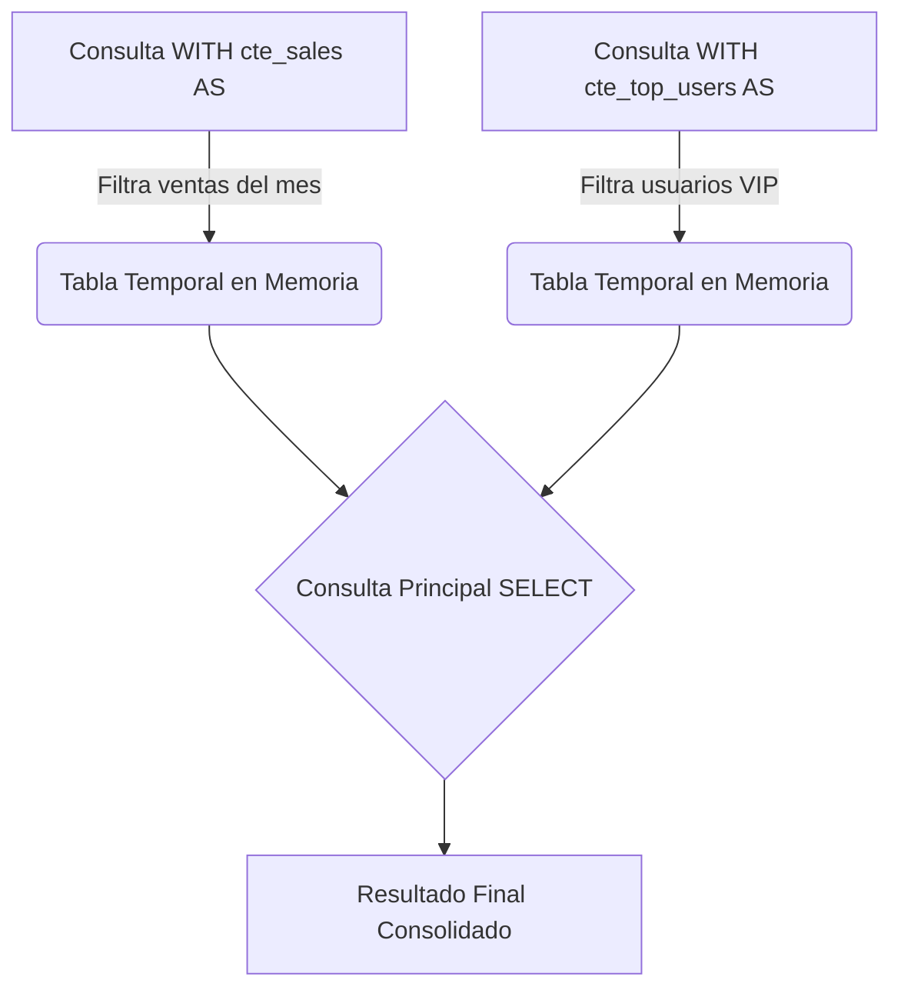
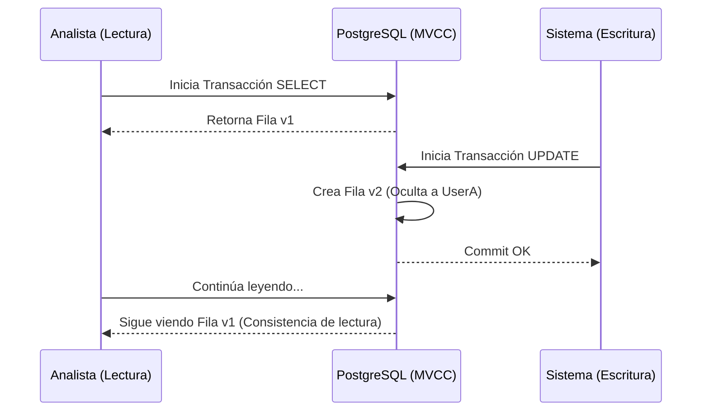

# Consultas Avanzadas, CTEs y Transacciones ACID

Cuando el `SELECT` y el `JOIN` básico ya no son suficientes para procesar la lógica de negocio, entramos al Nivel Medio. Aquí transformamos a PostgreSQL de un simple almacén de datos a un **motor de computación analítica**. Mover el cómputo a la base de datos (donde viven los datos) es casi siempre más eficiente que enviar gigabytes de datos a través de la red hacia tu servidor Node.js o Python.

## 1. Common Table Expressions (CTEs): Limpiando el Espagueti SQL

Las subconsultas anidadas pueden convertirse rápidamente en un infierno de mantenimiento. Las CTEs (cláusula `WITH`) te permiten definir bloques de resultados temporales y legibles.

### Diagrama de Flujo CTE



### Ejemplo Práctico
Imagina que queremos calcular el ticket promedio de nuestros "Top Customers" sin hacer un espagueti de SQL:

```sql
WITH top_customers AS (
    SELECT customer_id, SUM(total_amount) as lifetime_value
    FROM billing.invoices
    GROUP BY customer_id
    HAVING SUM(total_amount) > 10000
),
recent_invoices AS (
    SELECT customer_id, total_amount
    FROM billing.invoices
    WHERE created_at >= NOW() - INTERVAL '30 days'
)
-- Consulta principal uniendo las CTEs
SELECT t.customer_id, t.lifetime_value, AVG(r.total_amount) as avg_recent_ticket
FROM top_customers t
JOIN recent_invoices r ON t.customer_id = r.customer_id
GROUP BY t.customer_id, t.lifetime_value;
```

## 2. Window Functions: La Magia de la Analítica

Las *Window Functions* permiten realizar cálculos sobre un conjunto de filas que están relacionadas con la fila actual, **sin agruparlas (sin colapsar los resultados como hace `GROUP BY`)**.

¿Quieres saber qué posición (ranking) tiene el salario de un empleado dentro de su propio departamento, manteniendo los detalles del empleado?

```sql
SELECT 
    employee_name, 
    department, 
    salary,
    RANK() OVER (PARTITION BY department ORDER BY salary DESC) as salary_rank,
    salary - AVG(salary) OVER (PARTITION BY department) as diff_from_dept_avg
FROM hr.employees;
```
En este código mágico:
- `PARTITION BY` crea sub-grupos (ventanas) por departamento.
- La consulta retorna TODAS las filas de los empleados, pero añade columnas computadas analíticamente que observan a toda su ventana.

## 3. Transacciones y Control de Concurrencia (MVCC)

PostgreSQL cumple con **ACID** (Atomicidad, Consistencia, Aislamiento, Durabilidad) gracias a su arquitectura MVCC (*Multi-Version Concurrency Control*).

### ¿Qué es MVCC?
Cuando actualizas una fila en Postgres, el motor **no sobreescribe** los datos en el disco. En lugar de eso, marca la fila antigua como "obsoleta" (dead tuple) e inserta una nueva versión de la fila. Esto significa que **los lectores nunca bloquean a los escritores, y los escritores nunca bloquean a los lectores.**



### Transacciones Explícitas
Agrupar operaciones críticas garantiza que el estado de la base de datos sea consistente.

```sql
BEGIN; -- Inicia la transacción

UPDATE accounts SET balance = balance - 100 WHERE id = 1;
UPDATE accounts SET balance = balance + 100 WHERE id = 2;

-- Si algo falla aquí en tu código, haces un ROLLBACK;
-- Si todo está bien, confirmas:
COMMIT; 
```

## 4. Upsert (INSERT ... ON CONFLICT)

El patrón *Upsert* resuelve las carreras de concurrencia al intentar insertar un registro que podría ya existir. En lugar de hacer un `SELECT` (para verificar) y luego un `INSERT` o `UPDATE` desde el backend (lo cual es lento y propenso a condiciones de carrera), hazlo atómicamente:

```sql
INSERT INTO analytics.daily_stats (date, user_id, visits)
VALUES ('2023-10-01', 105, 1)
ON CONFLICT (date, user_id) 
DO UPDATE SET visits = analytics.daily_stats.visits + 1;
```

Con estas herramientas, has dejado atrás la escritura de SQL monolítico. Estás escribiendo código limpio, declarativo y matemáticamente robusto. En el **Nivel Avanzado**, nos adentraremos en el subsuelo del motor: los Planes de Ejecución (EXPLAIN) y la limpieza interna (Vacuum).
