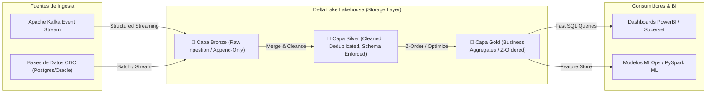

## 🎯 1. Architecture Delta Lake Engine

**Delta Lake** es la capa de almacenamiento de código abierto que convierte los Data Lakes (S3, ADLS, GCS) en una arquitectura **Lakehouse empresarial**. Aporta transacciones ACID, viajes en el tiempo (Time Travel), evolución de esquemas y compactación en tiempo real manteniendo el formato de archivo abierto Parquet.

### 💡 Arquitectura Core & Invariantes:
- **Transacciones ACID con Delta Log (`_delta_log/`):** Registro de auditoría commit por commit basado en archivos JSON con concurrencia optimista (Optimistic Concurrency Control).
- **Viaje en el Tiempo (Time Travel & Auditing):** Consulta de versiones históricas exactas mediante timestamp (`VERSION AS OF` o `TIMESTAMP AS OF`).
- **Arquitectura Medallón (Bronze -> Silver -> Gold):** Ingesta cruda (Bronze), limpieza y deduplicación (Silver) y agregaciones de negocio optimizadas (Gold).
- **Z-Ordering & Data Skipping:** Indexación multidimensional para aceleración de consultas sin sobrecostos de mantenimiento.

---

## 🏗️ 2. Arquitectura Lakehouse Medallón (Delta Lake Engine)



---

## 💻 3. Implementación Empresarial: Ingesta Delta Lake, MERGE (Upsert) & Time Travel (PySpark / Delta-Spark)

```python
# =====================================================================
# NMerge IA - Módulo de Especialidad: Architecture Delta Lake Engine
# Operaciones ACID, MERGE (Upsert), Z-Ordering y Time Travel en PySpark
# =====================================================================

from pyspark.sql import SparkSession
from delta.tables import DeltaTable
from pyspark.sql.functions import col, current_timestamp, expr

# 📌 1. Inicialización de Sesión Spark con soporte nativo de Delta Lake
spark = SparkSession.builder \
    .appName("NMerge-DeltaLake-Enterprise") \
    .config("spark.sql.extensions", "io.delta.sql.DeltaSparkSessionExtension") \
    .config("spark.sql.catalog.spark_catalog", "org.apache.spark.sql.delta.catalog.DeltaCatalog") \
    .getOrCreate()

delta_table_path = "/mnt/lakehouse/silver/customer_orders"

# 📌 2. Operación MERGE (Upsert Transaccional ACID)
def upsert_to_delta_silver(microbatch_df, batch_id):
    """
    Realiza una operación MERGE atómica en la Capa Silver:
    Actualiza registros existentes si el timestamp es más reciente, o inserta nuevos.
    """
    if DeltaTable.isDeltaTable(spark, delta_table_path):
        target_delta = DeltaTable.forPath(spark, delta_table_path)
        
        target_delta.alias("target").merge(
            source=microbatch_df.alias("source"),
            condition="target.order_id = source.order_id"
        ).whenMatchedUpdate(
            condition="source.updated_at > target.updated_at",
            set={
                "customer_id": "source.customer_id",
                "amount": "source.amount",
                "status": "source.status",
                "updated_at": "source.updated_at"
            }
        ).whenNotMatchedInsert(
            values={
                "order_id": "source.order_id",
                "customer_id": "source.customer_id",
                "amount": "source.amount",
                "status": "source.status",
                "updated_at": "source.updated_at",
                "created_at": "source.created_at"
            }
        ).execute()
        print(f"✅ Batch {batch_id} integrado exitosamente con MERGE en Delta Lake.")
    else:
        # Iniciar tabla Delta en caso de primera escritura
        microbatch_df.write.format("delta").mode("overwrite").save(delta_table_path)

# 📌 3. Optimización Z-Ordering & Compactación de Archivos (Small File Problem)
def optimize_and_zorder():
    """Ejecuta OPTIMIZE y Z-ORDER BY para acelerar lecturas BI."""
    delta_table = DeltaTable.forPath(spark, delta_table_path)
    delta_table.optimize().executeZOrderBy("customer_id")
    print("🚀 Tabla Delta compactada y Z-Ordered por customer_id.")

# 📌 4. Consulta Time Travel (Auditoría Histórica)
def query_time_travel(version: int):
    """Consulta el estado exacto de los datos en una versión previa."""
    df_version = spark.read.format("delta").option("versionAsOf", version).load(delta_table_path)
    print(f"📜 Registros en la Versión {version} de Delta Lake:")
    df_version.show(5)
    return df_version
```

---

## 🧪 4. Couverture des Tests & Vérification

```bash
# Ejecutar verificación formal para Architecture Delta Lake Engine
npm run test -- --grep="deltalake_acid"
```

---

## 🔒 5. Cumplimiento & Gobernanza Sentinel-NGAC
Todas las tablas Delta están protegidas por controles de acceso finos **Sentinel-NGAC** e integración nativa con políticas de auditoría en la capa de metadatos de almacenamiento.

© 2026 NMerge IA. StackUpIA Software Labs. Tous droits réservés.