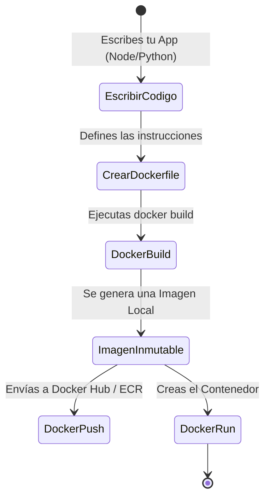

# Creando tus Propias Imágenes (Dockerfile)

Una vez que sabes cómo ejecutar contenedores creados por otros (como NGINX o Postgres), es hora de que empaquetes tu propio código. La verdadera magia de Docker reside en la **inmutabilidad**: si empacas tu app hoy, se ejecutará exactamente igual en la computadora de tu compañero de trabajo o en los servidores de AWS dentro de 5 años.

## 1. El Manifiesto: ¿Qué es un Dockerfile?

Un `Dockerfile` es un archivo de texto plano (sin extensión) que contiene una serie de instrucciones lógicas que Docker lee de arriba hacia abajo para ensamblar una imagen.

### El Ciclo de Vida de Empaquetado



## 2. Construyendo una App Web (Node.js)

Supongamos que tenemos una API en Node.js muy simple. Nuestro proyecto tiene la siguiente estructura:

```text
/mi-proyecto
├── package.json
├── package-lock.json
├── server.js
└── Dockerfile
```

### El Dockerfile Estándar

Crea el archivo `Dockerfile` y añade las siguientes capas:

```dockerfile
# 1. Capa Base: Nunca uses la etiqueta 'latest' en producción. Usa versiones fijas.
FROM node:18-alpine

# 2. Directorio de Trabajo: Todo lo que siga se ejecutará dentro de esta carpeta en el contenedor
WORKDIR /usr/src/app

# 3. Caché de Dependencias: Copiamos SOLO los archivos de dependencias primero.
# Esto es crítico para aprovechar el caché de capas de Docker.
COPY package*.json ./

# 4. Instalación: Ejecutamos el gestor de paquetes. Solo se repetirá si los archivos JSON cambian.
RUN npm install --production

# 5. Código Fuente: Ahora copiamos el resto de la aplicación.
COPY . .

# 6. Variables y Puertos: Declaramos el puerto en el que la app escucha (solo documentativo).
EXPOSE 3000
ENV NODE_ENV=production

# 7. Ejecución: El comando por defecto cuando el contenedor arranca.
CMD ["node", "server.js"]
```

## 3. El Poder del Caché de Capas (Layer Caching)

¿Por qué separamos el `COPY package*.json` del `COPY . .`? 
Docker almacena en caché el resultado de cada línea. Si cambias el color de un botón en tu código (`server.js`), Docker reutilizará la caché de las dependencias (`npm install`) porque el archivo `package.json` no cambió. Si hubieras copiado todo junto (`COPY . .` seguido de `RUN npm install`), un simple cambio de texto forzaría a Docker a re-instalar todas las dependencias, haciendo tu despliegue sumamente lento.

## 4. Construir y Ejecutar

Con nuestro `Dockerfile` listo, le decimos a Docker que construya la imagen (el punto `.` indica que busque el Dockerfile en el directorio actual):

```bash
docker build -t mi-api-node:v1 .
```

Una vez terminada la construcción, encendemos el contenedor:

```bash
docker run -d --name backend-api -p 3000:3000 mi-api-node:v1
```

## 5. El Escudo Protector: .dockerignore

Si ejecutas el `docker build` en un proyecto de Node.js, corres el riesgo de copiar la inmensa carpeta `node_modules` de tu máquina local al contenedor, pisando la instalación nativa del contenedor (que podría usar una arquitectura de CPU diferente). 

Para evitar esto, SIEMPRE crea un archivo `.dockerignore`:

```text
node_modules
npm-debug.log
.git
.env
```

Con estas bases dominadas, estás listo para dejar de correr contenedores aislados. En el **Niveau Intermédiaire**, aprenderemos a conectar múltiples servicios (como tu API en Node.js y una base de datos PostgreSQL) en una red orquestada utilizando **Docker Compose**.
