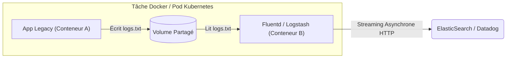

# Patrons Architecturaux, Registre Privé et Scalabilité

Nous atteignons le sommet technologique. Au niveau Maestro, les conteneurs individuels et les environnements locaux ne sont plus le sujet principal. Nous pensons désormais en termes d'écosystèmes distribués, de CI/CD, de distribution globale d'images et de patrons architecturaux avancés tels que les Sidecars et les Daemons.

## 1. Le Patron Sidecar : Architecture Découplée

Un conteneur doit faire **une seule chose et la faire parfaitement**. 
Que se passe-t-il si vous avez une API obsolète (Legacy) qui enregistre des logs dans des fichiers texte, mais que votre équipe SRE (Ingénieurs de Fiabilité) exige que les logs soient envoyés en temps réel à Datadog ou ElasticSearch ?

Modifier le code Legacy est dangereux. La solution architecturale est le patron **Sidecar** (Side-car).

### Mise en œuvre du Sidecar

Nous adjoignons un conteneur secondaire sur le même réseau (ou le même Pod dans Kubernetes) qui partage un volume physique.



Dans ce patron, le conteneur Legacy ne sait absolument pas qu'il est surveillé. Le conteneur Fluentd (le Sidecar) capture le fichier, le transforme et l'envoie vers le cloud. Nous avons modernisé l'observabilité sans toucher à une seule ligne de code source ancien.

## 2. Gouverner votre propre Docker Registry

Lorsque vous opérez sous une conformité légale stricte (Fintech, Santé, Défense), vous ne pouvez pas dépendre de dépôts publics comme Docker Hub, ni télécharger le code source propriétaire de votre entreprise sur des dépôts partagés sans révision.

### Monter un Registre Privé et Sécurisé

Vous devez déployer votre propre **Registry**. Le composant core de distribution officielle est lui-même un conteneur :

```yaml
services:
  private-registry:
    image: registry:2
    ports:
      - "5000:5000"
    environment:
      REGISTRY_AUTH: htpasswd
      REGISTRY_AUTH_HTPASSWD_REALM: "Registry Realm"
      REGISTRY_AUTH_HTPASSWD_PATH: /auth/htpasswd
      REGISTRY_STORAGE_DELETE_ENABLED: true
    volumes:
      - ./auth:/auth
      - registry_data:/var/lib/registry
```

Une fois déployé, les pipelines d'Intégration Continue (CI) doivent étiqueter (Tag) les images en pointant vers votre domaine d'entreprise et les signer avec **Docker Content Trust** afin de prévenir les attaques sur la chaîne d'approvisionnement (Supply Chain Attacks).

```bash
# 1. Le pipeline construit et signe l'image
export DOCKER_CONTENT_TRUST=1
docker build -t registry.miempresa.com/api-pagos:v1.0.4 .

# 2. L'image signée cryptographiquement est envoyée au serveur central
docker push registry.miempresa.com/api-pagos:v1.0.4
```

## 3. Préparer le passage à Kubernetes

Docker Compose est formidable pour le développement local et les déploiements modestes sur un seul serveur physique. Mais lorsque vous exigez une haute disponibilité (HA), des mises à jour sans interruption de service (Zero-Downtime Deployments) et la répartition de charge automatique sur des dizaines de serveurs (Nœuds), Docker seul ne suffit plus.

Vous devez passer le contrôle à un Orchestrateur de Niveau 3.
Votre connaissance approfondie des *Dockerfiles, Multi-Stage, Cgroups et Volumes* est exactement la même que celle exigée par **Kubernetes (K8s)**. Dans K8s, un conteneur reste un conteneur Docker (o containerd) ; nous l'enveloppons simplement dans un concept logique appelé `Pod` et déléguons son cycle de vie au plan de contrôle maître.

**Félicitations !** Vous êtes passé de la théorie de la virtualisation de base à l'ingénierie des conteneurs de niveau entreprise. Votre infrastructure est désormais immuable, hyper-optimisée et blindée.
