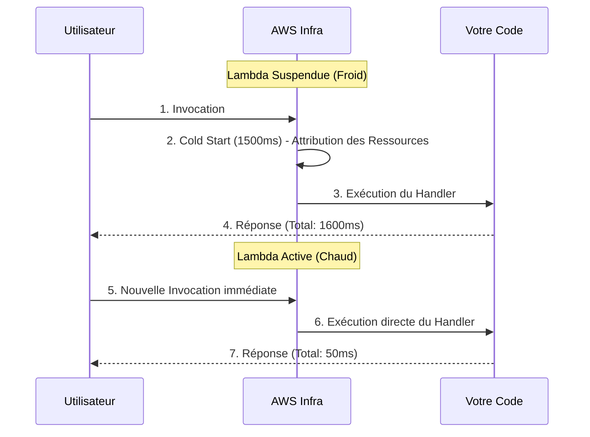

# Maîtriser AWS Lambda et le Cold Start

AWS Lambda est le cœur absolu de l'architecture Serverless. C'est un environnement de calcul éphémère. Littéralement, AWS charge votre code dans un micro-conteneur, l'exécute, vous facture les millisecondes utilisées, et le détruit.

## 1. L'Anatomie d'une Lambda

Une fonction Lambda comporte toujours trois éléments essentiels dans sa signature.

```javascript
// index.mjs
export const handler = async (event, context) => {
  try {
    // 1. ÉVÉNEMENT : Contient les données du déclencheur (S3, API Gateway, SQS)
    const body = JSON.parse(event.body);
    
    // 2. CONTEXTE : Métadonnées de l'environnement (Temps restant, Request ID)
    const tiempoRestante = context.getRemainingTimeInMillis();

    if (body.action === 'procesar') {
       return { statusCode: 200, body: "Procesado!" };
    }

  } catch (error) {
    console.error("Erreur critique :", error);
    return { statusCode: 500, body: "Erreur interne" };
  }
};
```

### Contraintes Strictes (Limites Strictes)
Vous devez concevoir votre architecture en tenant compte de ces limites de Lambda :
* **Temps d'Exécution Maximal :** 15 Minutes. (Si vous avez besoin de plusieurs heures, utilisez AWS Batch ou Fargate).
* **Mémoire Maximale :** 10 Go.
* **Couche Éphémère (`/tmp`) :** Maximum 10 Go de stockage temporaire qui disparaîtra.

## 2. L'Ennemi #1 : Cold Start (Démarrage à Froid)

Si votre Lambda n'a pas été invoquée au cours des dernières minutes, AWS la suspend pour économiser des ressources. Lorsqu'une nouvelle requête arrive, AWS doit :
1. Trouver un serveur physique disposant d'espace libre.
2. Télécharger votre code depuis un bucket interne.
3. Démarrer l'environnement (Node.js, Python).
4. Exécuter la fonction.

Ce processus est appelé **Cold Start** (Démarrage à froid). Il peut durer de 300 millisecondes à 3 secondes, ce qui est très préjudiciable pour l'expérience utilisateur.



### Stratégies d'Atténuation Basiques
* **Minimiser le Poids du Paquet :** Ne téléversez pas un dossier `node_modules` de 200 Mo. Utilisez `esbuild` ou `webpack` pour empaqueter votre code dans un seul fichier minifié de 2 Mo.
* **Initialisation Globale :** Les connexions à la Base de Données doivent être effectuées en DEHORS du `handler`.

```javascript
import { Client } from 'pg';

// ✅ BIEN : S'exécute pendant le Cold Start et est réutilisé lors des invocations à chaud.
const db = new Client({ connectionString: process.env.DB_URL });
await db.connect();

export const handler = async (event) => {
  // Ceci sera extrêmement rapide.
  const res = await db.query('SELECT * FROM users');
  return { statusCode: 200, body: JSON.stringify(res.rows) };
};
```

Dans le **Niveau Intermédiaire**, nous verrons comment connecter nos Lambdas au monde extérieur à l'aide d'API Gateway et comment gérer des bases de données Serverless avec DynamoDB.
