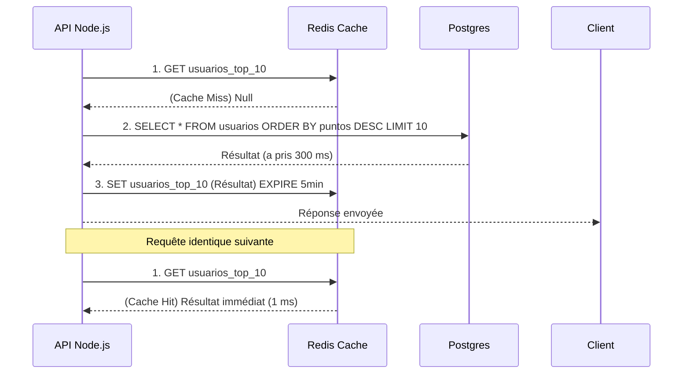

# Microservices, Redis Cache et Messagerie (Event-Driven)

Lorsqu'une API REST Node.js monte en charge pour supporter un million d'utilisateurs, le goulot d'étranglement n'est plus l'Event Loop, c'est la base de données. Chaque requête SQL ajoute entre 50 ms et 200 ms. Si 10 000 utilisateurs consultent la page d'accueil de votre application simultanément, votre base de données s'effondrera.

## 1. Le cache distribué (Redis)

Redis est une base de données In-Memory (stockée en mémoire RAM) clé-valeur. Sa latence de lecture est inférieure à 1 ms. 

Le motif principal est le **Cache-Aside Pattern** :



## 2. Event-Driven Architecture (Microservices)

Dans un monolithe, lorsqu'une vente survient, vous appelez séquentiellement des fonctions : `crearOrden()`, `restarStock()`, `enviarEmail()`. Si l'envoi de l'e-mail prend 3 secondes, l'utilisateur reste en attente.

Dans une architecture microservices, nous utilisons des **Message Brokers** (RabbitMQ, Kafka, AWS SQS) pour découpler les opérations.

```javascript
// Service de paiement (Node.js)
const channel = await RabbitMQ.createChannel();

app.post('/pagar', async (req, res) => {
  const exito = await procesarTarjeta(req.body);
  
  if (exito) {
    // Envoi et oubli (Fire and Forget)
    // Nous émettons un événement dans la file d'attente et répondons à l'utilisateur INSTANTANÉMENT.
    channel.publish('ventas_exchange', 'pago.completado', Buffer.from(JSON.stringify(req.body)));
    
    return res.json({ msg: "Votre commande est en cours de traitement." });
  }
});
```

Pendant ce temps, dans des conteneurs totalement séparés (peut-être écrits en Python ou Go), d'autres microservices sont à l'écoute de cet événement :
* Le **Service d'E-mails** écoute `pago.completado` et envoie le reçu.
* Le **Service d'Inventaire** écoute `pago.completado` et déduit le stock.

## 3. JWT et sessions Stateless

Les architectures distribuées exigent une authentification sans état (Stateless). Au lieu de stocker des sessions dans la mémoire du serveur (ce qui poserait problème si vous aviez 5 instances de Node derrière un Load Balancer), nous utilisons les **JSON Web Tokens (JWT)**.

Le JWT contient les informations d'autorisation chiffrées *à l'intérieur* de la chaîne de caractères elle-même. Le serveur n'a pas besoin de vérifier la base de données pour savoir si vous êtes administrateur ; il déchiffre simplement de manière cryptographique le JWT avec sa signature secrète (`HMAC SHA256`).

Dans le **Niveau des Optimisations**, nous utiliserons les clusters Node, PM2 et nous analyserons les threads de travail (Worker Threads) pour tirer le meilleur parti du matériel bare-metal.
