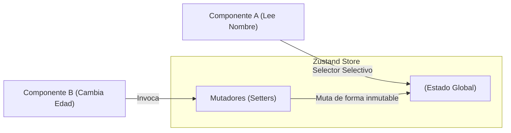

# Gestión de Estado Global (Redux Toolkit & Zustand)

La Context API de React es fantástica para dependencias estáticas (como un Tema Oscuro/Claro o la Sesión de Usuario). Sin embargo, cuando construimos Dashboards masivos (como NMergeIA) donde los datos cambian miles de veces por segundo (sockets, filtros, gráficos en tiempo real), **Context colapsa arquitectónicamente**.

¿Por qué? Porque si un valor dentro de un Context Provider cambia, **TODOS** los componentes suscritos a ese contexto se re-renderizan instantáneamente, incluso si solo necesitan una fracción minúscula de esos datos.

## 1. El Surgimiento de los Gestores Atómicos / Flux

Necesitamos un gestor que permita **Selectores Selectivos**: Si un componente solo necesita leer el `nombre` del usuario, no debería re-renderizarse si cambia la `edad`.

### Arquitectura Zustand (El estándar moderno)
Atrás quedó el código repetitivo de Redux clásico (Actions, Reducers, Types). Hoy en día, Zustand lidera el ecosistema por su simplicidad y potencia.



## 2. Implementación de una Store en Zustand

Zustand permite crear un hook de estado global fuera del árbol de React, eliminando la necesidad de los asfixiantes `<Provider>` en `App.jsx`.

```jsx
// store/useUserStore.js
import { create } from 'zustand';

export const useUserStore = create((set) => ({
  // Estado Inicial
  usuario: { nombre: 'Alice', edad: 25 },
  tema: 'oscuro',
  
  // Acciones (Mutadores)
  setNombre: (nuevoNombre) => set((state) => ({
    usuario: { ...state.usuario, nombre: nuevoNombre }
  })),
  
  toggleTema: () => set((state) => ({
    tema: state.tema === 'oscuro' ? 'claro' : 'oscuro'
  }))
}));
```

## 3. Selectores Quirúrgicos (El secreto del rendimiento)

Aquí es donde Zustand aplasta a la Context API. En nuestro componente, NO llamaremos a todo el estado, usaremos una función callback para extraer *únicamente* lo que nos importa.

```jsx
import { useUserStore } from './store/useUserStore';

export const UserBadge = () => {
  // Selector Quirúrgico: Si 'tema' cambia, este componente NO se re-renderizará.
  // Solo reaccionará si cambia 'usuario.nombre'.
  const nombre = useUserStore((state) => state.usuario.nombre);
  
  return <div className="badge">{nombre}</div>;
};

export const ThemeSwitcher = () => {
  // Destructuramos la acción mutadora
  const toggleTema = useUserStore((state) => state.toggleTema);
  
  return <button onClick={toggleTema}>Cambiar Tema</button>;
};
```

## 4. Middleware y Persistencia

Al estar fuera del ciclo de React, estos gestores permiten inyectar "Middlewares" nativos con una línea de código. ¿Quieres que el estado sobreviva a un F5 (Recarga de página)?

```jsx
import { persist } from 'zustand/middleware';

export const useAppStore = create(
  persist(
    (set) => ({
      filtros: [],
      addFiltro: (f) => set((s) => ({ filtros: [...s.filtros, f] }))
    }),
    {
      name: 'nmerge-storage', // Zustand guardará y sincronizará automáticamente con LocalStorage
    }
  )
);
```

En el **Niveau Expert**, dejaremos de lado el estado y nos concentraremos en el infierno más temido de los desarrolladores React: El manejo asíncrono profundo, el cacheo de peticiones HTTP con React Query, y el SSR.
