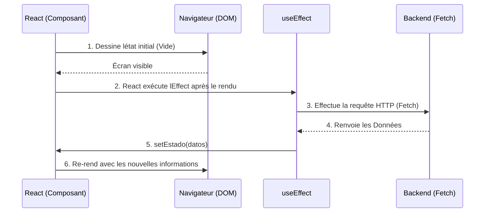

# Hooks Core et Gestion de l'État Local

Les composants fonctionnels en eux-mêmes sont purs et sans mémoire (« Stateless »). Si vous appelez une fonction deux fois, elle repart de zéro. Pour qu'un composant se « souvienne » d'informations entre les rendus (comme un panier d'achats ou l'état d'ouverture d'une fenêtre modale), React a introduit les **Hooks**.

## 1. L'État Local : useState

`useState` est le hook le plus fondamental. Il dote votre composant d'un coffre de mémoire privé qui survit aux cycles de rendu.

```jsx
import React, { useState } from 'react';

export const Contador = () => {
  // 1. Déclaration : 'contador' est la valeur, 'setContador' est la fonction mutatrice
  // 2. Initialisation : Démarre à 0
  const [contador, setContador] = useState(0);

  return (
    <div>
      <p>Vous avez cliqué {contador} fois</p>
      {/* Ne jamais muter directement (ex : contador = contador + 1). Toujours utiliser le Setter */}
      <button onClick={() => setContador(contador + 1)}>
        Incrémenter
      </button>
    </div>
  );
};
```

### Règle d'Or de l'État : L'Immuabilité
React décide de re-rendre l'écran en comparant si le nouvel état est différent du précédent via l'égalité référentielle (`===`). Si vous avez un Tableau (Array) ou un Objet, vous ne devez JAMAIS leur appliquer un `.push()` ni modifier leurs propriétés directement, car leur référence en mémoire ne changera pas et React ne mettra pas l'écran à jour.
**Vous devez toujours créer un nouveau Tableau ou Objet en copiant le précédent (Opérateur Spread `...`).**

## 2. Effets Secondaires : useEffect

Les fonctions pures ne doivent pas toucher au « monde extérieur » (effectuer des requêtes HTTP, s'abonner à des WebSockets, modifier le LocalStorage). Si vous devez le faire, vous devez utiliser `useEffect`.



### Le Tableau de Dépendances

Le second argument de `useEffect` contrôle **quand** l'effet est exécuté. C'est l'origine de 90 % des bugs dans React lorsqu'il n'est pas maîtrisé.

```jsx
// Scénario 1 : Sans tableau de dépendances (Danger)
// S'exécute APRÈS CHAQUE RENDU. Peut provoquer des boucles infinies.
useEffect(() => { fetchDatos() }); 

// Scénario 2 : Tableau vide [] (Le « componentDidMount » moderne)
// S'exécute UNE SEULE FOIS lors de la création du composant.
useEffect(() => { fetchDatos() }, []); 

// Scénario 3 : Tableau avec variables [userId]
// S'exécute à la création et À CHAQUE FOIS que 'userId' change.
useEffect(() => { fetchDatosUsuario(userId) }, [userId]); 
```

Maîtriser `useState` et `useEffect` vous permet de construire 80 % de n'importe quelle application. Au **Niveau Intermédiaire**, nous résoudrons l'infâme problème du « Prop Drilling » et connecterons notre application à un état global grâce à l'API Context.
