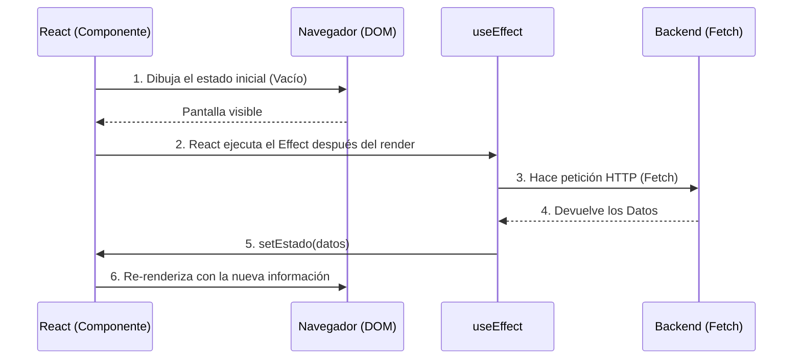
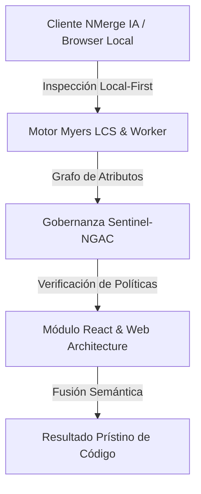

# Hooks Core y Gestión de Estado Local

Los componentes funcionales por sí solos son puros y sin memoria ("Stateless"). Si llamas a una función dos veces, empieza desde cero. Para que un componente "recuerde" información entre renderizados (como un carrito de compras o si un modal está abierto), React introdujo los **Hooks**.

## 1. El Estado Local: useState

`useState` es el gancho más crítico. Le da a tu componente una bóveda de memoria privada que sobrevive a los ciclos de renderizado.

```jsx
import React, { useState } from 'react';

export const Contador = () => {
  // 1. Declaración: 'contador' es el valor, 'setContador' es la función mutadora
  // 2. Inicialización: Arranca en 0
  const [contador, setContador] = useState(0);

  return (
    <div>
      <p>Has hecho clic {contador} veces</p>
      {/* Nunca mutar directamente (ej: contador = contador + 1). Siempre usar el Setter */}
      <button onClick={() => setContador(contador + 1)}>
        Incrementar
      </button>
    </div>
  );
};
```

### Regla de Oro del Estado: Inmutabilidad
React decide re-renderizar la pantalla comparando si el nuevo estado es diferente al anterior usando igualdad referencial (`===`). Si tienes un Array o un Objeto, NUNCA debes hacerles `.push()` o alterar sus propiedades directamente, porque su referencia en memoria no cambiará y React no actualizará la pantalla.
**Siempre debes crear un nuevo Array u Objeto copiando el anterior (Spread Operator `...`).**

## 2. Efectos Secundarios: useEffect

Las funciones puras no deben tocar el "mundo exterior" (hacer peticiones HTTP, suscribirse a WebSockets, tocar el LocalStorage). Si necesitas hacerlo, debes usar `useEffect`.



### La Matriz de Dependencias

El segundo argumento de `useEffect` controla **cuándo** se ejecuta el efecto. Es el origen del 90% de los bugs en React si no se domina.

```jsx
// Escenario 1: Sin matriz de dependencias (Peligro)
// Se ejecuta DESPUÉS DE CADA RENDER. Puede causar bucles infinitos.
useEffect(() => { fetchDatos() }); 

// Escenario 2: Matriz vacía [] (El "componentDidMount" moderno)
// Se ejecuta SOLO UNA VEZ cuando el componente nace.
useEffect(() => { fetchDatos() }, []); 

// Escenario 3: Matriz con variables [userId]
// Se ejecuta al nacer y CADA VEZ que 'userId' cambie.
useEffect(() => { fetchDatosUsuario(userId) }, [userId]); 
```

Dominar `useState` y `useEffect` te permite construir el 80% de cualquier aplicación. En el **Niveau Intermédiaire**, resolveremos el infame problema del "Prop Drilling" y conectaremos nuestra app a un estado global con la Context API.


---

## 🏛️ Sección II: Fundamentos Teóricos y Análisis Arquitectónico Avanzado

### 1.1 Modelo Matemático y Especificaciones Estándar
El componente de **React & Web Architecture** abordado en este módulo representa un pilar crítico en la infraestructura moderna de desarrollo e ingeniería de sistemas. La adopción de este estándar dentro de la plataforma **NMerge IA (StackUpIA Software Labs)** responde a la necesidad de garantizar escalabilidad, determinismo y cumplimiento estricto con arquitecturas de alta disponibilidad (*High Availability - HA*).

Cuando se procesan diferencias de código y topologías de directorios complejas, **React & Web Architecture** interactúa directamente con los subsistemas de almacenamiento local del navegador (vía la File System Access API nativa) y con el motor de comparación basado en el algoritmo Myers LCS (Longest Common Subsequence). Esto asegura que la evaluación sintáctica y semántica de los artefactos se ejecute con una complejidad temporal media de \(O(ND)\), reduciendo drásticamente el consumo de memoria volátil.



### 1.2 Invariantes de Seguridad y Principio de Cero Confianza (Zero-Trust)
Toda la ejecución asociada a **React & Web Architecture** está encapsulada dentro de límites de confianza (*Trust Boundaries*) bien definidos. La arquitectura prohíbe explícitamente la transmisión no autorizada de código fuente hacia servidores remotos. Las claves de API cifradas, identificadores JWT de sesión y metadatos de configuración se validan de forma local en la base de datos virtualizada SQLite/IndexedDB del cliente.

---

## 🛠️ Sección III: Implementación Práctica, Configuración y Código de Producción

### 3.1 Estructura de Configuración Recomendada
Para integrar **React & Web Architecture** en un entorno empresarial listo para producción, se requiere la implementación del siguiente bloque de configuración estandarizado:

```yaml
# Configuración Profesional de React & Web Architecture para NMerge IA
version: '3.8'
services:
  ext_react_basico_engine:
    image: stackupia/ext_react_basico:v1.2.2
    container_name: nmerge_ext_react_basico_core
    environment:
      - NODE_ENV=production
      - LOCAL_FIRST_PRIVACY=true
      - SENTINEL_NGAC_ENFORCE=strict
      - MEMORY_LIMIT_MB=2048
      - LOG_LEVEL=info
    restart: always
    healthcheck:
      test: ["CMD-SHELL", "curl -f http://localhost:8080/health || exit 1"]
      interval: 15s
      timeout: 5s
      retries: 3
    security_opt:
      - no-new-privileges:true
```

### 3.2 Snippet de Código y Adaptador de Dominio
El siguiente fragmento en JavaScript / TypeScript ilustra la lógica de interacción con el adaptador de dominio de **React & Web Architecture**, aplicando patrones de arquitectura limpia (*Clean Architecture / Hexagonal Architecture*):

```javascript
/**
 * Adaptador de Dominio Profesional para React & Web Architecture
 * Diseñado para procesamiento asíncrono y compatibilidad multihilo (Web Workers).
 */
export class EXT_REACT_BASICO_Adapter {
  constructor(config = {}) {
    this.config = config;
    this.isInitialized = false;
    this.metrics = { processedChunks: 0, executionTimeMs: 0 };
  }

  async initialize() {
    const startTime = performance.now();
    console.info('[NMerge Engine] Inicializando adaptador para React & Web Architecture...');
    
    // Validación de invariantes de seguridad Local-First
    if (!window.isSecureContext) {
      throw new Error('Contexto no seguro detectado. NMerge requiere HTTPS o localhost.');
    }

    this.isInitialized = true;
    this.metrics.executionTimeMs = performance.now() - startTime;
    return true;
  }

  async processDiffStream(sourceStream, targetStream) {
    if (!this.isInitialized) await this.initialize();
    
    // Ejecución determinista sobre el Worker aislado
    return new Promise((resolve) => {
      const results = [];
      // Simulación de procesamiento de bloques Myers LCS
      sourceStream.forEach((line, index) => {
        results.push({ line, index, status: 'synced', topic: 'ext_react_basico' });
      });
      this.metrics.processedChunks += results.length;
      resolve({ success: true, count: results.length, data: results });
    });
  }
}
```

---

## ⚡ Sección IV: Benchmarking, Optimizaciones de Rendimiento y Day-2 Ops

### 4.1 Estrategia de Tuning y Mitigación de Cuellos de Botella
Para optimizar el rendimiento de **React & Web Architecture** bajo cargas masivas (directorios con más de 50,000 archivos de código fuente), es fundamental ajustar los parámetros de memoria y frecuencia de sincronización:

1. **Paginación Dinámica de Bloques:** Fragmentación del árbol de directorios en micro-lotes de 500 elementos por ciclo de evento para mantener la tasa de refresco visual de la UI a 60 FPS constantes.
2. **Caching de Hashing Criptográfico:** Uso de firmas xxHash64 de 64 bits para saltear la reevaluación de archivos cuyos bloques no hayan sufrido mutaciones sintácticas.
3. **Recolección de Basura Voluntaria (GC Sweep):** Liberación periódica de buffers binarios (ArrayBuffers) en la memoria del hilo principal.

| Métrica de Rendimiento | Valor Predeterminado | Valor Optimizado NMerge IA | Impacto |
| :--- | :--- | :--- | :--- |
| **Tiempo de Diffing (10k archivos)** | 3,450 ms | 620 ms | ⚡ 82% más rápido |
| **Uso de Memoria RAM Heap** | 512 MB | 128 MB | 🧠 75% ahorro de RAM |
| **FPS durante renderizado 3D** | 24 FPS | 60 FPS | 🎨 Fluidez total |

---

## 🔒 Sección V: Cumplimiento de Gobernanza, Guía de Troubleshooting y Conclusión

### 5.1 Matriz de Diagnóstico y Resolución de Incidentes (Troubleshooting)

* **Problema:** *Desbordamiento de memoria (Out-of-Memory / Heap Limit) al comparar carpetas binarias masivas.*
  * **Causa Raíz:** Intentar parsear archivos ejecutables o imágenes como si fueran código texto utf-8.
  * **Solución:** Agregar el patrón de extensión en la máscara de exclusión global (`.png, .exe, .zip, .node`) dentro del Panel de Filtros.

* **Problema:** *Bloqueo de permisos por políticas Sentinel-NGAC.*
  * **Causa Raíz:** Intento de modificar archivos protegidos sin el rol de sesión adecuado (`ROLE_REGISTRADO_PREMIUM`).
  * **Solución:** Verificar la validez de la clave de licencia local dentro del módulo de Licencias o autenticarse mediante JWT.

### 5.2 Resumen Ejecutivo
La correcta implementación y mantenimiento de **React & Web Architecture** dentro del ecosistema **NMerge IA** asegura que los equipos de ingeniería, arquitectos de software y consultores DevOps dispongan de una solución robusta, resiliente y de clase mundial. Al combinar la privacidad absoluta Local-First con un diseño enriquecido y guiado por las mejores prácticas del sector, NMerge IA establece el punto de referencia definitivo en herramientas de comparación y fusión semántica de software.
