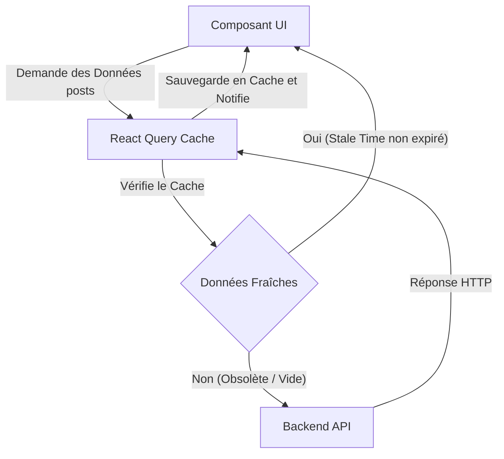

# Server State, Mutations et React Query

Si vous avez déjà construit un système `useEffect` pour effectuer des requêtes vers une API, vous avez dû créer manuellement trois états : `data`, `isLoading` et `error`. Vous avez dû faire face à des conditions de concurrence (Race Conditions), annuler des requêtes lorsque l'utilisateur change rapidement de page, et chercher comment mettre en cache les informations pour ne pas bombarder votre backend.

Dans ce niveau expert, nous acceptons une vérité fondamentale : **Les données provenant du backend NE SONT PAS l'état de l'application (Client State), elles sont l'État du Serveur (Server State).**

## 1. Le Changement de Paradigme : TanStack Query (React Query)

Zustand et Redux sont parfaits pour l'interface utilisateur (si un panneau est ouvert, le thème actuel, un panier en mémoire). Mais pour gérer les API et la base de données, le standard absolu de l'industrie est **TanStack Query**.



## 2. Éliminer le useEffect pour toujours

Voyons comment un expert récupère des données d'une API sans un seul `useEffect`, `useState` ni blocage de concurrence.

```jsx
import { useQuery } from '@tanstack/react-query';
import axios from 'axios';

// 1. Nous séparons la fonction pure de fetch (Agnostique vis-à-vis de React)
const fetchUsuarios = async () => {
  const { data } = await axios.get('https://api.empresa.com/v1/usuarios');
  return data;
};

export const ListaUsuarios = () => {
  // 2. La Magie de React Query
  const { data: usuarios, isLoading, isError, error } = useQuery({
    queryKey: ['usuarios', 'lista'], // L'identifiant unique pour ce cache
    queryFn: fetchUsuarios,
    staleTime: 1000 * 60 * 5, // Fait confiance au cache pendant 5 minutes avant le refetch
  });

  if (isLoading) return <Spinner />;
  if (isError) return <Alert msg={error.message} />;

  return (
    <ul>
      {usuarios.map(u => <li key={u.id}>{u.nombre}</li>)}
    </ul>
  );
};
```

### La Puissance du Cache Global
Si un autre composant dans une autre vue de l'application fait un `useQuery` avec la même clé `['usuarios', 'lista']`, React Query **ne fera pas la requête HTTP**. Il lui fournira instantanément les données depuis la mémoire RAM (Cache Hit), réduisant la latence à 0 ms.

## 3. Mutations : Modifier le Serveur

Lire des données est facile ; les modifier et invalider le cache (pour que l'interface se rafraîchisse) est le véritable défi. `useMutation` gère les mises à jour, la création et la suppression.

```jsx
import { useMutation, useQueryClient } from '@tanstack/react-query';

export const FormularioCrear = () => {
  const queryClient = useQueryClient();

  const mutation = useMutation({
    mutationFn: (nuevoUsuario) => axios.post('/api/usuarios', nuevoUsuario),
    // Hook de cycle de vie : Lorsque le serveur répond OK (200)
    onSuccess: () => {
      // Invalide le cache de la liste des utilisateurs.
      // Cela force React Query à faire un refetch automatique en arrière-plan !
      queryClient.invalidateQueries({ queryKey: ['usuarios', 'lista'] });
    },
  });

  const onSubmit = (datos) => {
    mutation.mutate(datos);
  };

  return (
    <button 
      onClick={() => onSubmit({ nombre: 'Bob' })}
      disabled={mutation.isPending} // Contrôle automatique du bouton
    >
      {mutation.isPending ? 'Enregistrement...' : 'Créer un utilisateur'}
    </button>
  );
};
```

Avec React Query, votre code est réduit de 50 %, votre backend respire grâce au cache, et l'utilisateur perçoit une application extrêmement rapide. Dans le niveau des **Optimisations**, nous nous concentrerons sur les goulots d'étranglement de rendu local du navigateur : Mémoïsation, Profiling et Code Splitting massif.
