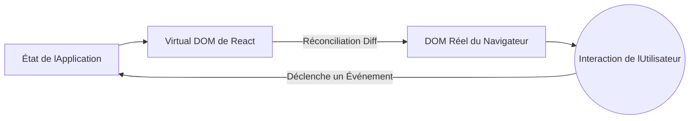

# Concepts Initiaux et Cycle de Vie Moderne

Bienvenue dans l'écosystème moderne de React. Fini l'époque des Classes et des cycles de vie monstrueux (`componentDidMount`, `componentWillReceiveProps`). Aujourd'hui, React est fonctionnel, déclaratif et extrêmement rapide s'il est utilisé correctement.

## 1. Le Paradigme Déclaratif

Contrairement au JavaScript Vanilla (Impératif), où vous dites au navigateur *comment* réaliser chaque étape (créer un élément, ajouter une classe, attacher au DOM), dans React vous lui dites *ce que* vous voulez afficher, et React se charge du *comment*.



## 2. Composants Fonctionnels (Le Standard)

Un composant dans React est simplement une fonction pure JavaScript qui reçoit des données (Props) et retourne du JSX (une syntaxe hybride entre JS et HTML).

```jsx
// Un composant parfait et pur
export const TarjetaUsuario = ({ nombre, rol }) => {
  return (
    <div className="tarjeta">
      <h2>{nombre}</h2>
      <p>Rol: {rol}</p>
    </div>
  );
};
```

### Pourquoi le JSX ?
Le JSX n'est pas du HTML réel. C'est du sucre syntaxique pour `React.createElement()`. Sous le capot, React transforme ces balises en objets JavaScript, ce qui permet au *Virtual DOM* d'effectuer des comparaisons mathématiques (diffing) à une vitesse que le DOM réel ne pourrait jamais atteindre.

## 3. Le Moteur du Changement : Le Virtual DOM

Lorsque vous modifiez l'état de votre application, React ne détruit ni ne reconstruit toute la page web (comme le faisaient les anciens frameworks). 

1. **Snapshot :** React prend une "photo" du nouveau Virtual DOM.
2. **Diffing :** Il compare la nouvelle photo avec le Virtual DOM précédent en utilisant un algorithme heuristique en O(n).
3. **Réconciliation (Patching) :** Il n'applique au DOM réel que les changements mathématiquement exacts.

Si seul le nombre de "Likes" d'un bouton a changé, React ira directement sur ce nœud du DOM et mettra à jour le texte, laissant intact le reste de l'arbre (images, formulaires).

## Prochaines Étapes
Nous avons compris comment React affiche l'écran. Dans le **Niveau Basique**, nous explorerons comment donner de la "mémoire" à nos composants en utilisant les Hooks (`useState` et `useEffect`), le cœur du React moderne.
