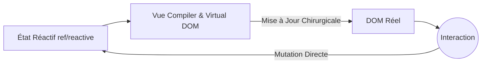

# Concepts Initiaux et Réactivité

Bienvenue dans Vue.js, le framework progressif. Contrairement à React, Vue utilise un système de réactivité basé sur les Proxies (dans Vue 3) qui rend la gestion de l'état beaucoup plus intuitive et moins sujette aux rendus inutiles.

## 1. Le Paradigme Progressif
Vue est qualifié de « progressif » car vous pouvez l'utiliser pour rendre un seul composant sur une page statique (comme jQuery) ou pour construire une SPA (Single Page Application) complète en utilisant Vue Router et Pinia.



## 2. Options API vs Composition API
Dans Vue 3, la norme est la **Composition API** avec `<script setup>`. Cela permet de regrouper la logique par fonctionnalité au lieu du cycle de vie.

```html
<script setup>
import { ref } from 'vue'

const contador = ref(0)
const incrementar = () => contador.value++
</script>

<template>
  <div class="tarjeta">
    <h2>Compteur : {{ contador }}</h2>
    <button @click="incrementar">Incrémenter</button>
  </div>
</template>
```
