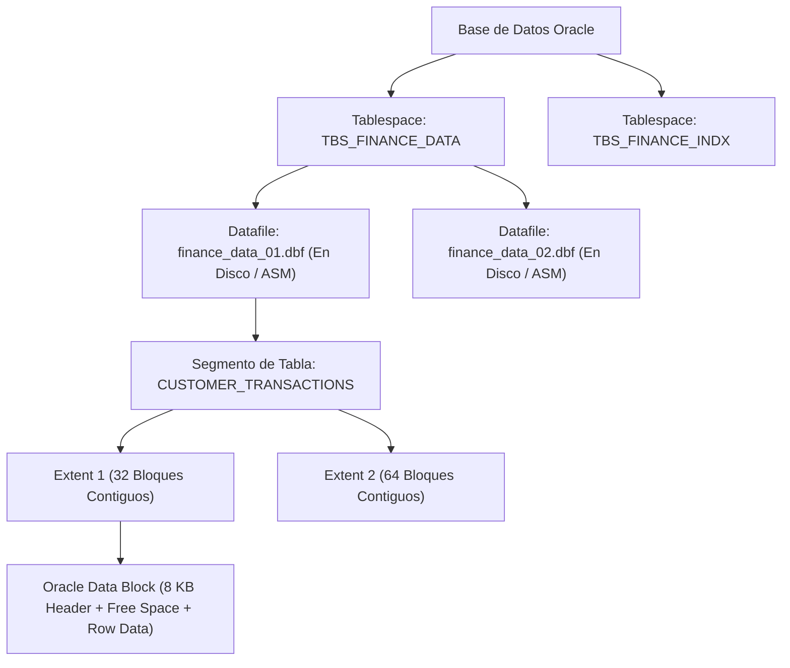

## 🎯 1. Estructuras de Almacenamiento & Fundamentos de PL/SQL

En **Oracle Database Enterprise**, el almacenamiento físico y lógico está estrictamente estructurado en una jerarquía de 5 niveles: **Base de Datos -> Tablespace -> Datafile -> Extent -> Oracle Data Block**. Adicionalmente, el lenguaje **PL/SQL (Procedural Language/SQL)** combina la potencia declarativa de SQL con estructuras de control procedurales.

### 💡 Jerarquía de Almacenamiento & PL/SQL Core:
- **Oracle Block:** La unidad de E/S más pequeña de la base de datos (típicamente 8 KB o 16 KB).
- **Extent:** Conjunto contiguo de bloques Oracle asignados a un segmento.
- **Segment:** Colección de extents asignados a una objeto específico (Tabla, Índice, LOB).
- **Tablespace:** Contenedor lógico que agrupa uno o varios Datafiles físicos en disco.
- **Estructura de Bloque PL/SQL:**
  - `DECLARE`: Declaración de variables, tipos y cursores.
  - `BEGIN`: Ejecución de sentencias SQL y lógica procedural.
  - `EXCEPTION`: Captura y manejo estructurado de errores (`WHEN OTHERS THEN`).
  - `END;`: Cierre del bloque.

---

## 🏗️ 2. Jerarquía de Almacenamiento Lógico y Físico de Oracle



---

## 💻 3. Implementación Empresarial: Procedimiento Almacenado PL/SQL con Manejo de Excepciones

```sql
-- =====================================================================
-- NMerge IA - Oracle Enterprise: Procedimiento Almacenado PL/SQL
-- Registro de Transacciones Financieras con SAVEPOINT y Excepciones
-- =====================================================================

CREATE OR REPLACE PROCEDURE prc_process_transfer (
    p_sender_id      IN  NUMBER,
    p_receiver_id    IN  NUMBER,
    p_amount         IN  NUMBER,
    p_transaction_id OUT VARCHAR2,
    p_status_code    OUT NUMBER
) AS
    v_sender_balance   NUMBER;
    v_tx_code          VARCHAR2(64);
    
    -- Excepciones personalizadas
    e_insufficient_funds EXCEPTION;
    PRAGMA EXCEPTION_INIT(e_insufficient_funds, -20001);
BEGIN
    p_status_code := 0; -- Éxito por defecto
    v_tx_code := 'TX-' || TO_CHAR(SYSDATE, 'YYYYMMDDHH24MISS') || '-' || DBMS_RANDOM.STRING('X', 6);
    
    -- Establecer un Savepoint transaccional
    SAVEPOINT sp_before_transfer;
    
    -- 1. Validar saldo del remitente con bloqueo FOR UPDATE
    SELECT balance INTO v_sender_balance
    FROM accounts
    WHERE account_id = p_sender_id
    FOR UPDATE WAIT 5;
    
    IF v_sender_balance < p_amount THEN
        RAISE_APPLICATION_ERROR(-20001, 'Saldo insuficiente en la cuenta de origen.');
    END IF;
    
    -- 2. Débito en cuenta remitente
    UPDATE accounts
    SET balance = balance - p_amount,
        updated_at = SYSDATE
    WHERE account_id = p_sender_id;
    
    -- 3. Crédito en cuenta receptora
    UPDATE accounts
    SET balance = balance + p_amount,
        updated_at = SYSDATE
    WHERE account_id = p_receiver_id;
    
    -- 4. Registrar auditoría de transacción
    INSERT INTO transaction_audit (
        tx_id, sender_id, receiver_id, amount, created_at
    ) VALUES (
        v_tx_code, p_sender_id, p_receiver_id, p_amount, SYSDATE
    );
    
    COMMIT;
    p_transaction_id := v_tx_code;
    
EXCEPTION
    WHEN e_insufficient_funds THEN
        ROLLBACK TO sp_before_transfer;
        p_status_code := 400;
        p_transaction_id := NULL;
        DBMS_OUTPUT.PUT_LINE('❌ Error Negocio: ' || SQLERRM);
        
    WHEN NO_DATA_FOUND THEN
        ROLLBACK TO sp_before_transfer;
        p_status_code := 404;
        p_transaction_id := NULL;
        DBMS_OUTPUT.PUT_LINE('❌ Error: Una de las cuentas no existe.');
        
    WHEN OTHERS THEN
        ROLLBACK TO sp_before_transfer;
        p_status_code := 500;
        p_transaction_id := NULL;
        -- Registrar log de error del sistema
        DBMS_OUTPUT.PUT_LINE('💥 Error Crítico [ORA' || SQLCODE || ']: ' || SQLERRM);
        RAISE;
END prc_process_transfer;
/
```

---

© 2026 NMerge IA. StackUpIA Software Labs. Tous droits réservés.