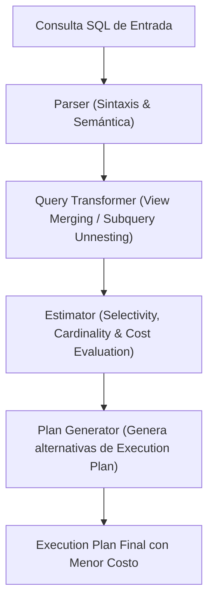

## 🎯 1. Performance Tuning: CBO, Optimizer Hints & AWR/ASH Profiling

El ajuste de rendimiento en **Oracle Database Enterprise** requiere dominar el **Cost-Based Optimizer (CBO)**, el uso estratégico de **Optimizer Hints**, y la interpretación profunda de reportes **AWR (Automatic Workload Repository)** y **ASH (Active Session History)**.

### 💡 Técnicas Avanzadas de Profiling & Tuning:
- **Cost-Based Optimizer (CBO):** Calcula el costo ordinal (I/O, CPU, Latencia de Red) evaluando estadísticas en `DBA_TAB_STATISTICS`.
- **Optimizer Hints (`/*+ ... */`):** Directivas forzadas para guiar el optimizador (`/*+ INDEX(t idx_name) */`, `/*+ PARALLEL(t 8) */`, `/*+ USE_HASH(a b) */`, `/*+ LEADING(a b c) */`).
- **AWR (Automatic Workload Repository):** Capturas periódicas de rendimiento global (Eventos de Espera Top 5 Wait Events, Latch Free, DB Sequential Read, Enqueue).
- **ASH (Active Session History):** Muestreo en memoria a nivel de segundo de todas las sesiones activas no inactivas.

---

## 🏗️ 2. Arquitectura de Evaluación del Optimizador CBO



---

## 💻 3. Implementación Empresarial: Profiling AWR/ASH y Hints de Optimización

```sql
-- =====================================================================
-- NMerge IA - Oracle Enterprise: Tuning Avanzado con Hints y DBMS_XPLAN
-- =====================================================================

-- 📌 1. Consulta Compleja con Hints de Optimización de Paralelismo y Hash Join
EXPLAIN PLAN FOR
SELECT /*+ LEADING(l a) USE_HASH(a) PARALLEL(l 8) FULL(l) INDEX(a idx_acc_id) */
    a.account_number,
    SUM(l.amount) AS total_amount
FROM ledger_transactions l
JOIN accounts a ON l.account_id = a.account_id
WHERE l.transaction_date >= TO_DATE('2026-01-01', 'YYYY-MM-DD')
GROUP BY a.account_number;

-- Display del Plan de Ejecución Completo en Memoria
SELECT * FROM TABLE(DBMS_XPLAN.DISPLAY(format => 'ALLSTATS LAST +COST +BYTES +PARALLEL'));

-- 📌 2. Script DBA: Identificación de Sesiones Activas Bloqueadas (ASH - Active Session History)
SELECT 
    session_id,
    session_serial#,
    sql_id,
    event,
    wait_time_micro / 1000 AS wait_time_ms,
    program
FROM v$active_session_history
WHERE sample_time > SYSDATE - INTERVAL '5' MINUTE
  AND session_state = 'WAITING'
ORDER BY wait_time_micro DESC;

-- 📌 3. Generación de Reporte AWR para Diagnóstico de Rendimiento Global
-- Ejecutar en SQL*Plus o SQL Developer
-- EXEC DBMS_WORKLOAD_REPOSITORY.CREATE_SNAPSHOT();
-- SELECT * FROM TABLE(DBMS_WORKLOAD_REPOSITORY.AWR_REPORT_HTML(dbid => 12948201, inst_num => 1, bid => 104, eid => 105));
```

---

© 2026 NMerge IA. StackUpIA Software Labs. Tous droits réservés.