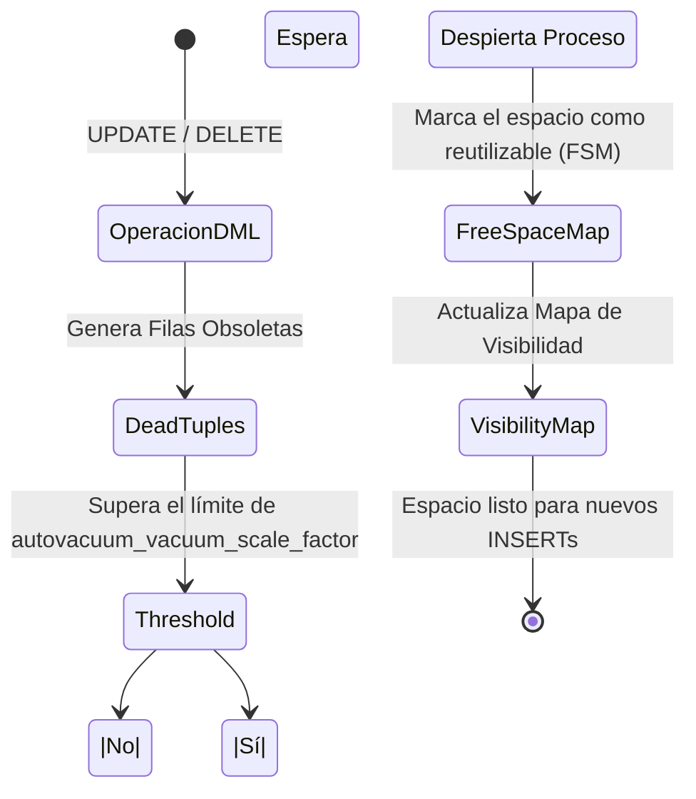

# Moteur d'exécution, Vacuum e Índices Compuestos

En el nivel avanzado, dejamos de escribir código ciegamente y empezamos a entender **cómo PostgreSQL lee nuestro código**. La diferencia entre una consulta que tarda 5 minutos y una que tarda 50 milisegundos radica en comprender el *Query Planner*.

## 1. El Arte de EXPLAIN ANALYZE

Nunca asumas que un índice está siendo utilizado. PostgreSQL tiene un optimizador basado en costos (Cost-Based Optimizer). Si el motor calcula que hacer un *Sequential Scan* (leer toda la tabla) es más barato que usar el índice porque estás pidiendo el 80% de los datos, ignorará tu índice.

### Cómo leer un plan de ejecución

```sql
EXPLAIN ANALYZE 
SELECT * FROM sales.orders 
WHERE status = 'pending' AND total > 1000;
```

**Métricas Críticas a observar:**
- `Execution Time`: El tiempo real que tomó.
- `Buffers: shared hit=... read=...`: Si ves muchos `read`, Postgres está yendo al disco. Si ves muchos `hit`, la data está sirviéndose de la memoria RAM (¡Excelente!).
- `Seq Scan`: Alarma roja si la tabla tiene millones de filas. Busca reemplazarlo por un `Index Scan` o `Bitmap Heap Scan`.

## 2. Índices Compuestos y el Orden de las Columnas

Cuando filtras por múltiples columnas, un índice simple no es suficiente.

```sql
-- Índice Compuesto
CREATE INDEX idx_orders_status_total ON sales.orders(status, total);
```
**Regla de Oro:** El orden importa. Siempre coloca primero la columna que tenga mayor **cardinalidad** (la que descarte más datos rápidamente) o la columna que uses con operadores de igualdad (`=`). Las columnas usadas para rangos (`>`, `<`) deben ir al final del índice.

## 3. Autovacuum: El Recolector de Basura de MVCC

En el Niveau Intermédiaire aprendimos sobre MVCC y las *dead tuples* (filas obsoletas generadas por UPDATEs y DELETEs). Si estas filas no se limpian, tu base de datos sufrirá de **Bloat** (hinchazón), consumiendo disco y destruyendo el rendimiento.

El proceso `Autovacuum` es el encargado de limpiar esto.

### Diagrama del Proceso Autovacuum



**Tuning Crítico para Tablas Grandes:**
El valor por defecto de Postgres (`autovacuum_vacuum_scale_factor = 0.2`) significa que el Autovacuum solo se dispara cuando cambia el 20% de la tabla. Si tienes una tabla de 100 millones de filas, ¡tendrían que cambiar 20 millones de filas para limpiarla! 
Ajusta esto por tabla:

```sql
ALTER TABLE sales.orders SET (autovacuum_vacuum_scale_factor = 0.01);
```

Comprender el EXPLAIN y dominar el Autovacuum separa a un desarrollador senior de un verdadero experto en bases de datos. En el nivel **Experto**, escalaremos esto hacia la replicación y el particionamiento masivo.
