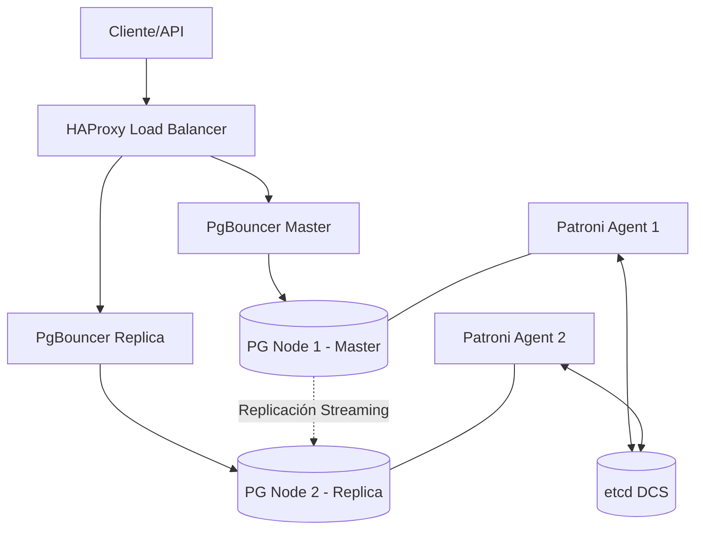

# Alta Disponibilidad y Arquitectura Interna

> [!IMPORTANT]
> **Tiempo Estimado:** 15 minutos  
> **Perfil:** Staff / Principal Engineer  

Esta guía define los estándares arquitectónicos para escalar PostgreSQL en clústeres distribuidos. Analizaremos la integración con **Patroni**, **PgBouncer** y **HAProxy** para garantizar un *Recovery Time Objective* (RTO) menor a 30 segundos.

---

## 1. Arquitectura Topológica (Digital Twin)

La siguiente arquitectura de Alta Disponibilidad asegura replicación física sincrónica o asincrónica y failover automático.



> [!NOTE]  
> **Consenso Distribuido:** Patroni utiliza `etcd` (o Consul/ZooKeeper) para mantener el estado del clúster y elegir a un nuevo líder mediante el algoritmo de consenso Raft en caso de partición de red (Split-Brain).

---

## 2. Ajuste Crítico: Pool de Conexiones

> [!WARNING]
> **FinOps & Performance Warning:**  
> Cada conexión nativa en PostgreSQL consume aproximadamente 10MB de memoria debido a su arquitectura multiproceso (fork por conexión). 5000 conexiones concurrentes sin pooler causarían OOM (Out Of Memory) en instancias con menos de 64GB RAM.  
> Costo estimado de un clúster RDS Multi-AZ r6g.4xlarge: ~$1,600 USD/mes.

Para mitigar el consumo masivo de memoria, es obligatorio el uso de un Pooler transaccional (`PgBouncer`).

### Archivo de Configuración Quirúrgico (`pgbouncer.ini`)

```ini
[databases]
nmerge_db = host=127.0.0.1 port=5432 dbname=[NOMBRE_DE_TU_BD]

[pgbouncer]
listen_port = 6432
listen_addr = *
auth_type = md5
auth_file = /etc/pgbouncer/userlist.txt
pool_mode = transaction
max_client_conn = 10000
default_pool_size = 100
reserve_pool_size = 20
```

---

## 3. Optimización del Kernel (Sysctl)

Para bases de datos masivas (Terabytes de RAM), el *tuning* de memoria compartida de Linux es imperativo.

```bash
# Habilitar Huge Pages para reducir la sobrecarga de la tabla de paginación
echo "vm.nr_hugepages = 10240" >> /etc/sysctl.conf

# Prevenir que Linux haga Swap agresivo de la BD
echo "vm.swappiness = 1" >> /etc/sysctl.conf

# Aplicar los cambios en caliente
sysctl -p
```

---
*Fin de la Guía Experta. Procede a aplicar estos perfiles directamente a través de Terraform en tu infraestructura Cloud Native.*
