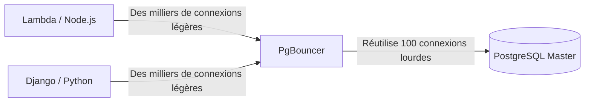

# Tuning Extrême, PgBouncer et Optimisations

Bienvenue au niveau final. Ici, nous n'écrivons pas de SQL ; ici, nous modifions le comportement du Noyau Linux (Kernel) et manipulons l'allocation de mémoire brute pour extraire chaque goutte de performance du matériel (hardware) qui héberge notre base de données.

## 1. Le Problème des Connexions (Connection Pooling)

Comme nous l'avons vu au Niveau Initial, Postgres fait un *fork* (crée un nouveau processus) pour chaque connexion client. Chaque processus consomme environ 2 à 10 Mo de RAM. Si votre API Serverless (ex. AWS Lambda) ouvre 5 000 connexions concurrentes, Postgres consommera toute la mémoire du serveur uniquement en processus inactifs, provoquant un *Out of Memory (OOM) Crash*.

### Architecture avec PgBouncer

La solution obligatoire en production est de placer un **Connection Pooler** devant la base de données. `PgBouncer` est le standard de l'industrie.



PgBouncer maintient un petit groupe de connexions actives avec Postgres. Lorsqu'une API demande à exécuter une requête, PgBouncer lui prête une connexion, exécute la requête et la renvoie immédiatement au pool (*Transaction Pooling*). Cela réduit la charge CPU de Postgres à presque zéro dans la gestion des connexions.

## 2. Tuning Extrême : Modification de postgresql.conf

Le fichier par défaut `postgresql.conf` est configuré pour s'exécuter sur un Raspberry Pi (c'est-à-dire qu'il utilise le minimum de ressources). Si vous travaillez sur un serveur disposant de 64 Go de RAM et de disques NVMe, vous gâchez 95 % de votre matériel.

### Paramètres Vitaux d'Optimisation (Exemple pour un Serveur de 64 Go de RAM) :

```conf
# 1. Mémoire Partagée (Stockage cache des tables)
# Recommandé : 25% à 40% de la RAM totale.
shared_buffers = 16GB 

# 2. Mémoire pour les Tris (Sorts, Hashes)
# Mémoire par connexion. Attention : S'il y a 100 connexions effectuant un SORT énorme, cela consommera 100 * 64MB.
work_mem = 64MB 
maintenance_work_mem = 2GB # Uniquement pour VACUUM et création d'INDEX.

# 3. Réglage pour Disques SSD (Éviter le comportement des disques rotatifs HDD)
random_page_cost = 1.1 # Suppose des lectures aléatoires presque aussi rapides que séquentielles.
effective_io_concurrency = 200 # Augmente le traitement I/O asynchrone pour les SSDs.

# 4. Transactions et WAL
wal_level = logical # Préparé pour la réplication logique si nécessaire
checkpoint_completion_target = 0.9 # Lisse les écritures sur disque pendant les checkpoints
```

## 3. Huge Pages sous Linux (Tuning du Système d'Exploitation)

Pour les bases de données haute performance, le système d'exploitation consomme trop de CPU à gérer les "pages de mémoire" standard de 4 Ko. Activer les **Huge Pages** (pages de 2 Mo ou 1 Go) permet à Postgres de gérer son `shared_buffers` avec une fraction de l'effort CPU.

1. Calculer la taille du `shared_buffers`.
2. Configurer `/etc/sysctl.conf` sous Linux :
   ```bash
   vm.nr_hugepages = 8500
   ```
3. Indiquer à Postgres de les utiliser dans `postgresql.conf` :
   ```conf
   huge_pages = on
   ```

Vous avez atteint la maîtrise. De la syntaxe de base à la configuration du Kernel, votre infrastructure PostgreSQL est désormais prête à opérer à échelle mondiale, à tolérer des pannes catastrophiques et à traiter des millions de transactions par seconde.
