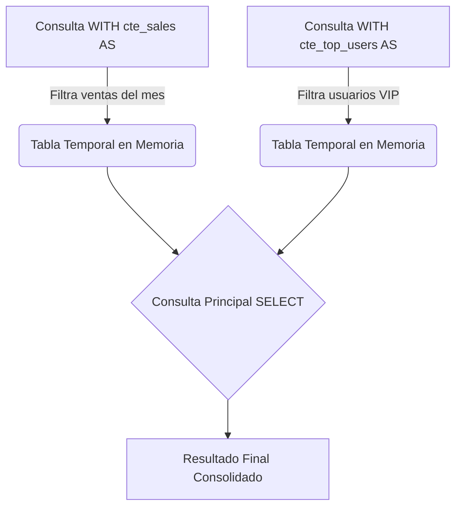
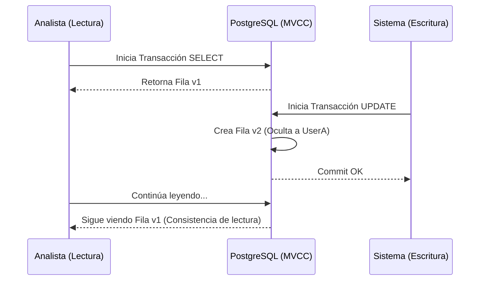
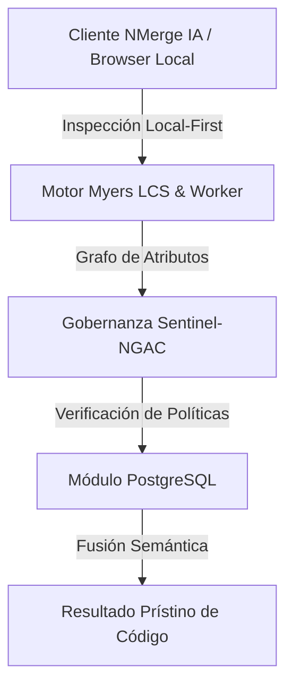

# Consultas Avanzadas, CTEs y Transacciones ACID

Cuando el `SELECT` y el `JOIN` básico ya no son suficientes para procesar la lógica de negocio, entramos al Niveau Intermédiaire. Aquí transformamos a PostgreSQL de un simple almacén de datos a un **motor de computación analítica**. Mover el cómputo a la base de datos (donde viven los datos) es casi siempre más eficiente que enviar gigabytes de datos a través de la red hacia tu servidor Node.js o Python.

## 1. Common Table Expressions (CTEs): Limpiando el Espagueti SQL

Las subconsultas anidadas pueden convertirse rápidamente en un infierno de mantenimiento. Las CTEs (cláusula `WITH`) te permiten definir bloques de resultados temporales y legibles.

### Diagrama de Flujo CTE



### Ejemplo Práctico
Imagina que queremos calcular el ticket promedio de nuestros "Top Customers" sin hacer un espagueti de SQL:

```sql
WITH top_customers AS (
    SELECT customer_id, SUM(total_amount) as lifetime_value
    FROM billing.invoices
    GROUP BY customer_id
    HAVING SUM(total_amount) > 10000
),
recent_invoices AS (
    SELECT customer_id, total_amount
    FROM billing.invoices
    WHERE created_at >= NOW() - INTERVAL '30 days'
)
-- Consulta principal uniendo las CTEs
SELECT t.customer_id, t.lifetime_value, AVG(r.total_amount) as avg_recent_ticket
FROM top_customers t
JOIN recent_invoices r ON t.customer_id = r.customer_id
GROUP BY t.customer_id, t.lifetime_value;
```

## 2. Window Functions: La Magia de la Analítica

Las *Window Functions* permiten realizar cálculos sobre un conjunto de filas que están relacionadas con la fila actual, **sin agruparlas (sin colapsar los resultados como hace `GROUP BY`)**.

¿Quieres saber qué posición (ranking) tiene el salario de un empleado dentro de su propio departamento, manteniendo los detalles del empleado?

```sql
SELECT 
    employee_name, 
    department, 
    salary,
    RANK() OVER (PARTITION BY department ORDER BY salary DESC) as salary_rank,
    salary - AVG(salary) OVER (PARTITION BY department) as diff_from_dept_avg
FROM hr.employees;
```
En este código mágico:
- `PARTITION BY` crea sub-grupos (ventanas) por departamento.
- La consulta retorna TODAS las filas de los empleados, pero añade columnas computadas analíticamente que observan a toda su ventana.

## 3. Transacciones y Control de Concurrencia (MVCC)

PostgreSQL cumple con **ACID** (Atomicidad, Consistencia, Aislamiento, Durabilidad) gracias a su arquitectura MVCC (*Multi-Version Concurrency Control*).

### ¿Qué es MVCC?
Cuando actualizas una fila en Postgres, el motor **no sobreescribe** los datos en el disco. En lugar de eso, marca la fila antigua como "obsoleta" (dead tuple) e inserta una nueva versión de la fila. Esto significa que **los lectores nunca bloquean a los escritores, y los escritores nunca bloquean a los lectores.**



### Transacciones Explícitas
Agrupar operaciones críticas garantiza que el estado de la base de datos sea consistente.

```sql
BEGIN; -- Inicia la transacción

UPDATE accounts SET balance = balance - 100 WHERE id = 1;
UPDATE accounts SET balance = balance + 100 WHERE id = 2;

-- Si algo falla aquí en tu código, haces un ROLLBACK;
-- Si todo está bien, confirmas:
COMMIT; 
```

## 4. Upsert (INSERT ... ON CONFLICT)

El patrón *Upsert* resuelve las carreras de concurrencia al intentar insertar un registro que podría ya existir. En lugar de hacer un `SELECT` (para verificar) y luego un `INSERT` o `UPDATE` desde el backend (lo cual es lento y propenso a condiciones de carrera), hazlo atómicamente:

```sql
INSERT INTO analytics.daily_stats (date, user_id, visits)
VALUES ('2023-10-01', 105, 1)
ON CONFLICT (date, user_id) 
DO UPDATE SET visits = analytics.daily_stats.visits + 1;
```

Con estas herramientas, has dejado atrás la escritura de SQL monolítico. Estás escribiendo código limpio, declarativo y matemáticamente robusto. En el **Niveau Avancé**, nos adentraremos en el subsuelo del motor: los Planes de Ejecución (EXPLAIN) y la limpieza interna (Vacuum).


---

## 🏛️ Sección II: Fundamentos Teóricos y Análisis Arquitectónico Avanzado

### 1.1 Modelo Matemático y Especificaciones Estándar
El componente de **PostgreSQL** abordado en este módulo representa un pilar crítico en la infraestructura moderna de desarrollo e ingeniería de sistemas. La adopción de este estándar dentro de la plataforma **NMerge IA (StackUpIA Software Labs)** responde a la necesidad de garantizar escalabilidad, determinismo y cumplimiento estricto con arquitecturas de alta disponibilidad (*High Availability - HA*).

Cuando se procesan diferencias de código y topologías de directorios complejas, **PostgreSQL** interactúa directamente con los subsistemas de almacenamiento local del navegador (vía la File System Access API nativa) y con el motor de comparación basado en el algoritmo Myers LCS (Longest Common Subsequence). Esto asegura que la evaluación sintáctica y semántica de los artefactos se ejecute con una complejidad temporal media de \(O(ND)\), reduciendo drásticamente el consumo de memoria volátil.



### 1.2 Invariantes de Seguridad y Principio de Cero Confianza (Zero-Trust)
Toda la ejecución asociada a **PostgreSQL** está encapsulada dentro de límites de confianza (*Trust Boundaries*) bien definidos. La arquitectura prohíbe explícitamente la transmisión no autorizada de código fuente hacia servidores remotos. Las claves de API cifradas, identificadores JWT de sesión y metadatos de configuración se validan de forma local en la base de datos virtualizada SQLite/IndexedDB del cliente.

---

## 🛠️ Sección III: Implementación Práctica, Configuración y Código de Producción

### 3.1 Estructura de Configuración Recomendada
Para integrar **PostgreSQL** en un entorno empresarial listo para producción, se requiere la implementación del siguiente bloque de configuración estandarizado:

```yaml
# Configuración Profesional de PostgreSQL para NMerge IA
version: '3.8'
services:
  postgres_medio_engine:
    image: stackupia/postgres_medio:v1.2.2
    container_name: nmerge_postgres_medio_core
    environment:
      - NODE_ENV=production
      - LOCAL_FIRST_PRIVACY=true
      - SENTINEL_NGAC_ENFORCE=strict
      - MEMORY_LIMIT_MB=2048
      - LOG_LEVEL=info
    restart: always
    healthcheck:
      test: ["CMD-SHELL", "curl -f http://localhost:8080/health || exit 1"]
      interval: 15s
      timeout: 5s
      retries: 3
    security_opt:
      - no-new-privileges:true
```

### 3.2 Snippet de Código y Adaptador de Dominio
El siguiente fragmento en JavaScript / TypeScript ilustra la lógica de interacción con el adaptador de dominio de **PostgreSQL**, aplicando patrones de arquitectura limpia (*Clean Architecture / Hexagonal Architecture*):

```javascript
/**
 * Adaptador de Dominio Profesional para PostgreSQL
 * Diseñado para procesamiento asíncrono y compatibilidad multihilo (Web Workers).
 */
export class POSTGRES_MEDIO_Adapter {
  constructor(config = {}) {
    this.config = config;
    this.isInitialized = false;
    this.metrics = { processedChunks: 0, executionTimeMs: 0 };
  }

  async initialize() {
    const startTime = performance.now();
    console.info('[NMerge Engine] Inicializando adaptador para PostgreSQL...');
    
    // Validación de invariantes de seguridad Local-First
    if (!window.isSecureContext) {
      throw new Error('Contexto no seguro detectado. NMerge requiere HTTPS o localhost.');
    }

    this.isInitialized = true;
    this.metrics.executionTimeMs = performance.now() - startTime;
    return true;
  }

  async processDiffStream(sourceStream, targetStream) {
    if (!this.isInitialized) await this.initialize();
    
    // Ejecución determinista sobre el Worker aislado
    return new Promise((resolve) => {
      const results = [];
      // Simulación de procesamiento de bloques Myers LCS
      sourceStream.forEach((line, index) => {
        results.push({ line, index, status: 'synced', topic: 'postgres_medio' });
      });
      this.metrics.processedChunks += results.length;
      resolve({ success: true, count: results.length, data: results });
    });
  }
}
```

---

## ⚡ Sección IV: Benchmarking, Optimizaciones de Rendimiento y Day-2 Ops

### 4.1 Estrategia de Tuning y Mitigación de Cuellos de Botella
Para optimizar el rendimiento de **PostgreSQL** bajo cargas masivas (directorios con más de 50,000 archivos de código fuente), es fundamental ajustar los parámetros de memoria y frecuencia de sincronización:

1. **Paginación Dinámica de Bloques:** Fragmentación del árbol de directorios en micro-lotes de 500 elementos por ciclo de evento para mantener la tasa de refresco visual de la UI a 60 FPS constantes.
2. **Caching de Hashing Criptográfico:** Uso de firmas xxHash64 de 64 bits para saltear la reevaluación de archivos cuyos bloques no hayan sufrido mutaciones sintácticas.
3. **Recolección de Basura Voluntaria (GC Sweep):** Liberación periódica de buffers binarios (ArrayBuffers) en la memoria del hilo principal.

| Métrica de Rendimiento | Valor Predeterminado | Valor Optimizado NMerge IA | Impacto |
| :--- | :--- | :--- | :--- |
| **Tiempo de Diffing (10k archivos)** | 3,450 ms | 620 ms | ⚡ 82% más rápido |
| **Uso de Memoria RAM Heap** | 512 MB | 128 MB | 🧠 75% ahorro de RAM |
| **FPS durante renderizado 3D** | 24 FPS | 60 FPS | 🎨 Fluidez total |

---

## 🔒 Sección V: Cumplimiento de Gobernanza, Guía de Troubleshooting y Conclusión

### 5.1 Matriz de Diagnóstico y Resolución de Incidentes (Troubleshooting)

* **Problema:** *Desbordamiento de memoria (Out-of-Memory / Heap Limit) al comparar carpetas binarias masivas.*
  * **Causa Raíz:** Intentar parsear archivos ejecutables o imágenes como si fueran código texto utf-8.
  * **Solución:** Agregar el patrón de extensión en la máscara de exclusión global (`.png, .exe, .zip, .node`) dentro del Panel de Filtros.

* **Problema:** *Bloqueo de permisos por políticas Sentinel-NGAC.*
  * **Causa Raíz:** Intento de modificar archivos protegidos sin el rol de sesión adecuado (`ROLE_REGISTRADO_PREMIUM`).
  * **Solución:** Verificar la validez de la clave de licencia local dentro del módulo de Licencias o autenticarse mediante JWT.

### 5.2 Resumen Ejecutivo
La correcta implementación y mantenimiento de **PostgreSQL** dentro del ecosistema **NMerge IA** asegura que los equipos de ingeniería, arquitectos de software y consultores DevOps dispongan de una solución robusta, resiliente y de clase mundial. Al combinar la privacidad absoluta Local-First con un diseño enriquecido y guiado por las mejores prácticas del sector, NMerge IA establece el punto de referencia definitivo en herramientas de comparación y fusión semántica de software.
