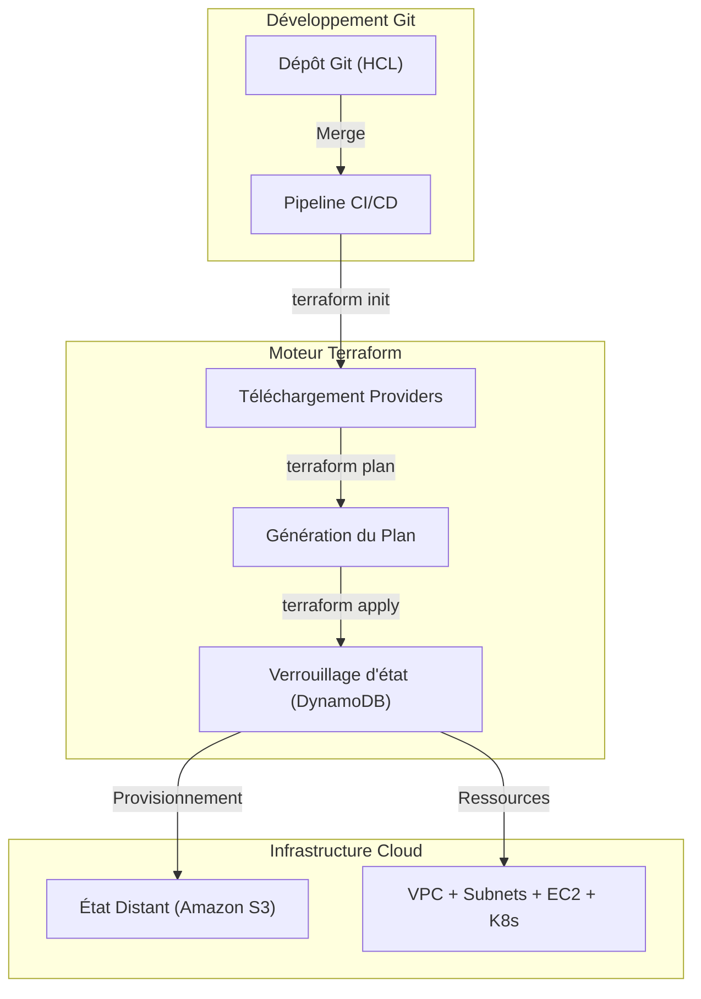

# Infrastructure en tant que Code & Immuabilité (IaC & Terraform)

**Infrastructure as Code (IaC)** est la pratique clé du DevOps pour approvisionner et gérer les infrastructures via du code source.

## 1. Paradigme Déclaratif

**Terraform** utilise une approche déclarative où vous définissez l'état souhaité de votre infrastructure.



## 2. Cycle de vie Terraform

```bash
terraform init
terraform plan
terraform apply -auto-approve
terraform destroy
```

## 3. État Distant & Verrouillage (S3 + DynamoDB)

```hcl
terraform {
  backend "s3" {
    bucket         = "nmerge-terraform-state-prod"
    key            = "global/s3/terraform.tfstate"
    region         = "us-east-1"
    dynamodb_table = "nmerge-terraform-locks"
    encrypt        = true
  }
}
```
