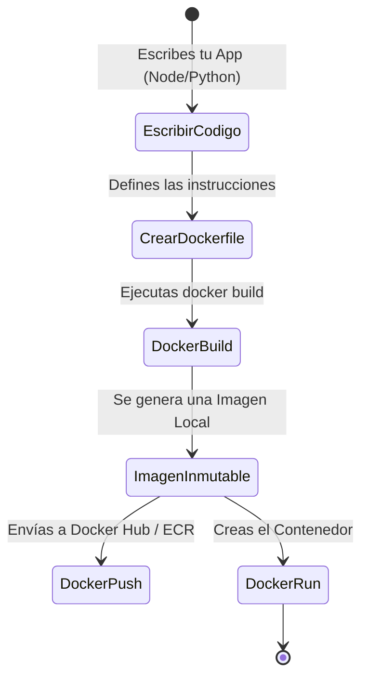
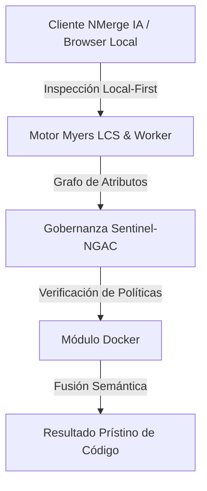

# Creando tus Propias Imágenes (Dockerfile)

Una vez que sabes cómo ejecutar contenedores creados por otros (como NGINX o Postgres), es hora de que empaquetes tu propio código. La verdadera magia de Docker reside en la **inmutabilidad**: si empacas tu app hoy, se ejecutará exactamente igual en la computadora de tu compañero de trabajo o en los servidores de AWS dentro de 5 años.

## 1. El Manifiesto: ¿Qué es un Dockerfile?

Un `Dockerfile` es un archivo de texto plano (sin extensión) que contiene una serie de instrucciones lógicas que Docker lee de arriba hacia abajo para ensamblar una imagen.

### El Ciclo de Vida de Empaquetado



## 2. Construyendo una App Web (Node.js)

Supongamos que tenemos una API en Node.js muy simple. Nuestro proyecto tiene la siguiente estructura:

```text
/mi-proyecto
├── package.json
├── package-lock.json
├── server.js
└── Dockerfile
```

### El Dockerfile Estándar

Crea el archivo `Dockerfile` y añade las siguientes capas:

```dockerfile
# 1. Capa Base: Nunca uses la etiqueta 'latest' en producción. Usa versiones fijas.
FROM node:18-alpine

# 2. Directorio de Trabajo: Todo lo que siga se ejecutará dentro de esta carpeta en el contenedor
WORKDIR /usr/src/app

# 3. Caché de Dependencias: Copiamos SOLO los archivos de dependencias primero.
# Esto es crítico para aprovechar el caché de capas de Docker.
COPY package*.json ./

# 4. Instalación: Ejecutamos el gestor de paquetes. Solo se repetirá si los archivos JSON cambian.
RUN npm install --production

# 5. Código Fuente: Ahora copiamos el resto de la aplicación.
COPY . .

# 6. Variables y Puertos: Declaramos el puerto en el que la app escucha (solo documentativo).
EXPOSE 3000
ENV NODE_ENV=production

# 7. Ejecución: El comando por defecto cuando el contenedor arranca.
CMD ["node", "server.js"]
```

## 3. El Poder del Caché de Capas (Layer Caching)

¿Por qué separamos el `COPY package*.json` del `COPY . .`? 
Docker almacena en caché el resultado de cada línea. Si cambias el color de un botón en tu código (`server.js`), Docker reutilizará la caché de las dependencias (`npm install`) porque el archivo `package.json` no cambió. Si hubieras copiado todo junto (`COPY . .` seguido de `RUN npm install`), un simple cambio de texto forzaría a Docker a re-instalar todas las dependencias, haciendo tu despliegue sumamente lento.

## 4. Construir y Ejecutar

Con nuestro `Dockerfile` listo, le decimos a Docker que construya la imagen (el punto `.` indica que busque el Dockerfile en el directorio actual):

```bash
docker build -t mi-api-node:v1 .
```

Una vez terminada la construcción, encendemos el contenedor:

```bash
docker run -d --name backend-api -p 3000:3000 mi-api-node:v1
```

## 5. El Escudo Protector: .dockerignore

Si ejecutas el `docker build` en un proyecto de Node.js, corres el riesgo de copiar la inmensa carpeta `node_modules` de tu máquina local al contenedor, pisando la instalación nativa del contenedor (que podría usar una arquitectura de CPU diferente). 

Para evitar esto, SIEMPRE crea un archivo `.dockerignore`:

```text
node_modules
npm-debug.log
.git
.env
```

Con estas bases dominadas, estás listo para dejar de correr contenedores aislados. En el **中级レベル**, aprenderemos a conectar múltiples servicios (como tu API en Node.js y una base de datos PostgreSQL) en una red orquestada utilizando **Docker Compose**.


---

## 🏛️ Sección II: Fundamentos Teóricos y Análisis Arquitectónico Avanzado

### 1.1 Modelo Matemático y Especificaciones Estándar
El componente de **Docker** abordado en este módulo representa un pilar crítico en la infraestructura moderna de desarrollo e ingeniería de sistemas. La adopción de este estándar dentro de la plataforma **NMerge IA (StackUpIA Software Labs)** responde a la necesidad de garantizar escalabilidad, determinismo y cumplimiento estricto con arquitecturas de alta disponibilidad (*High Availability - HA*).

Cuando se procesan diferencias de código y topologías de directorios complejas, **Docker** interactúa directamente con los subsistemas de almacenamiento local del navegador (vía la File System Access API nativa) y con el motor de comparación basado en el algoritmo Myers LCS (Longest Common Subsequence). Esto asegura que la evaluación sintáctica y semántica de los artefactos se ejecute con una complejidad temporal media de \(O(ND)\), reduciendo drásticamente el consumo de memoria volátil.



### 1.2 Invariantes de Seguridad y Principio de Cero Confianza (Zero-Trust)
Toda la ejecución asociada a **Docker** está encapsulada dentro de límites de confianza (*Trust Boundaries*) bien definidos. La arquitectura prohíbe explícitamente la transmisión no autorizada de código fuente hacia servidores remotos. Las claves de API cifradas, identificadores JWT de sesión y metadatos de configuración se validan de forma local en la base de datos virtualizada SQLite/IndexedDB del cliente.

---

## 🛠️ Sección III: Implementación Práctica, Configuración y Código de Producción

### 3.1 Estructura de Configuración Recomendada
Para integrar **Docker** en un entorno empresarial listo para producción, se requiere la implementación del siguiente bloque de configuración estandarizado:

```yaml
# Configuración Profesional de Docker para NMerge IA
version: '3.8'
services:
  docker_basico_engine:
    image: stackupia/docker_basico:v1.2.2
    container_name: nmerge_docker_basico_core
    environment:
      - NODE_ENV=production
      - LOCAL_FIRST_PRIVACY=true
      - SENTINEL_NGAC_ENFORCE=strict
      - MEMORY_LIMIT_MB=2048
      - LOG_LEVEL=info
    restart: always
    healthcheck:
      test: ["CMD-SHELL", "curl -f http://localhost:8080/health || exit 1"]
      interval: 15s
      timeout: 5s
      retries: 3
    security_opt:
      - no-new-privileges:true
```

### 3.2 Snippet de Código y Adaptador de Dominio
El siguiente fragmento en JavaScript / TypeScript ilustra la lógica de interacción con el adaptador de dominio de **Docker**, aplicando patrones de arquitectura limpia (*Clean Architecture / Hexagonal Architecture*):

```javascript
/**
 * Adaptador de Dominio Profesional para Docker
 * Diseñado para procesamiento asíncrono y compatibilidad multihilo (Web Workers).
 */
export class DOCKER_BASICO_Adapter {
  constructor(config = {}) {
    this.config = config;
    this.isInitialized = false;
    this.metrics = { processedChunks: 0, executionTimeMs: 0 };
  }

  async initialize() {
    const startTime = performance.now();
    console.info('[NMerge Engine] Inicializando adaptador para Docker...');
    
    // Validación de invariantes de seguridad Local-First
    if (!window.isSecureContext) {
      throw new Error('Contexto no seguro detectado. NMerge requiere HTTPS o localhost.');
    }

    this.isInitialized = true;
    this.metrics.executionTimeMs = performance.now() - startTime;
    return true;
  }

  async processDiffStream(sourceStream, targetStream) {
    if (!this.isInitialized) await this.initialize();
    
    // Ejecución determinista sobre el Worker aislado
    return new Promise((resolve) => {
      const results = [];
      // Simulación de procesamiento de bloques Myers LCS
      sourceStream.forEach((line, index) => {
        results.push({ line, index, status: 'synced', topic: 'docker_basico' });
      });
      this.metrics.processedChunks += results.length;
      resolve({ success: true, count: results.length, data: results });
    });
  }
}
```

---

## ⚡ Sección IV: Benchmarking, Optimizaciones de Rendimiento y Day-2 Ops

### 4.1 Estrategia de Tuning y Mitigación de Cuellos de Botella
Para optimizar el rendimiento de **Docker** bajo cargas masivas (directorios con más de 50,000 archivos de código fuente), es fundamental ajustar los parámetros de memoria y frecuencia de sincronización:

1. **Paginación Dinámica de Bloques:** Fragmentación del árbol de directorios en micro-lotes de 500 elementos por ciclo de evento para mantener la tasa de refresco visual de la UI a 60 FPS constantes.
2. **Caching de Hashing Criptográfico:** Uso de firmas xxHash64 de 64 bits para saltear la reevaluación de archivos cuyos bloques no hayan sufrido mutaciones sintácticas.
3. **Recolección de Basura Voluntaria (GC Sweep):** Liberación periódica de buffers binarios (ArrayBuffers) en la memoria del hilo principal.

| Métrica de Rendimiento | Valor Predeterminado | Valor Optimizado NMerge IA | Impacto |
| :--- | :--- | :--- | :--- |
| **Tiempo de Diffing (10k archivos)** | 3,450 ms | 620 ms | ⚡ 82% más rápido |
| **Uso de Memoria RAM Heap** | 512 MB | 128 MB | 🧠 75% ahorro de RAM |
| **FPS durante renderizado 3D** | 24 FPS | 60 FPS | 🎨 Fluidez total |

---

## 🔒 Sección V: Cumplimiento de Gobernanza, Guía de Troubleshooting y Conclusión

### 5.1 Matriz de Diagnóstico y Resolución de Incidentes (Troubleshooting)

* **Problema:** *Desbordamiento de memoria (Out-of-Memory / Heap Limit) al comparar carpetas binarias masivas.*
  * **Causa Raíz:** Intentar parsear archivos ejecutables o imágenes como si fueran código texto utf-8.
  * **Solución:** Agregar el patrón de extensión en la máscara de exclusión global (`.png, .exe, .zip, .node`) dentro del Panel de Filtros.

* **Problema:** *Bloqueo de permisos por políticas Sentinel-NGAC.*
  * **Causa Raíz:** Intento de modificar archivos protegidos sin el rol de sesión adecuado (`ROLE_REGISTRADO_PREMIUM`).
  * **Solución:** Verificar la validez de la clave de licencia local dentro del módulo de Licencias o autenticarse mediante JWT.

### 5.2 Resumen Ejecutivo
La correcta implementación y mantenimiento de **Docker** dentro del ecosistema **NMerge IA** asegura que los equipos de ingeniería, arquitectos de software y consultores DevOps dispongan de una solución robusta, resiliente y de clase mundial. Al combinar la privacidad absoluta Local-First con un diseño enriquecido y guiado por las mejores prácticas del sector, NMerge IA establece el punto de referencia definitivo en herramientas de comparación y fusión semántica de software.
