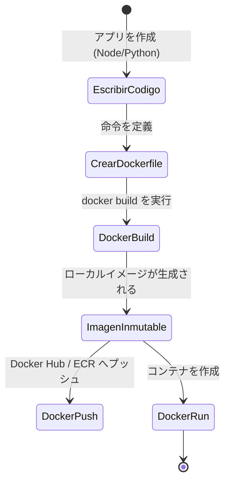

# Docker ベーシック：独自のイメージの作成 (Dockerfile)

他人が作成したコンテナ（NGINX や Postgres など）の実行方法を理解したら、次は自分のコードをパッケージ化する番です。Dockerの真の魔法は**不変性 (Immutability)** にあります。今日アプリをパッケージ化すれば、同僚のコンピューターでも、5年後の AWS のサーバーでも、まったく同じように実行されます。

## 1. マニフェスト：Dockerfile とは何か？

`Dockerfile` は、イメージを組み立てるために Docker が上から下へと読み込む一連の論理的な命令を含む（拡張子のない）プレーンテキストファイルです。

### パッケージ化のライフサイクル



## 2. Web アプリの構築 (Node.js)

非常にシンプルな Node.js API があるとします。プロジェクトの構造は次のとおりです：

```text
/mi-proyecto
├── package.json
├── package-lock.json
├── server.js
└── Dockerfile
```

### 標準的な Dockerfile

`Dockerfile` を作成し、以下のレイヤーを追加します：

```dockerfile
# 1. ベースレイヤー: 本番環境で 'latest' タグは絶対に使用しないでください。固定バージョンを使用します。
FROM node:18-alpine

# 2. 作業ディレクトリ: これ以降のすべては、コンテナ内のこのフォルダーで実行されます。
WORKDIR /usr/src/app

# 3. 依存関係のキャッシュ: 最初に依存関係ファイル「のみ」をコピーします。
# これは Docker のレイヤーキャッシュを利用するために非常に重要です。
COPY package*.json ./

# 4. インストール: パッケージマネージャーを実行します。JSON ファイルが変更された場合にのみ繰り返されます。
RUN npm install --production

# 5. ソースコード: 次に、アプリケーションの残りの部分をコピーします。
COPY . .

# 6. 変数とポート: アプリがリッスンするポートを宣言します (文書化のみ)。
EXPOSE 3000
ENV NODE_ENV=production

# 7. 実行: コンテナが起動したときのデフォルトのコマンド。
CMD ["node", "server.js"]
```

## 3. レイヤーキャッシュ (Layer Caching) の力

なぜ `COPY package*.json` と `COPY . .` を分けるのでしょうか？
Docker は各行の結果をキャッシュに保存します。コード (`server.js`) のボタンの色を変更した場合、`package.json` ファイルは変更されていないため、Docker は依存関係 (`npm install`) のキャッシュを再利用します。もしすべてを一緒にコピーしていたら (`COPY . .` の後に `RUN npm install`)、テキストを少し変更しただけで、Dockerはすべての依存関係を強制的に再インストールし、デプロイが非常に遅くなります。

## 4. ビルドと実行

`Dockerfile` の準備ができたら、Docker にイメージをビルドするように指示します（ドット `.` は、現在のディレクトリで Dockerfile を探すことを示します）：

```bash
docker build -t mi-api-node:v1 .
```

ビルドが完了したら、コンテナを起動します：

```bash
docker run -d --name backend-api -p 3000:3000 mi-api-node:v1
```

## 5. 保護シールド：.dockerignore

Node.js プロジェクトで `docker build` を実行すると、ローカルマシンから巨大な `node_modules` フォルダーをコンテナにコピーしてしまうリスクがあります。これにより、コンテナのネイティブインストール（異なる CPU アーキテクチャを使用している可能性があります）が上書きされてしまいます。

これを回避するために、**常に** `.dockerignore` ファイルを作成してください：

```text
node_modules
npm-debug.log
.git
.env
```

これらの基本を習得すれば、分離されたコンテナの実行から卒業する準備が整いました。**中級レベル**では、**Docker Compose**を使用してオーケストレーションされたネットワーク内で複数のサービス（Node.js APIとPostgreSQLデータベースなど）を接続する方法を学びます。
