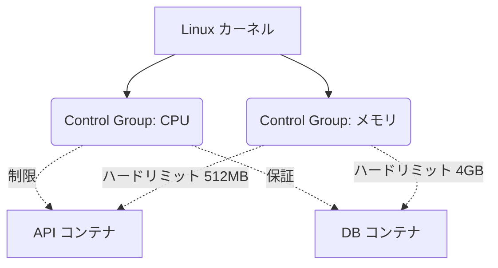

# Docker エキスパート：カーネルの制限、CGroups、およびセキュリティ

高度に最適化されたイメージを構築し、オーケストレーションする方法を学びました。しかし、リソースを管理せずに本番環境でコンテナを実行することは、システム全体を大惨事に導くレシピです。このエキスパートレベルでは、Linux カーネルの深部へと降りていきます。

メモリリーク (Memory Leak) のあるコンテナが物理サーバーのRAMを100%消費し、他のアプリケーションをクラッシュさせるのを、Docker はどのように防いでいるのでしょうか？ その答えは **Cgroups (Control Groups)** と **Namespaces** です。

## 1. 物理的隔離 vs 論理的隔離

- **Namespaces:** コンテナに嘘をつきます。コンテナに、独自のハードドライブ、独自のネットワークシステム、および独自のプロセスツリー (PID 1) があると信じ込ませます。これが*論理的*な隔離（アイソレーション）です。
- **Cgroups:** コンテナに手錠をかけます。コンテナが基盤となるハードウェアに要求できる CPU、RAM、および I/O の物理的な量を制限します。これが*物理的*な隔離です。

### リソース制御アーキテクチャ



## 2. ハードリミット (Hard Limits) の実装

コンテナが割り当てられたメモリ制限を超えると、Linuxカーネルは悪名高い **OOM Killer (Out Of Memory Killer)** を呼び出し、ホストOSを救うためにコンテナのプロセスを即座に強制終了（キル）します。

`docker-compose.yml` では、常に厳格なポリシーを適用してください（特に V3/Compose Spec バージョンの *Deploy* 指定を使用して）：

```yaml
services:
  data-processor:
    image: python-worker:latest
    deploy:
      resources:
        limits:
          cpus: '0.50'     # 最大 物理 CPU の半分のコア
          memory: 512M     # 513MB に達すると OOM Killer が動作します
        reservations:
          cpus: '0.10'     # スケジューラーによって保証される最小 CPU
          memory: 128M     # 予約された最小メモリ
```

この構成では、Pythonワーカ内でプログラミングが不十分な無限ループ `while(True)` が発生しても、1つのコアの50%にしか影響を与えず、メインサーバーは100%安定した状態を維持します。

## 3. 専門的なセキュリティ：Drop Capabilities と Non-Root

デフォルトでは、Docker コンテナ内のメインプロセスは **root** ユーザーとして実行されます。これは大きなリスクです。コンテナからの脱出 (Container Breakout) が発生した場合、攻撃者はホストサーバー上でスーパーユーザー権限を持つことになります。

### ルール 1: 非特権ユーザー (Unprivileged User)
アプリケーションを実行する前に権限をダウングレードするように、Dockerfile の末尾を変更します。

```dockerfile
# ... (以前の設定) ...

# シェルと権限を持たないシステムユーザーを作成します
RUN addgroup -S appgroup && adduser -S appuser -G appgroup

# ファイルの所有権をそのユーザーに割り当てます
RUN chown -R appuser:appgroup /usr/src/app

# 安全なユーザーにコンテキストを切り替えます
USER appuser

# これで初めてサーバーを実行します
CMD ["node", "server.js"]
```

### ルール 2: カーネル機能 (Capabilities) の削除
`root` として実行していても、Linuxはスーパーユーザー権限を "Capabilities (機能/権限)" と呼ばれるブロックに分割します。デフォルトのコンテナはあまりにも多くの機能（Ping やネットワークスプーフィングを許可する `CAP_NET_RAW` など）を保持しています。

本番環境では、すべての機能（Capabilities）を削除 (drop) し、厳密に必要な数学的機能のみを元に戻す必要があります。

```yaml
services:
  web:
    image: nginx:alpine
    cap_drop:
      - ALL # すべてのカーネル特権を破壊します
    cap_add:
      - NET_BIND_SERVICE # 下位ポート (<1024) へのバインドのみを許可します
    security_opt:
      - no-new-privileges:true # 内部の権限昇格を防ぎます
```

## エキスパートのまとめ (Summary)
熟練したコンテナアーキテクトは、コンテナが侵害され、悪意のあるコードが注入されることを前提としています。厳格な Cgroups の制限を適用し、プロセスを `非特権 USER` として実行し、カーネルの `Capabilities` を削除することで、攻撃の爆発半径 (Blast Radius) を確実になくすことができます。**マスター**レベルでは、これをグローバルオーケストレーションにスケーリングします。
