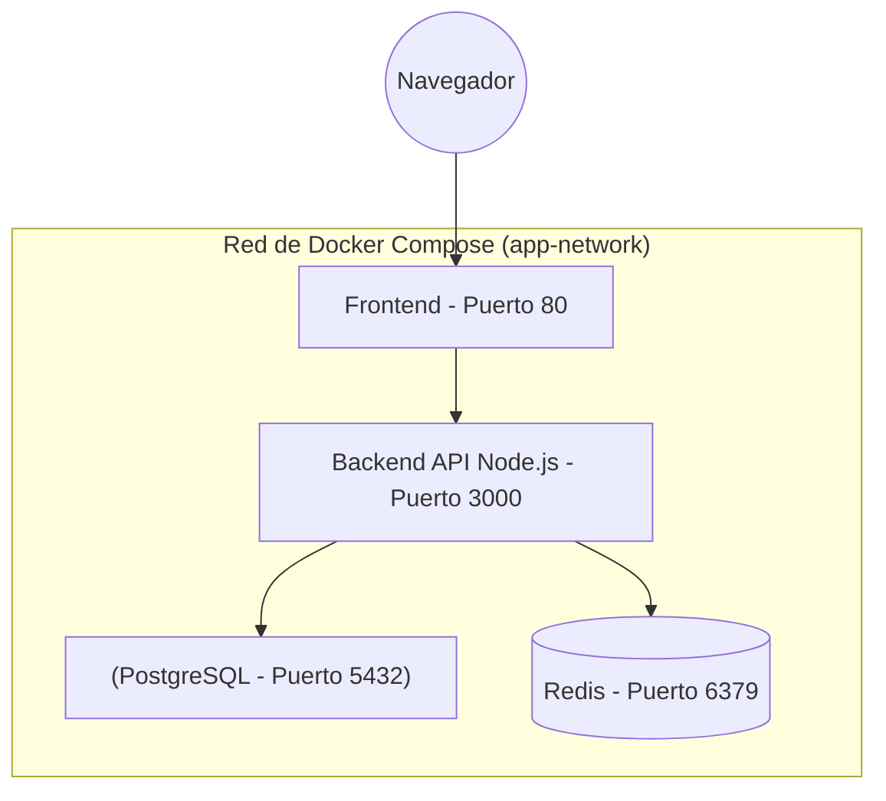
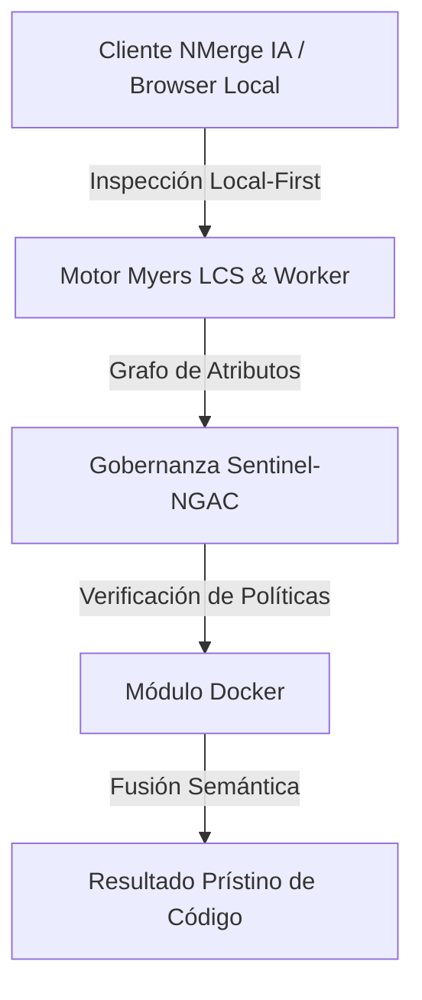

# Orquestación Local con Docker Compose y Redes

Tener una API corriendo en un contenedor es excelente, pero el software del mundo real requiere múltiples componentes: un Backend, una Base de Datos, un caché de Redis y un Frontend. Encenderlos todos manualmente usando decenas de comandos `docker run` con parámetros infinitos es insostenible y propenso a errores. 

La respuesta es **Docker Compose**: un orquestador declarativo para entornos locales.

## 1. El Archivo Declarativo: docker-compose.yml

En lugar de teclear comandos imperativos, definimos el estado final deseado de nuestra infraestructura en un archivo YAML. Docker se encargará de encender, conectar y apagar todo en el orden correcto.



**Atención a la regla de Redes:** Dentro de una red de Docker Compose, los contenedores no se comunican usando `localhost`. Se comunican usando **el nombre del servicio** como dominio de DNS.

## 2. Construyendo el Cluster de Desarrollo

Crea un archivo llamado `docker-compose.yml` en la raíz de tu proyecto:

```yaml
version: '3.8'

services:
  # Servicio 1: Nuestra Base de Datos
  db:
    image: postgres:15-alpine
    restart: always # Si la DB crashea, Docker la reinicia
    environment:
      POSTGRES_USER: admin
      POSTGRES_PASSWORD: mysecretpassword
      POSTGRES_DB: main_db
    volumes:
      - pg_data:/var/lib/postgresql/data # Persistencia
    ports:
      - "5432:5432" # Solo necesario para acceder desde DBeaver/DataGrip localmente

  # Servicio 2: Nuestro Backend Personalizado
  api:
    build: 
      context: ./backend # Ubicación del Dockerfile del backend
    ports:
      - "3000:3000"
    environment:
      - DB_HOST=db # Mágico: DNS automático gracias a Docker Compose
      - DB_USER=admin
      - DB_PASS=mysecretpassword
    depends_on:
      - db # Obliga a que la base de datos arranque antes que la API

  # Servicio 3: Caché Ultra-rápido
  redis-cache:
    image: redis:7-alpine
    ports:
      - "6379:6379"

volumes:
  pg_data: # Define el volumen nombrado para la persistencia de datos
```

## 3. El Poder del DNS Interno

Fíjate en la variable de entorno `DB_HOST=db` del servicio de la API. Como ambos servicios (`api` y `db`) están definidos en el mismo archivo compose, Docker crea automáticamente una red puente (bridge network) y un servidor DNS interno.

Cuando tu código en Node.js intente conectarse a `postgresql://admin:mysecretpassword@db:5432/main_db`, Docker resolverá la palabra `db` a la dirección IP interna del contenedor de PostgreSQL. No necesitas (ni debes) usar IPs crudas.

## 4. Ciclo de Vida del Comando Compose

El flujo de trabajo diario de un desarrollador moderno es ridículamente simple con Compose:

1. **Encender todo el cluster en segundo plano:**
   ```bash
   docker-compose up -d
   ```
2. **Ver los logs centralizados de todos los contenedores:**
   ```bash
   docker-compose logs -f
   ```
3. **Apagar y destruir los contenedores (manteniendo los volúmenes intactos):**
   ```bash
   docker-compose down
   ```

## 5. Volúmenes (Volumes): Inmortalidad para tus Datos

Los contenedores son entidades **efímeras**. Si eliminas un contenedor de base de datos, todos sus datos mueren con él. Para lograr persistencia, usamos **Volúmenes**.

En el ejemplo anterior, al definir `volumes: - pg_data:/var/lib/postgresql/data`, le estamos diciendo a Docker: "Toma todo lo que PostgreSQL guarde en esa carpeta interna y guárdalo de forma segura en un volumen de mi disco duro físico". Si destruyes el contenedor de Postgres y levantas uno nuevo al día siguiente, el nuevo contenedor se conectará al volumen `pg_data` y recuperará todas tus tablas al instante.

Dominar `docker-compose` elimina por completo el síndrome de "Configuración de Entorno Local". En el **上級レベル**, daremos el salto crítico de desarrollo a producción: exploraremos las Builds Multietapa (Multi-Stage Builds) para reducir imágenes de gigabytes a unos pocos megabytes blindados.


---

## 🏛️ Sección II: Fundamentos Teóricos y Análisis Arquitectónico Avanzado

### 1.1 Modelo Matemático y Especificaciones Estándar
El componente de **Docker** abordado en este módulo representa un pilar crítico en la infraestructura moderna de desarrollo e ingeniería de sistemas. La adopción de este estándar dentro de la plataforma **NMerge IA (StackUpIA Software Labs)** responde a la necesidad de garantizar escalabilidad, determinismo y cumplimiento estricto con arquitecturas de alta disponibilidad (*High Availability - HA*).

Cuando se procesan diferencias de código y topologías de directorios complejas, **Docker** interactúa directamente con los subsistemas de almacenamiento local del navegador (vía la File System Access API nativa) y con el motor de comparación basado en el algoritmo Myers LCS (Longest Common Subsequence). Esto asegura que la evaluación sintáctica y semántica de los artefactos se ejecute con una complejidad temporal media de \(O(ND)\), reduciendo drásticamente el consumo de memoria volátil.



### 1.2 Invariantes de Seguridad y Principio de Cero Confianza (Zero-Trust)
Toda la ejecución asociada a **Docker** está encapsulada dentro de límites de confianza (*Trust Boundaries*) bien definidos. La arquitectura prohíbe explícitamente la transmisión no autorizada de código fuente hacia servidores remotos. Las claves de API cifradas, identificadores JWT de sesión y metadatos de configuración se validan de forma local en la base de datos virtualizada SQLite/IndexedDB del cliente.

---

## 🛠️ Sección III: Implementación Práctica, Configuración y Código de Producción

### 3.1 Estructura de Configuración Recomendada
Para integrar **Docker** en un entorno empresarial listo para producción, se requiere la implementación del siguiente bloque de configuración estandarizado:

```yaml
# Configuración Profesional de Docker para NMerge IA
version: '3.8'
services:
  docker_medio_engine:
    image: stackupia/docker_medio:v1.2.2
    container_name: nmerge_docker_medio_core
    environment:
      - NODE_ENV=production
      - LOCAL_FIRST_PRIVACY=true
      - SENTINEL_NGAC_ENFORCE=strict
      - MEMORY_LIMIT_MB=2048
      - LOG_LEVEL=info
    restart: always
    healthcheck:
      test: ["CMD-SHELL", "curl -f http://localhost:8080/health || exit 1"]
      interval: 15s
      timeout: 5s
      retries: 3
    security_opt:
      - no-new-privileges:true
```

### 3.2 Snippet de Código y Adaptador de Dominio
El siguiente fragmento en JavaScript / TypeScript ilustra la lógica de interacción con el adaptador de dominio de **Docker**, aplicando patrones de arquitectura limpia (*Clean Architecture / Hexagonal Architecture*):

```javascript
/**
 * Adaptador de Dominio Profesional para Docker
 * Diseñado para procesamiento asíncrono y compatibilidad multihilo (Web Workers).
 */
export class DOCKER_MEDIO_Adapter {
  constructor(config = {}) {
    this.config = config;
    this.isInitialized = false;
    this.metrics = { processedChunks: 0, executionTimeMs: 0 };
  }

  async initialize() {
    const startTime = performance.now();
    console.info('[NMerge Engine] Inicializando adaptador para Docker...');
    
    // Validación de invariantes de seguridad Local-First
    if (!window.isSecureContext) {
      throw new Error('Contexto no seguro detectado. NMerge requiere HTTPS o localhost.');
    }

    this.isInitialized = true;
    this.metrics.executionTimeMs = performance.now() - startTime;
    return true;
  }

  async processDiffStream(sourceStream, targetStream) {
    if (!this.isInitialized) await this.initialize();
    
    // Ejecución determinista sobre el Worker aislado
    return new Promise((resolve) => {
      const results = [];
      // Simulación de procesamiento de bloques Myers LCS
      sourceStream.forEach((line, index) => {
        results.push({ line, index, status: 'synced', topic: 'docker_medio' });
      });
      this.metrics.processedChunks += results.length;
      resolve({ success: true, count: results.length, data: results });
    });
  }
}
```

---

## ⚡ Sección IV: Benchmarking, Optimizaciones de Rendimiento y Day-2 Ops

### 4.1 Estrategia de Tuning y Mitigación de Cuellos de Botella
Para optimizar el rendimiento de **Docker** bajo cargas masivas (directorios con más de 50,000 archivos de código fuente), es fundamental ajustar los parámetros de memoria y frecuencia de sincronización:

1. **Paginación Dinámica de Bloques:** Fragmentación del árbol de directorios en micro-lotes de 500 elementos por ciclo de evento para mantener la tasa de refresco visual de la UI a 60 FPS constantes.
2. **Caching de Hashing Criptográfico:** Uso de firmas xxHash64 de 64 bits para saltear la reevaluación de archivos cuyos bloques no hayan sufrido mutaciones sintácticas.
3. **Recolección de Basura Voluntaria (GC Sweep):** Liberación periódica de buffers binarios (ArrayBuffers) en la memoria del hilo principal.

| Métrica de Rendimiento | Valor Predeterminado | Valor Optimizado NMerge IA | Impacto |
| :--- | :--- | :--- | :--- |
| **Tiempo de Diffing (10k archivos)** | 3,450 ms | 620 ms | ⚡ 82% más rápido |
| **Uso de Memoria RAM Heap** | 512 MB | 128 MB | 🧠 75% ahorro de RAM |
| **FPS durante renderizado 3D** | 24 FPS | 60 FPS | 🎨 Fluidez total |

---

## 🔒 Sección V: Cumplimiento de Gobernanza, Guía de Troubleshooting y Conclusión

### 5.1 Matriz de Diagnóstico y Resolución de Incidentes (Troubleshooting)

* **Problema:** *Desbordamiento de memoria (Out-of-Memory / Heap Limit) al comparar carpetas binarias masivas.*
  * **Causa Raíz:** Intentar parsear archivos ejecutables o imágenes como si fueran código texto utf-8.
  * **Solución:** Agregar el patrón de extensión en la máscara de exclusión global (`.png, .exe, .zip, .node`) dentro del Panel de Filtros.

* **Problema:** *Bloqueo de permisos por políticas Sentinel-NGAC.*
  * **Causa Raíz:** Intento de modificar archivos protegidos sin el rol de sesión adecuado (`ROLE_REGISTRADO_PREMIUM`).
  * **Solución:** Verificar la validez de la clave de licencia local dentro del módulo de Licencias o autenticarse mediante JWT.

### 5.2 Resumen Ejecutivo
La correcta implementación y mantenimiento de **Docker** dentro del ecosistema **NMerge IA** asegura que los equipos de ingeniería, arquitectos de software y consultores DevOps dispongan de una solución robusta, resiliente y de clase mundial. Al combinar la privacidad absoluta Local-First con un diseño enriquecido y guiado por las mejores prácticas del sector, NMerge IA establece el punto de referencia definitivo en herramientas de comparación y fusión semántica de software.
