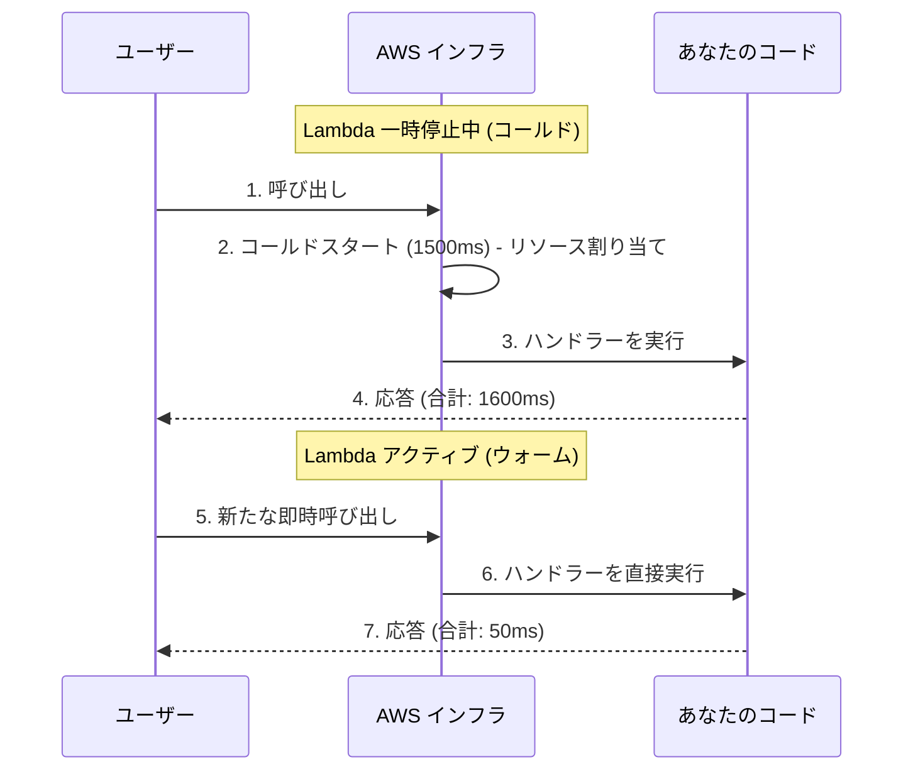

# AWS ベーシック：AWS Lambda とコールドスタートの習得

AWS Lambdaは、サーバーレスアーキテクチャの絶対的な核です。これは一時的（エフェメラル）なコンピューティング環境です。文字通り、AWSはあなたのコードをマイクロコンテナにロードして実行し、使用したミリ秒単位で課金した後、それを破棄します。

## 1. Lambda の解剖学

Lambda関数は、そのシグネチャ（signature）に常に3つの必須要素で構成されています。

```javascript
// index.mjs
export const handler = async (event, context) => {
  try {
    // 1. EVENTO: トリガー (S3, API Gateway, SQS) のデータが含まれます
    const body = JSON.parse(event.body);
    
    // 2. CONTEXTO: 環境のメタデータ (残り時間、Request ID)
    const tiempoRestante = context.getRemainingTimeInMillis();

    if (body.action === 'procesar') {
       return { statusCode: 200, body: "処理されました！" };
    }

  } catch (error) {
    console.error("致命的なエラー:", error);
    return { statusCode: 500, body: "内部エラー" };
  }
};
```

### 鉄の制限 (ハードリミット)
以下のLambdaの制限を前提として、アーキテクチャを設計する必要があります：
* **最大実行時間:** 15 分（数時間必要な場合は、AWS Batch または Fargate を使用します）。
* **最大メモリ:** 10 GB。
* **一時レイヤー (`/tmp`):** 消滅する最大 10 GB の一時ストレージ。

## 2. 敵のナンバー 1: コールドスタート (Cold Start)

Lambdaがここ数分間呼び出されていない場合、AWSはリソースを節約するためにそれを一時停止（サスペンド）します。新しいリクエストが到着すると、AWSは以下を行わなければなりません：
1. スペースのある物理サーバーを見つける。
2. 内部バケットからコードをダウンロードする。
3. 環境（Node.js、Pythonなど）を起動する。
4. 関数を実行する。

このプロセスは **コールドスタート (Cold Start)** と呼ばれます。300ミリ秒から3秒かかることがあり、ユーザー体験にとっては最悪です。



### 基本的な緩和策
* **パッケージの重さを最小限に抑える:** 200MB の `node_modules` フォルダをアップロードしないでください。`esbuild` または `webpack` を使用して、コードを 2MB の縮小（ミニファイ）された単一のファイルにパッケージ化します。
* **グローバルな初期化:** データベースへの接続は `handler` の「外側」で行う必要があります。

```javascript
import { Client } from 'pg';

// ✅ 正解: コールドスタート中に実行され、ウォーム呼び出しで再利用されます。
const db = new Client({ connectionString: process.env.DB_URL });
await db.connect();

export const handler = async (event) => {
  // これは超高速になります。
  const res = await db.query('SELECT * FROM users');
  return { statusCode: 200, body: JSON.stringify(res.rows) };
};
```

**中級レベル**では、API Gateway を使用して Lambda を外界に接続する方法と、DynamoDB を使用してサーバーレスデータベースを処理する方法について見ていきます。
