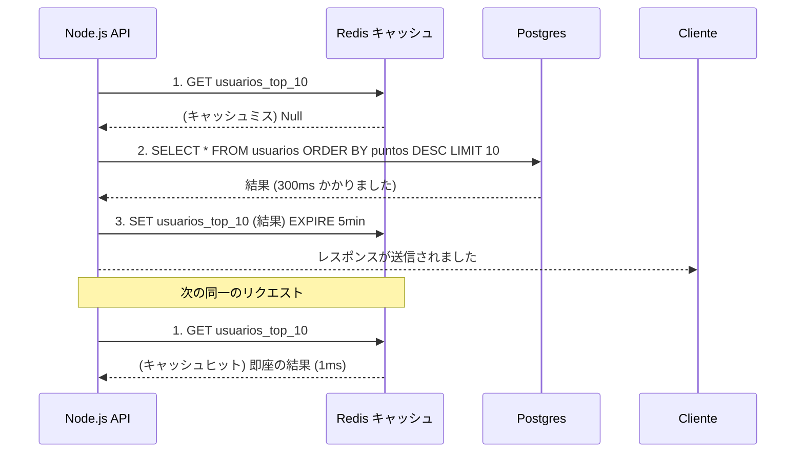

# Node.js エキスパート：マイクロサービス、Redis キャッシュ、およびメッセージング (イベント駆動型)

Node.jsのREST APIが100万人のユーザーをサポートするようにスケーリングすると、ボトルネックはもはやイベントループではなく、データベースになります。各SQLクエリには50msから200msかかります。10,000人のユーザーが同時にアプリのホーム画面をクエリすると、データベースは停止します。

## 1. 分散キャッシュ (Redis)

Redisは、キー・バリュー型のインメモリ（RAMに存在する）データベースです。その読み取りレイテンシは1ms未満です。

マスターパターンは **Cache-Aside Pattern** です。



## 2. イベント駆動型アーキテクチャ (Event-Driven / マイクロサービス)

モノリス（Monolith）では、販売が発生した場合、`crearOrden()`、`restarStock()`、`enviarEmail()` などの関数を順番に呼び出します。メールの送信に3秒かかると、ユーザーは待たされることになります。

マイクロサービスでは、操作を分離（デカップリング）するために **メッセージブローカー (Message Brokers)**（RabbitMQ、Kafka、AWS SQS）を使用します。

```javascript
// 支払いサービス (Node.js)
const channel = await RabbitMQ.createChannel();

app.post('/pagar', async (req, res) => {
  const exito = await procesarTarjeta(req.body);
  
  if (exito) {
    // 撃ちっ放し (Fire and Forget)
    // キューにイベントを発火させ、ユーザーに「即座に」応答します。
    channel.publish('ventas_exchange', 'pago.completado', Buffer.from(JSON.stringify(req.body)));
    
    return res.json({ msg: "注文は処理中です。" });
  }
});
```

その間、完全に分離されたコンテナ（おそらくPythonやGoで書かれている）では、他のマイクロサービスがそのイベントを*リッスン（傍受）*しています。
* **メールサービス**は `pago.completado` をリッスンし、領収書を送信します。
* **在庫サービス**は `pago.completado` をリッスンし、在庫を減らします。

## 3. JWT とステートレスセッション

分散アーキテクチャでは、ステートレス（Stateless / 状態を持たない）認証が必要です。サーバーのメモリにセッションを保存する（ロードバランサーの背後に5つのNodeインスタンスがある場合は壊れてしまいます）代わりに、**JSON Web Tokens (JWT)** を使用します。

JWTには、暗号化された承認情報が文字列*自体*に含まれています。サーバーはあなたがAdminであるかどうかを確認するためにデータベースをチェックする必要はありません。秘密の署名（`HMAC SHA256`）を使用してJWTを暗号的に解読するだけです。

**最適化**レベルでは、Node クラスター、PM2を使用し、ワーカー・スレッド (Worker Threads) を分析して、ベアメタルハードウェアの能力を最大限に引き出します。
