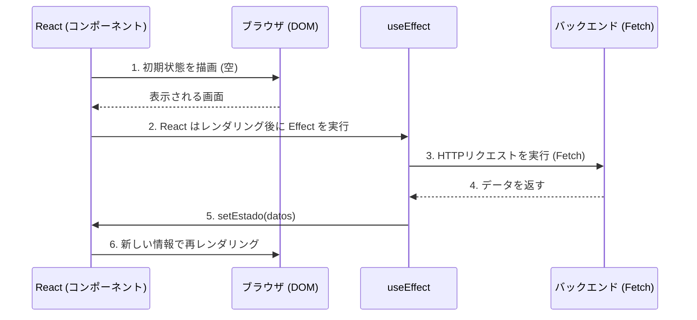

# React ベーシック：コアフックとローカル状態管理

関数コンポーネント自体は純粋で記憶を持たない（「ステートレス」な）ものです。関数を2回呼び出すと、ゼロから始まります。コンポーネントがレンダリングサイクル間で情報を「記憶」するため（ショッピングカートやモーダルが開いているかどうかなど）、Reactは**フック (Hooks)** を導入しました。

## 1. ローカル状態: useState

`useState` は最も重要なフックです。レンダリングサイクルを生き残るプライベートなメモリの保管庫をコンポーネントに与えます。

```jsx
import React, { useState } from 'react';

export const Contador = () => {
  // 1. 宣言: 'contador' は値、'setContador' はミューテーター関数です
  // 2. 初期化: 0 から始まります
  const [contador, setContador] = useState(0);

  return (
    <div>
      <p>あなたは {contador} 回クリックしました</p>
      {/* 決して直接変更しないでください (例: contador = contador + 1)。常に Setter を使用してください */}
      <button onClick={() => setContador(contador + 1)}>
        増加
      </button>
    </div>
  );
};
```

### 状態の黄金律：不変性 (Immutability)
Reactは、参照の等価性（`===`）を使用して、新しい状態が前の状態と異なるかどうかを比較することにより、画面を再レンダリングするかどうかを決定します。配列やオブジェクトがある場合、それらに直接 `.push()` を行ったり、プロパティを変更したりしてはいけません。メモリ内の参照が変わらず、Reactが画面を更新しないためです。
**常に前の配列やオブジェクトをコピーして新しいものを作成する必要があります（スプレッド演算子 `...` を使用します）。**

## 2. 副作用: useEffect

純粋な関数は「外界」に触れるべきではありません（HTTPリクエストの実行、WebSocketのサブスクライブ、LocalStorageへのアクセスなど）。これを行う必要がある場合は、`useEffect` を使用する必要があります。



### 依存関係配列 (Matriz de Dependencias)

`useEffect` の第2引数は、副作用が**いつ**実行されるかを制御します。これをマスターしないと、Reactのバグの90%の原因となります。

```jsx
// シナリオ 1: 依存関係配列なし (危険)
// 各レンダリングの「後」に実行されます。無限ループを引き起こす可能性があります。
useEffect(() => { fetchDatos() }); 

// シナリオ 2: 空の配列 [] (現代の "componentDidMount")
// コンポーネントが生成されたときに「1回だけ」実行されます。
useEffect(() => { fetchDatos() }, []); 

// シナリオ 3: 変数を含む配列 [userId]
// 生成時および 'userId' が変更される「たびに」実行されます。
useEffect(() => { fetchDatosUsuario(userId) }, [userId]); 
```

`useState` と `useEffect` をマスターすれば、どんなアプリケーションの80%も構築できます。**中級レベル**では、悪名高い「Prop Drilling」問題を解決し、Context APIを使用してアプリをグローバルな状態に接続します。
