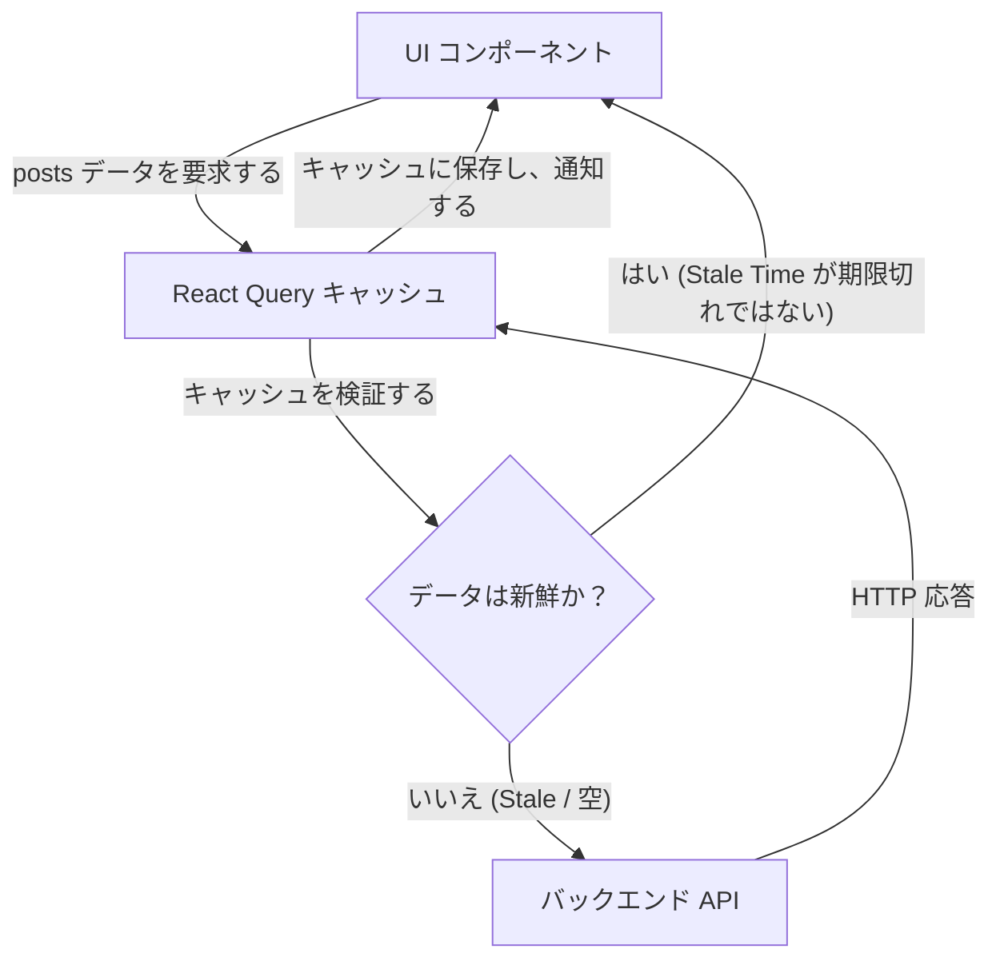

# React エキスパート：サーバー状態、ミューテーション、および React Query

APIを取得（fetch）するために `useEffect` システムを構築したことがあるなら、`data`、`isLoading`、`error` という3つの状態を手動で作成しなければならなかったはずです。競合状態（Race Conditions）に対処し、ユーザーがページを速く切り替えたときにリクエストを中止し、バックエンドに負荷をかけすぎないように情報をキャッシュする方法を見つけ出さなければなりませんでした。

このエキスパートレベルでは、根本的な真実を受け入れます：**バックエンドから来るデータは、アプリケーションの状態（クライアント状態 / Client State）ではありません。それはサーバー状態（Server State）です。**

## 1. パラダイムシフト：TanStack Query (React Query)

ZustandとReduxは、UI（パネルが開いているかどうか、現在のテーマ、メモリ内のカート）には最適です。しかし、APIとデータベースを処理するための絶対的な業界標準は **TanStack Query** です。



## 2. useEffect を永久に排除する

エキスパートが、`useEffect` や `useState` や並行性のロックを一切使用せずに、APIからどのようにデータを取得するかを見てみましょう。

```jsx
import { useQuery } from '@tanstack/react-query';
import axios from 'axios';

// 1. 純粋な fetch 関数を分離します (React に依存しない)
const fetchUsuarios = async () => {
  const { data } = await axios.get('https://api.empresa.com/v1/usuarios');
  return data;
};

export const ListaUsuarios = () => {
  // 2. React Query の魔法
  const { data: usuarios, isLoading, isError, error } = useQuery({
    queryKey: ['usuarios', 'lista'], // このキャッシュの一意の ID
    queryFn: fetchUsuarios,
    staleTime: 1000 * 60 * 5, // 再フェッチする前に 5 分間キャッシュを信頼する
  });

  if (isLoading) return <Spinner />;
  if (isError) return <Alert msg={error.message} />;

  return (
    <ul>
      {usuarios.map(u => <li key={u.id}>{u.nombre}</li>)}
    </ul>
  );
};
```

### グローバルキャッシュの力
アプリの別のビューにある別のコンポーネントが同じキー `['usuarios', 'lista']` で `useQuery` を実行した場合、React Query は**HTTPリクエストを行いません**。RAMメモリ（キャッシュヒット）から即座にデータを渡し、遅延を0ミリ秒に短縮します。

## 3. ミューテーション (Mutations)：サーバーの変更

データの読み取りは簡単です。データを変更し、キャッシュを無効化する（インターフェースを更新するため）ことこそが真の課題です。`useMutation` は更新、作成、削除を処理します。

```jsx
import { useMutation, useQueryClient } from '@tanstack/react-query';

export const FormularioCrear = () => {
  const queryClient = useQueryClient();

  const mutation = useMutation({
    mutationFn: (nuevoUsuario) => axios.post('/api/usuarios', nuevoUsuario),
    // ライフサイクルフック: サーバーが OK (200) を返したとき
    onSuccess: () => {
      // ユーザーリストのキャッシュを無効化します。
      // これにより、React Query はバックグラウンドで自動的に再フェッチ (refetch) を強制されます！
      queryClient.invalidateQueries({ queryKey: ['usuarios', 'lista'] });
    },
  });

  const onSubmit = (datos) => {
    mutation.mutate(datos);
  };

  return (
    <button 
      onClick={() => onSubmit({ nombre: 'Bob' })}
      disabled={mutation.isPending} // ボタンの自動制御
    >
      {mutation.isPending ? '保存中...' : 'ユーザーを作成'}
    </button>
  );
};
```

React Queryを使用すると、コードが50%削減され、バックエンドはキャッシュのおかげで息を吹き返し、ユーザーはアプリが非常に高速であると感じます。**最適化**レベルでは、メモ化、プロファイリング、そして大規模なコード分割（Code Splitting）といった、ブラウザのローカルレンダリングのボトルネックに焦点を当てます。
