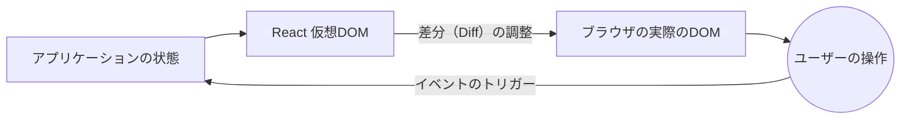

# 初期概念と最新のライフサイクル

最新のReactエコシステムへようこそ。クラスや巨大なライフサイクルメソッド（`componentDidMount`、`componentWillReceiveProps`）の時代は終わりました。今日、Reactは機能的で宣言的であり、正しく使用すれば非常に高速です。

## 1. 宣言型パラダイム

各ステップの「方法」（要素の作成、クラスの追加、DOMへのアタッチ）をブラウザに指示するバニラJavaScript（命令型）とは異なり、Reactでは描画したい「内容」を指示し、Reactがその「方法」を処理します。



## 2. 関数コンポーネント (標準)

Reactのコンポーネントは、データ（Props）を受け取り、JSX（JSとHTMLのハイブリッド構文）を返す純粋なJavaScript関数にすぎません。

```jsx
// 完璧で純粋なコンポーネント
export const TarjetaUsuario = ({ nombre, rol }) => {
  return (
    <div className="tarjeta">
      <h2>{nombre}</h2>
      <p>Rol: {rol}</p>
    </div>
  );
};
```

### なぜ JSX なのか？
JSXは実際のHTMLではありません。これは `React.createElement()` のシンタックスシュガー（糖衣構文）です。内部的には、ReactはこれらのタグをJavaScriptオブジェクトに変換します。これにより、*仮想DOM (Virtual DOM)* は実際のDOMが決して到達できない速度で数学的な比較（差分検出）を行うことができます。

## 3. 変化のエンジン: 仮想 DOM (Virtual DOM)

アプリケーションの状態を変更したとき、Reactは（古いフレームワークが行っていたように）Webページ全体を破棄して再構築することはありません。

1. **スナップショット:** Reactは新しい仮想DOMの「写真」を撮ります。
2. **差分検出 (Diffing):** O(n) のヒューリスティックアルゴリズムを使用して、新しい写真と前の仮想DOMを比較します。
3. **調整 (Patching / Reconciliación):** 実際のDOMに対して、数学的に正確な変更のみを適用します。

ボタンの「いいね」の数だけが変更された場合、ReactはDOMのそのノードに直接移動してテキストを更新し、ツリーの残りの部分（画像、フォームなど）はそのままにしておきます。

## 次のステップ
Reactがどのように画面を描画するかを理解しました。**ベーシックレベル**では、現代のReactの心臓部であるフック（`useState` と `useEffect`）を使用してコンポーネントに「記憶」を与える方法を探求します。
