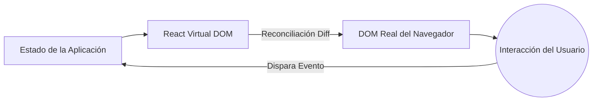

# Conceptos Iniciales y Ciclo de Vida Moderno

Bienvenido al ecosistema moderno de React. Atrás quedaron los días de las Clases y los ciclos de vida monstruosos (`componentDidMount`, `componentWillReceiveProps`). Hoy, React es funcional, declarativo y extremadamente rápido si se usa correctamente.

## 1. El Paradigma Declarativo

A diferencia del JavaScript Vanilla (Imperativo), donde le dices al navegador *cómo* hacer cada paso (crear elemento, añadir clase, adjuntar al DOM), en React le dices *qué* quieres que se dibuje, y React se encarga del *cómo*.



## 2. Componentes Funcionales (El Estándar)

Un componente en React es simplemente una función pura de JavaScript que recibe datos (Props) y retorna JSX (una sintaxis híbrida entre JS y HTML).

```jsx
// Un componente perfecto y puro
export const TarjetaUsuario = ({ nombre, rol }) => {
  return (
    <div className="tarjeta">
      <h2>{nombre}</h2>
      <p>Rol: {rol}</p>
    </div>
  );
};
```

### ¿Por qué JSX?
JSX no es HTML real. Es azúcar sintáctico para `React.createElement()`. Bajo el capó, React transforma esas etiquetas en objetos de JavaScript, lo que permite que el *Virtual DOM* realice comparaciones matemáticas (diffing) a una velocidad que el DOM real jamás podría alcanzar.

## 3. El Motor del Cambio: El Virtual DOM

Cuando cambias el estado de tu aplicación, React no destruye y reconstruye toda la página web (como hacían los frameworks antiguos). 

1. **Snapshot:** React toma una "foto" del nuevo Virtual DOM.
2. **Diffing:** Compara la nueva foto con el Virtual DOM anterior usando un algoritmo heurístico de O(n).
3. **Reconciliación (Patching):** Solo aplica los cambios matemáticamente exactos al DOM real.

Si solo cambió el número de "Likes" en un botón, React viajará directamente a ese nodo del DOM y actualizará el texto, dejando intacto el resto del árbol (imágenes, formularios).

## Próximos Pasos
Hemos entendido cómo React dibuja la pantalla. En el **基本レベル**, exploraremos cómo darle "memoria" a nuestros componentes utilizando Hooks (`useState` y `useEffect`), el corazón del React moderno.
