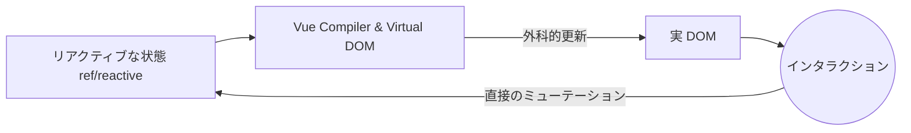

# 初期概念とリアクティビティ

プログレッシブフレームワーク、Vue.jsへようこそ。Reactとは異なり、Vueはプロキシ（Vue 3の場合）に基づいたリアクティビティシステムを使用しており、状態管理がより直感的になり、不要な再レンダリングが発生しにくくなります。

## 1. プログレッシブパラダイム
Vueが「プログレッシブ」と呼ばれる理由は、静的ページの単一コンポーネントをレンダリングするために使用したり（jQueryのように）、Vue RouterやPiniaを使用して完全なSPA（シングルページアプリケーション）を構築したりできるためです。



## 2. Options API vs Composition API
Vue 3では、`<script setup>`を使用する**Composition API**が標準です。これにより、ライフサイクルごとではなく、機能ごとにロジックをグループ化できます。

```html
<script setup>
import { ref } from 'vue'

const contador = ref(0)
const incrementar = () => contador.value++
</script>

<template>
  <div class="tarjeta">
    <h2>カウンター: {{ contador }}</h2>
    <button @click="incrementar">インクリメント</button>
  </div>
</template>
```
