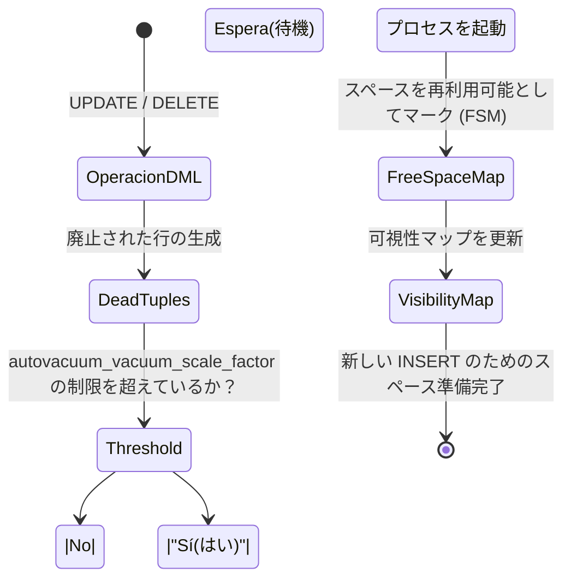

# PostgreSQL 上級：実行エンジン、Vacuum、および複合インデックス

上級レベルでは、盲目的にコードを書くことをやめ、**PostgreSQLが私たちのコードをどのように読むか**を理解し始めます。5分かかるクエリと50ミリ秒かかるクエリの違いは、*クエリプランナー (Query Planner)* を理解することにあります。

## 1. EXPLAIN ANALYZE の技術

インデックスが使用されていると決して思い込まないでください。PostgreSQLにはコストベースのオプティマイザ (Cost-Based Optimizer) があります。データの80%を要求しているため、インデックスを使用するよりも*シーケンシャルスキャン (Sequential Scan)*（テーブル全体の読み取り）を行う方が安価であるとエンジンが計算した場合、エンジンはインデックスを無視します。

### 実行計画 (Execution Plan) の読み方

```sql
EXPLAIN ANALYZE 
SELECT * FROM sales.orders 
WHERE status = 'pending' AND total > 1000;
```

**観察すべき重要なメトリクス：**
- `Execution Time`: 実際にかかった時間。
- `Buffers: shared hit=... read=...`: `read` が多い場合、Postgresはディスクにアクセスしています。`hit` が多い場合、データは RAM メモリから提供されています（素晴らしいことです！）。
- `Seq Scan`: テーブルに何百万行もある場合の赤信号 (Red alert)。`Index Scan` または `Bitmap Heap Scan` に置き換えるようにしてください。

## 2. 複合インデックスと列の順序

複数の列でフィルタリングする場合、単純なインデックスでは不十分です。

```sql
-- 複合インデックス
CREATE INDEX idx_orders_status_total ON sales.orders(status, total);
```
**黄金律:** 順序は重要です。常に**カーディナリティ**が最も高い（データを最も早く除外できる）列、または等価演算子 (`=`) で使用する列を最初に配置します。範囲 (`>`, `<`) に使用される列は、インデックスの最後に配置する必要があります。

## 3. Autovacuum：MVCC のガベージコレクター

中級レベルでは、MVCCと*dead tuples*（UPDATEやDELETEによって生成される廃止された行）について学びました。これらの行がクリーンアップされないと、データベースは**肥大化 (Bloat)** に悩まされ、ディスクを消費してパフォーマンスを破壊します。

`Autovacuum` プロセスは、これをクリーンアップする役割を担っています。

### Autovacuum プロセス図



**巨大なテーブルのための重要なチューニング：**
Postgresのデフォルト値 (`autovacuum_vacuum_scale_factor = 0.2`) は、テーブルの20%が変更された場合にのみAutovacuumがトリガーされることを意味します。1億行のテーブルがある場合、それをクリーニングするには2000万行が変更される必要があります！
これをテーブルごとに調整します：

```sql
ALTER TABLE sales.orders SET (autovacuum_vacuum_scale_factor = 0.01);
```

EXPLAINを理解し、Autovacuumを習得することは、シニア開発者と真のデータベースエキスパートを分けるものです。**エキスパート**レベルでは、これをレプリケーション（複製）と大規模なパーティショニングにスケーリングします。
