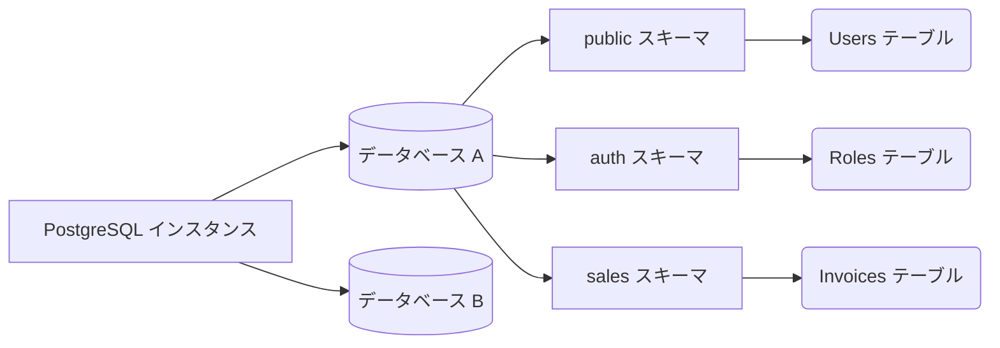

# PostgreSQL ベーシック：基礎、データ型、およびコアクエリ

インフラストラクチャのフェーズは過ぎました。これから開発者の「遊び場」に入ります。PostgreSQLは単なる行と列のストアではなく、オブジェクト関係データベースシステム (ORDBMS) です。これは、継承、複雑なデータ型、および拡張機能をサポートしていることを意味します。

## 1. スキーマ (Schemas) のパラダイム

MySQLから移行してきた開発者の間で非常によくある間違いは、データベースをテーブルの唯一の論理コンテナとして使用することです。PostgreSQLには中間レイヤーである**スキーマ (Schema)** があります。



デフォルトでは、すべてのテーブルは `public` スキーマに作成されます。**ベストプラクティス:** 単一のデータベースでモノリシックまたはマイクロサービスアーキテクチャを構築している場合は、スキーマを使用してビジネスドメインを分割します。

```sql
CREATE SCHEMA IF NOT EXISTS billing;
CREATE SCHEMA IF NOT EXISTS inventory;
```

## 2. データ型：JSONB と配列 (Arrays) の力

PostgreSQLは「SQLデータベースは硬直的である」という神話を打ち砕きます。Postgresは、並外れたパフォーマンスでNoSQLデータ型をネイティブにサポートしています。

### JSONB 型 (バイナリ JSON)
`JSON` がプレーンテキストを保存するのに対し、`JSONB` はJSONをカスタマイズされたバイナリ形式に前処理します。これにより、挿入は少し遅くなりますが、読み取りと**インデックス付き検索**は驚くほど速くなります。

```sql
CREATE TABLE billing.invoices (
    id UUID PRIMARY KEY DEFAULT gen_random_uuid(),
    customer_name VARCHAR(150) NOT NULL,
    total_amount NUMERIC(10, 2),
    metadata JSONB,
    created_at TIMESTAMP WITH TIME ZONE DEFAULT NOW()
);

-- リレーショナルテーブル内への NoSQL データの挿入
INSERT INTO billing.invoices (customer_name, total_amount, metadata)
VALUES ('Acme Corp', 500.50, '{"tags": ["b2b", "premium"], "payment_gateway": "stripe", "tax_exempt": false}');
```

### JSONB 内部のクエリ
PostgreSQLは、ドキュメント内を検索するための特別な演算子（`->>` や `@>` など）を提供しています：

```sql
-- Stripe によって処理されたすべての請求書を検索
SELECT customer_name, total_amount 
FROM billing.invoices 
WHERE metadata @> '{"payment_gateway": "stripe"}';

-- リストから最初のタグを抽出
SELECT metadata->'tags'->>0 AS primary_tag 
FROM billing.invoices;
```

## 3. 厳格な参照整合性 (制約 / Constraints)

適切に設計されたスキーマは、フロントエンドやバックエンドのコードがエラーをフィルタリングすることを信用しません。データベースが**最後の防衛線**です。

```sql
CREATE TABLE inventory.products (
    id SERIAL PRIMARY KEY,
    sku VARCHAR(20) UNIQUE NOT NULL,
    price NUMERIC(8,2) CHECK (price > 0),
    discount_percentage INT DEFAULT 0 CHECK (discount_percentage BETWEEN 0 AND 100),
    status VARCHAR(20) DEFAULT 'draft' CHECK (status IN ('draft', 'active', 'archived'))
);
```
`CHECK` 制約を無差別に（徹底して）使用することで、Node.js や Python の API にどれほどバグがあっても、負の価格の製品が入力されることは*決して*ないことを保証します。

## 4. B-Tree インデックスの概要

B-Tree（B木 / バランスツリー）インデックスは、Postgres の主力（ワークホース）です。これはデフォルトのインデックスであり、等価演算子および範囲演算子（`<`, `<=`, `=`, `>=`, `>`）に最適化されています。

```sql
-- 検索を高速化するためのクラシックな B-Tree インデックスの作成
CREATE INDEX idx_products_sku ON inventory.products(sku);

-- 部分インデックス：条件を満たす行のみをインデックスします。
-- ディスクスペースと RAM メモリを大幅に節約します。
CREATE INDEX idx_active_products ON inventory.products(status) WHERE status = 'active';
```

### 部分インデックスはいつ使用すべきか？
1000万件のレコードを持つ「Users」テーブルがあり、`is_deleted = false` とマークされているアクティブなユーザーが5万件しかない場合、アクティブなユーザーに対する部分インデックスは、テーブル全体をインデックス化するのと比較して、微小で超高速になります。

## 終わりに
`JSONB` 型を習得し、論理スキーマを使用し、`CHECK` 制約で情報を保護することで、データベースは単なる美化されたスプレッドシートから堅牢なデータ保管庫へと変貌します。**中級レベル**では、複雑なクエリの黒魔術である共通テーブル式 (CTEs: Common Table Expressions) とウィンドウ関数 (Window Functions) を探求します。
