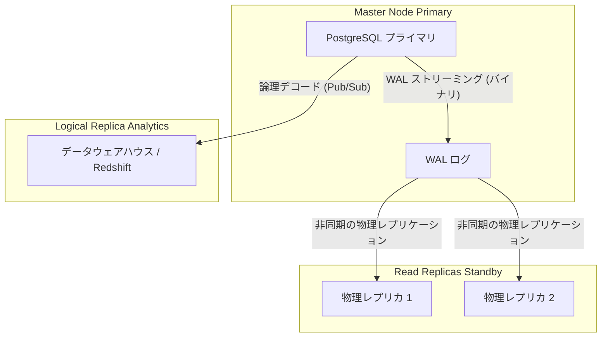

# PostgreSQL エキスパート：レプリケーションと大規模なパーティショニング

単一の PostgreSQL インスタンスが、読み取り負荷やストレージの容量（数テラバイトのデータについて話しています）を処理できなくなったとき、私たちはエキスパートの領域に入ります。負荷を分散する時が来ました。

## 1. 宣言的パーティショニング (ローカル・シャーディング)

5億件のレコードがある `logs` テーブルがある場合、古いデータを `DELETE` で削除しようとすると、テーブルがロックされ、パフォーマンスが崩壊します。解決策は、単一の論理テーブルを維持しながら、テーブルを物理的に分割することです。

### 例: 時間によるパーティショニング (Range)

```sql
-- 1. "親 (Parent)" テーブルの作成
CREATE TABLE telemetry.sensor_logs (
    id UUID,
    sensor_id INT,
    reading NUMERIC,
    created_at TIMESTAMP NOT NULL
) PARTITION BY RANGE (created_at);

-- 2. "子 (Child)" テーブル (物理) の作成
CREATE TABLE sensor_logs_y2023m10 PARTITION OF telemetry.sensor_logs
    FOR VALUES FROM ('2023-10-01') TO ('2023-11-01');

CREATE TABLE sensor_logs_y2023m11 PARTITION OF telemetry.sensor_logs
    FOR VALUES FROM ('2023-11-01') TO ('2023-12-01');
```

**決定的な利点:** 10月が不要になったら、`DELETE` を実行する**のではありません**。単に `DROP TABLE sensor_logs_y2023m10;` を実行します。この操作により、サーバーのパフォーマンスに影響を与えることなく、瞬時にギガバイトのスペースが解放されます。

## 2. レプリケーション・トポロジー：ストリーミング vs ロジカル

読み取りをスケーリングしたり、高可用性 (HA: High Availability) を保証したりするには、レプリカ（複製）が必要です。



### 物理レプリケーション (Streaming Replication)
Write-Ahead Logs (WAL) を読み取り、ブロックごとにデータベース全体をコピーします。物理レプリカは**読み取り専用**です。フェイルオーバー（マスターがダウンした場合にレプリカが引き継ぐ）の実行に最適です。

### 論理レプリケーション (Pub/Sub)
生のバイナリブロックをコピーする代わりに、Postgres は WAL をアプリケーション層のイベント (`INSERT`, `UPDATE`, `DELETE`) にデコード（論理デコード）し、それをサブスクライバー（購読者）に送信します。
- **特定のテーブルのみ**をレプリケートできます（販売テーブルをデータレイクに送信するのに最適です）。
- ターゲット（宛先）ノードが独自の独立したテーブルに書き込むことができます。

```sql
-- マスターサーバー側：
CREATE PUBLICATION sales_pub FOR TABLE sales.orders, sales.invoices;

-- 分析サーバー側：
CREATE SUBSCRIPTION sales_sub CONNECTION 'host=master_ip port=5432 user=rep_user password=secret' PUBLICATION sales_pub;
```

パーティショニングとレプリケーションを習得することで、Postgresを仮想的に無限にスケーリングすることができます。**マスターレベル（最適化）**では、ハードウェアを絶対的な限界に追いやるために、カーネルのチューニングとコネクションプーリングを探求します。
