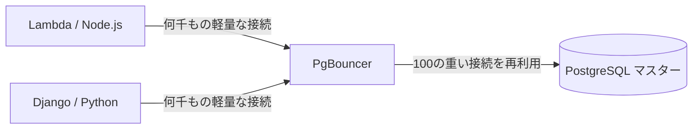

# PostgreSQL マスター：極限のチューニング、PgBouncer、および最適化

最終レベルへようこそ。ここでは SQL は書きません。Linux カーネルの動作を変更し、生のメモリ割り当てを操作して、データベースを支える鉄（ハードウェア）からパフォーマンスを一滴残らず絞り出します。

## 1. 接続の問題 (Connection Pooling)

初期レベルで見たように、Postgresはクライアント接続ごとに*フォーク (fork)*（新しいプロセスの作成）を行います。各プロセスは約2MB〜10MBのRAMを消費します。サーバーレスAPI (例: AWS Lambda) が5,000の同時接続を開いた場合、Postgresは非アクティブなプロセスだけでサーバーのすべてのメモリを消費し、*Out of Memory (OOM) クラッシュ*を引き起こします。

### PgBouncer によるアーキテクチャ

本番環境での必須のソリューションは、データベースの前に **コネクションプーラー (Connection Pooler)** を配置することです。`PgBouncer` は業界標準です。



PgBouncer は Postgres とのアクティブな接続の小さなプール（グループ）を維持します。API がクエリの実行を要求すると、PgBouncer は接続を貸し出し、クエリを実行し、すぐにプールに返します (*Transaction Pooling*)。これにより、接続管理における Postgres の CPU 負荷はほぼゼロに削減されます。

## 2. 極限のチューニング：postgresql.conf の変更

デフォルトの `postgresql.conf` ファイルは、Raspberry Pi で実行できるように構成されています（つまり、最小限のリソースを使用します）。64GBのRAMとNVMeディスクを搭載したサーバーで実行している場合、ハードウェアの95%を無駄にしていることになります。

### 最適化の重要なパラメータ (64GB RAM サーバーの例):

```conf
# 1. 共有メモリ (テーブルのキャッシュ・ストレージ)
# 推奨: 総 RAM の 25% から 40%。
shared_buffers = 16GB 

# 2. ソート用メモリ (Sorts, Hashes)
# 接続ごとのメモリ。注意: 100の接続が巨大な SORT を行っている場合、100 * 64MB を消費します。
work_mem = 64MB 
maintenance_work_mem = 2GB # VACUUM およびインデックス作成専用。

# 3. SSD ディスクの調整 (回転式 HDD の動作を回避)
random_page_cost = 1.1 # ランダムな読み取りがシーケンシャルとほぼ同じくらい速いと想定します。
effective_io_concurrency = 200 # SSD のための非同期 I/O 処理を増やします。

# 4. トランザクションと WAL
wal_level = logical # 必要に応じて論理レプリケーションの準備をします
checkpoint_completion_target = 0.9 # チェックポイント中のディスクへの書き込みをスムーズにします
```

## 3. Linux の Huge Pages (OS のチューニング)

高性能データベースの場合、オペレーティングシステムは標準の 4KB の「メモリページ」の管理にあまりにも多くのCPUを費やします。**Huge Pages** (2MB または 1GB のページ) を有効にすると、Postgres は CPU 負荷のほんの一部で `shared_buffers` を管理できるようになります。

1. `shared_buffers` のサイズを計算します。
2. Linux で `/etc/sysctl.conf` を構成します：
   ```bash
   vm.nr_hugepages = 8500
   ```
3. `postgresql.conf` で Postgres にこれらを使用するように指示します：
   ```conf
   huge_pages = on
   ```

あなたは卓越した領域 (マスター) に達しました。基本的な構文からカーネルの構成に至るまで、あなたの PostgreSQL インフラストラクチャは現在、グローバル規模で運用され、壊滅的な障害を許容し、毎秒数百万のトランザクションを処理する準備ができています。
