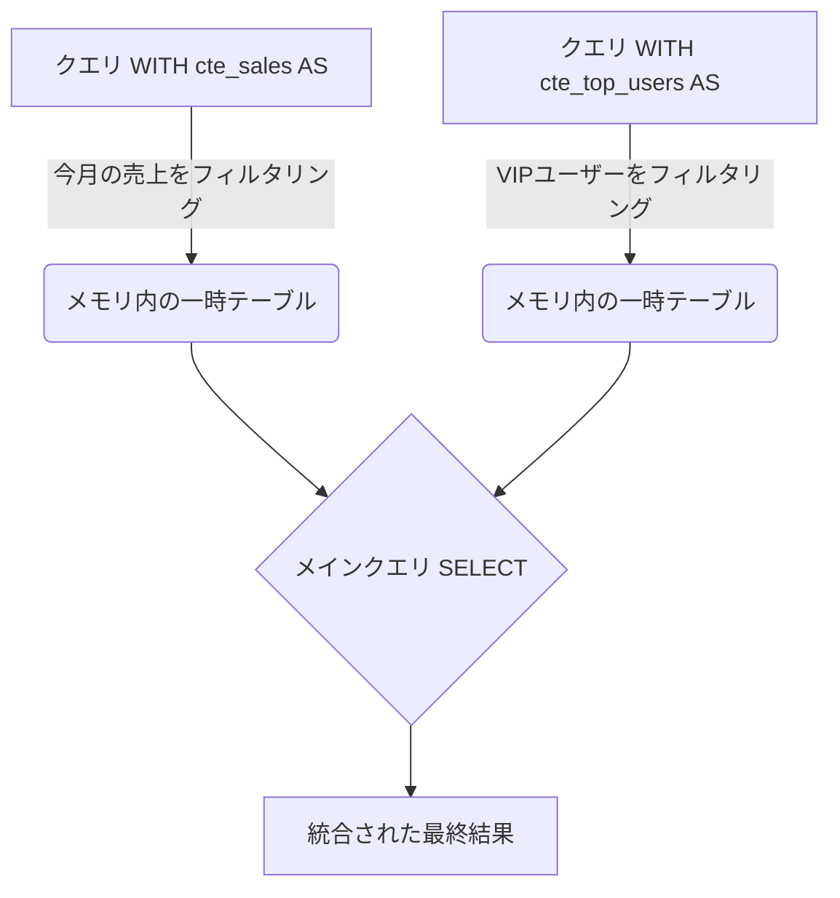
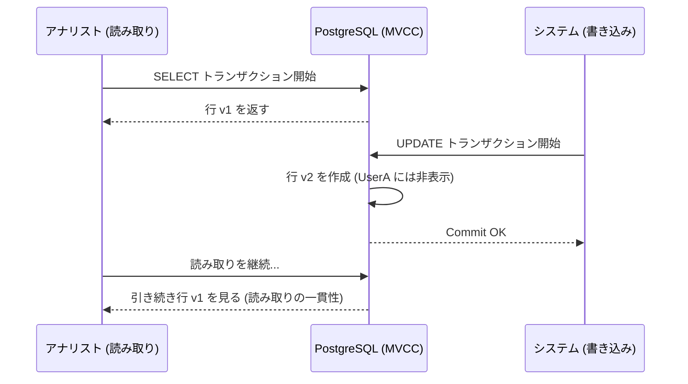

# PostgreSQL 中級：高度なクエリ、CTE、および ACID トランザクション

基本的な `SELECT` と `JOIN` ではビジネスロジックを処理するのに不十分になったとき、中級レベルに入ります。ここでは、PostgreSQLを単なるデータストアから**分析計算エンジン**へと変革します。データを（データが存在する）データベース側で計算することは、ネットワークを介してギガバイトのデータを Node.js や Python サーバーに送信するよりもほぼ常に効率的です。

## 1. 共通テーブル式 (CTEs): スパゲッティ SQL のクリーンアップ

ネストされたサブクエリは、あっという間にメンテナンスの地獄と化す可能性があります。CTE（`WITH` 句）を使用すると、一時的で読みやすい結果ブロックを定義できます。

### CTE フローチャート



### 実践例
SQLのスパゲッティを作ることなく、「トップ顧客 (Top Customers)」の平均チケットを計算したいとします：

```sql
WITH top_customers AS (
    SELECT customer_id, SUM(total_amount) as lifetime_value
    FROM billing.invoices
    GROUP BY customer_id
    HAVING SUM(total_amount) > 10000
),
recent_invoices AS (
    SELECT customer_id, total_amount
    FROM billing.invoices
    WHERE created_at >= NOW() - INTERVAL '30 days'
)
-- CTE を結合するメインクエリ
SELECT t.customer_id, t.lifetime_value, AVG(r.total_amount) as avg_recent_ticket
FROM top_customers t
JOIN recent_invoices r ON t.customer_id = r.customer_id
GROUP BY t.customer_id, t.lifetime_value;
```

## 2. ウィンドウ関数 (Window Functions): 分析の魔法

*ウィンドウ関数*を使用すると、**結果をグループ化せずに（`GROUP BY` が行うように結果を縮小せずに）**、現在の行に関連する行のセットに対して計算を実行できます。

従業員の詳細を保持したまま、ある従業員の給与がその部門内でどのような順位（ランキング）にあるかを知りたいですか？

```sql
SELECT 
    employee_name, 
    department, 
    salary,
    RANK() OVER (PARTITION BY department ORDER BY salary DESC) as salary_rank,
    salary - AVG(salary) OVER (PARTITION BY department) as diff_from_dept_avg
FROM hr.employees;
```
この魔法のコードでは：
- `PARTITION BY` は部門ごとにサブグループ（ウィンドウ）を作成します。
- クエリは従業員のすべての行を返しますが、ウィンドウ全体を観測して計算された分析列を追加します。

## 3. トランザクションと並行性制御 (MVCC)

PostgreSQL は MVCC (*Multi-Version Concurrency Control* : 多版同時実行制御) アーキテクチャにより、**ACID** (原子性、一貫性、独立性、耐久性) に準拠しています。

### MVCC とは？
Postgresで行を更新するとき、エンジンはディスク上のデータを**上書きしません**。代わりに、古い行を「廃止された（dead tuple）」としてマークし、行の新しいバージョンを挿入します。これは、**読み手は決して書き手をブロックせず、書き手は決して読み手をブロックしない**ことを意味します。



### 明示的なトランザクション
重要な操作をグループ化することで、データベースの状態が一貫していることを保証します。

```sql
BEGIN; -- トランザクション開始

UPDATE accounts SET balance = balance - 100 WHERE id = 1;
UPDATE accounts SET balance = balance + 100 WHERE id = 2;

-- ここでコードに何か失敗があった場合は、ROLLBACK します。
-- すべて問題なければ、確定（コミット）します：
COMMIT; 
```

## 4. Upsert (INSERT ... ON CONFLICT)

*Upsert* パターンは、すでに存在する可能性のあるレコードを挿入しようとしたときの並行性レースを解決します。（確認のために）`SELECT` を行ってからバックエンドから `INSERT` または `UPDATE` を行う（これは遅く、競合状態 / レースコンディション に陥りやすい）のではなく、アトミック（原子的）に実行します：

```sql
INSERT INTO analytics.daily_stats (date, user_id, visits)
VALUES ('2023-10-01', 105, 1)
ON CONFLICT (date, user_id) 
DO UPDATE SET visits = analytics.daily_stats.visits + 1;
```

これらのツールを使用することで、モノリシックな SQL の記述から脱却しました。あなたはクリーンで宣言的、かつ数学的に堅牢なコードを書いています。**上級レベル**では、エンジンの地下深くである 実行計画 (EXPLAIN) と内部クリーニング (Vacuum) に飛び込みます。
