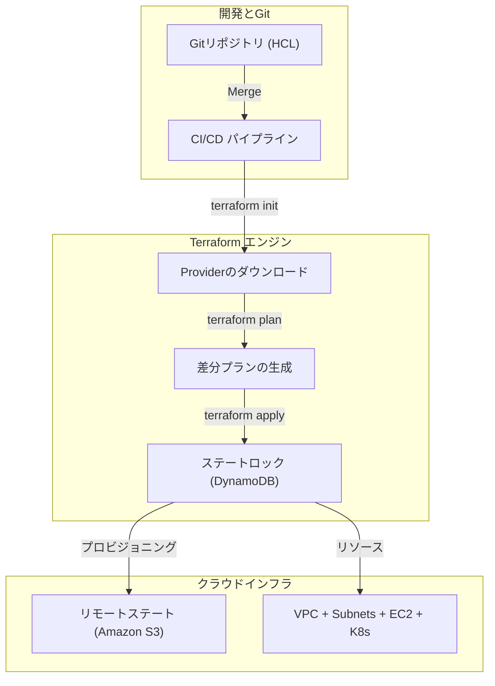

# コードとしてのインフラストラクチャと不可変性 (IaC & Terraform)

**Infrastructure as Code (IaC)** は、宣言型コードを使用してクラウドインフラを自動化・管理するDevOpsの標準手法です。

## 1. 宣言型アーキテクチャ



## 2. Terraform ライフサイクル

```bash
terraform init
terraform plan
terraform apply -auto-approve
terraform destroy
```

## 3. リモートステートと排他ロック (S3 + DynamoDB)

```hcl
terraform {
  backend "s3" {
    bucket         = "nmerge-terraform-state-prod"
    key            = "global/s3/terraform.tfstate"
    region         = "us-east-1"
    dynamodb_table = "nmerge-terraform-locks"
    encrypt        = true
  }
}
```
