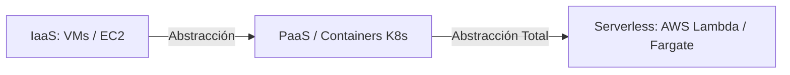
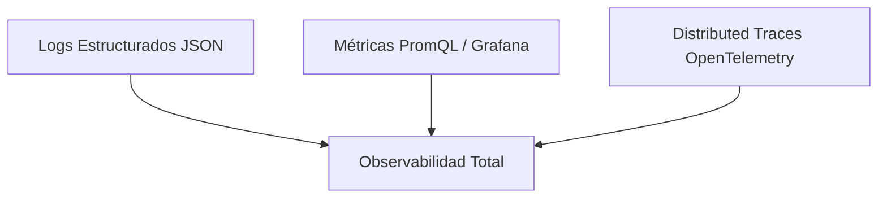

# クラウドネイティブ、サーバーレス、サイト信頼性エンジニアリング (SRE)

**クラウド ネイティブ** 開発と **サイト信頼性エンジニアリング (SRE)** の実践は、大規模でフォールト トレラントな分散アプリケーションを設計、展開、運用するための最新の方法論を表しています。

---

## 1. クラウド ネイティブの原則 (12 要素のアプリ標準)

クラウド ネイティブ アプリケーションは、12 要素の方法論に従って、クラウド環境での移植性、不変性、およびスケーラビリティを確保します。

1. **コードベース:** マイクロサービスごとに 1 つのリポジトリ、複数のデプロイメント (開発、ステージング、本番)。
2. **依存関係:** 明示的に宣言され、分離されます (`package.json`、`Dockerfile`)。
3. **構成:** **環境変数** (`process.env`) に厳密に保存され、ソース コードには決して保存されません。
4. **バッキング サービス:** バックアップ リソース (データベース、Redis、RabbitMQ) を、URL/資格情報経由でアクセスできる添付リソースとして扱います。
5. **ビルド、リリース、実行:** ビルド (イメージのコンパイル)、リリース (構成との統合)、および実行 (コンテナーの実行) フェーズが厳密に分離されています。
6. **ステートレス プロセス:** アプリケーションはステートレス プロセスを実行する必要があります。永続的な状態はすべて外部サービス (PostgreSQL、Redis) に委任する必要があります。
7. **ポート バインディング:** 透過的な HTTP/TCP ポート マッピングを使用してサービスをエクスポートします。
8. **同時実行性:** プロセス モデルを使用して水平方向にスケーリングします (ポッド/インスタンスのクローンを作成)。
9. **破棄

> [!NOTE]
> コードと図の構文を維持するために、ホワイト ペーパーの残りの部分は元の言語のままになっています。

abilidad:** Inicio rápido y apagado gradual (*Graceful Shutdown* reaccionando a señales `SIGTERM`).
10. **Paridad entre Dev y Prod:** Mantener entornos de desarrollo y producción lo más idénticos posible.
11. **Logs como Streams:** Tratar logs como flujos continuos de eventos hacia `stdout` / `stderr`.
12. **Procesos de Administración:** Ejecutar tareas administrativas/migraciones como procesos únicos de una sola vez.

---

## 2. Serverless vs Containers (CaaS)



* **Serverless (FaaS):** Modelo basado en eventos de ejecución efímera. Auto-escala de $0$ a miles de instancias bajo demanda y cobra únicamente por los milisegundos reales de cómputo consumidos.
* **Graceful Shutdown Pattern en Node.js (Cloud Native):**
```javascript
const server = app.listen(3005, () => console.log('Server running on 3005'));

process.on('SIGTERM', () => {
  console.log('SIGTERM recibido. Cerrando conexiones HTTP de forma gradual...');
  server.close(() => {
    console.log('Servidor HTTP cerrado. Desconectando Base de Datos...');
    db.destroy().then(() => process.exit(0));
  });
});
```

---

## 3. Arquitectura SRE: SLI, SLO y Presupuesto de Error (Error Budget)

SRE es la disciplina que aplica principios de ingeniería de software a las operaciones de infraestructura.

### A. Definición de Métricas Core SRE:
* **SLI (Service Level Indicator):** La medida cuantitativa real del rendimiento del servicio.
  $$\text{SLI} = \frac{\text{Número de Peticiones Exitosas } (< 200\text{ms})}{\text{Número Total de Peticiones}} \times 100\%$$
* **SLO (Service Level Objective):** El objetivo meta acordado internamente (ej. $99.9\%$ de peticiones exitosas al mes).
* **Error Budget:** La cuota de error permitida ($100\% - \text{SLO}$). Para un SLO del $99.9\%$, el presupuesto de error es $0.1\%$.

```gherkin
FEATURE: Gobierno de Despliegues por Error Budget
  GIVEN un SLO mensual de disponibilidad del 99.9%
  AND un Error Budget consumido del 100% debido a incidentes Sev-1
  WHEN un equipo de desarrollo intenta desplegar una nueva feature a Producción
  THEN el pipeline de CI/CD debe congelar el despliegue de características
  AND permitir únicamente hotfixes de estabilidad y mejoras SRE
```

---

## 4. Observabilidad: Los Tres Pilares (Logs, Metrics, Traces)



1. **Logs (Registros):** Eventos discretos codificados en JSON estructurado para indexación en ELK o Loki.
2. **Metrics (Métricas):** Datos agregados en series temporales (CPU, Latencia p99, Error Rate) visualizados en Grafana.
3. **Traces (Trazas Distribuidas):** Seguimiento del ciclo de vida de una petición HTTP a través de múltiples microservicios utilizando cabeceras `W3C Trace Context` (`traceparent`).
